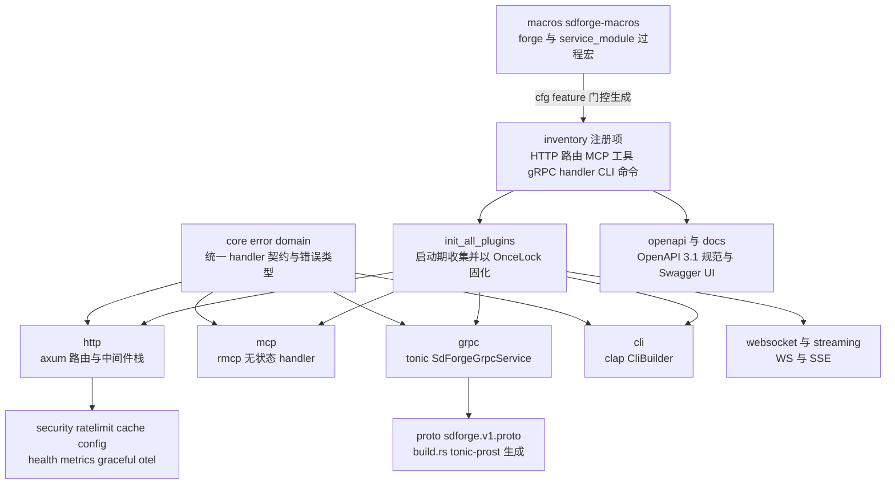
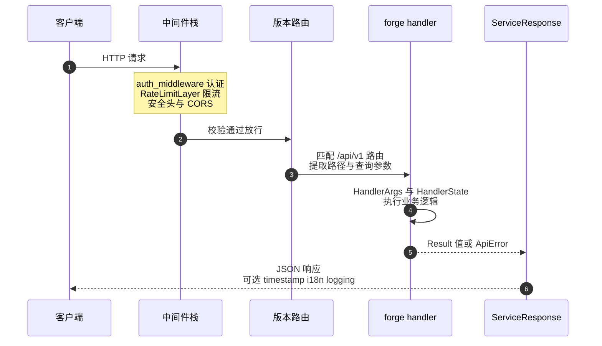
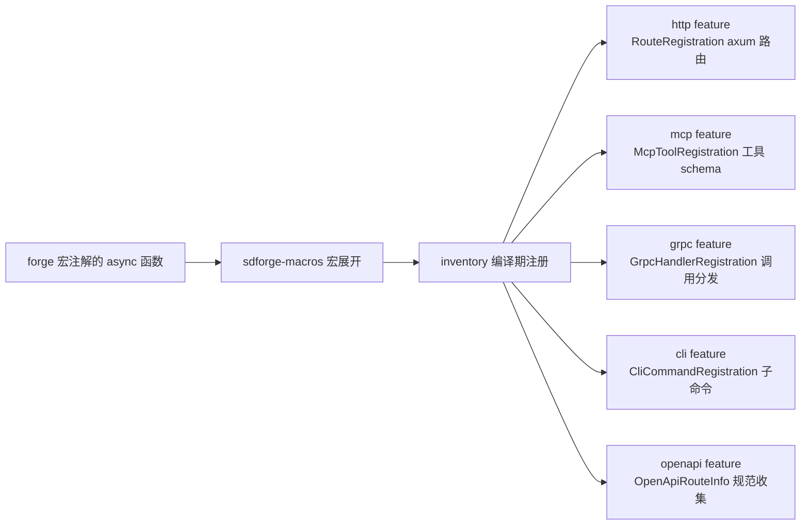

<div align="center">


[](https://github.com/Kirky-X/sdforge/actions/workflows/ci.yml) [](https://crates.io/crates/sdforge) [](https://docs.rs/sdforge) [](https://crates.io/crates/sdforge) [](LICENSE) [](https://www.rust-lang.org/) [](https://codecov.io/gh/Kirky-X/sdforge)

**中文** | [English](README_EN.md)

**一套宏注解，编译时装配多协议 SDK**

[✨ 功能特性](#-功能特性) • [🚀 快速开始](#-快速开始) • [📚 文档](#-文档) • [💻 示例](#-示例) • [🤝 参与贡献](#-参与贡献)

</div>

---

SDForge 是基于 Rust 的声明式 SDK 框架。用 `#[forge]` 过程宏标注一次函数，框架在编译期生成 HTTP、MCP、gRPC、WebSocket、CLI 五种协议的注册代码；协议选择完全由 Cargo features 决定，未启用的协议不产生任何编译代码。

<div align="center">

<table>
  <tr>
    <td align="center" width="25%">🎯<br><b>统一注解</b><br><code>#[forge]</code> 单宏定义端点<br>五种协议消费同一份元数据</td>
    <td align="center" width="25%">⚡<br><b>编译时协议选择</b><br>feature 门控代码生成<br>未启用协议零编译代码</td>
    <td align="center" width="25%">🌐<br><b>五种协议入口</b><br>HTTP / MCP / gRPC<br>WebSocket / CLI</td>
    <td align="center" width="25%">🛡️<br><b>安全默认</b><br>认证、限流、审计<br>fail-safe 默认值</td>
  </tr>
</table>

</div>

---

## 📋 目录

<details open>
<summary>📑 目录</summary>

- [✨ 功能特性](#-功能特性)
- [🚀 快速开始](#-快速开始)
- [🎨 特性标志](#-特性标志)
- [📚 文档](#-文档)
- [💻 示例](#-示例)
- [🏗️ 架构](#️-架构)
- [🔄 核心执行路径](#-核心执行路径)
- [🌐 一份注解，五种协议](#-一份注解五种协议)
- [🧪 测试](#-测试)
- [📊 性能](#-性能)
- [🔒 安全](#-安全)
- [🗺️ 开发路线图](#️-开发路线图)
- [🤝 参与贡献](#-参与贡献)
- [📋 更新日志](#-更新日志)
- [📄 许可证](#-许可证)
- [🙏 致谢](#-致谢)
- [📞 联系与支持](#-联系与支持)
- [⭐ Star 历史](#-star-历史)

</details>

---

## ✨ 功能特性

| 特性 | 说明 |
|------|------|
| 🎯 **统一接口定义** | 单个 `#[forge]` 宏同时配置 HTTP、MCP、gRPC、WebSocket、CLI |
| ⚡ **零协议税** | 协议选择发生在编译期，运行期无协议探测或动态加载 |
| 🌐 **多协议支持** | Axum 0.8、rmcp 3.2（MCP 2026-07-28 规范）、tonic、WebSocket、SSE、clap |
| 🔒 **类型安全** | 接口定义编译期验证，trybuild 覆盖编译失败用例 |
| 🛡️ **安全特性** | API Key / JWT Bearer 认证、limiteron 限流、审计日志、安全头 |
| 💾 **内存缓存** | oxcache 提供 LRU、模式失效、批量操作与统计，无数据库依赖 |
| 🔧 **配置管理** | 自包含 TOML 配置，模块化默认值与 Builder 模式 |
| 📊 **版本管理** | 内置 `/api/{version}` 多版本路由与 `#[service_module]` 模块前缀 |
| 📜 **OpenAPI 3.1** | utoipa 编译期收集路由，运行时生成规范 + Swagger UI |
| 🌍 **国际化** | ICU4X 本地化格式化与 Accept-Language 解析 |
| 🔭 **可观测性** | Prometheus 指标、OTLP 导出、健康探针、优雅停机、请求上下文 |
| 🧩 **特性组合** | 30+ Cargo features 按需装配，常驻核心不依赖任何协议栈 |

<details>
<summary>🔧 按需启用的进阶能力</summary>

| 能力 | Feature | 说明 |
|------|---------|------|
| 参数校验 | `validate` | `#[forge(validate)]` + `#[param(ge/le/...)]`，400 返回字段级错误 |
| 声明式分页 | `paginate` | `#[forge(paginate)]` 自动 page/size 与 `{items,total,next}` 包装 |
| ETag 条件请求 | `etag` | GET 响应自动强 ETag（SHA-256），If-None-Match 返回 304 |
| 生命周期钩子 | `lifecycle` | `#[forge(on_start/on_stop)]` 进程级钩子，与优雅停机顺序协同 |
| 钩子管道 | `hooks` | 处理器前后钩子（中间件式），统一错误契约 |
| 优雅停机 | `graceful` | SIGTERM/SIGINT 触发停止接新、排空在途、三阶段关闭 |
| 健康探针 | `health` | `build_with_config` 自动挂载 `/healthz` `/readyz`（bypass 认证） |
| Prometheus 指标 | `metrics` | 请求计数、延迟直方图、状态码分布，`/metrics` 端点 |
| OTel 导出 | `otel` | OTLP/HTTP JSON 导出请求 span 与指标快照，零额外依赖 |
| 请求上下文 | `context` | request_id/trace_id 生成与跨协议（HTTP/MCP/gRPC/WS）注入 |
| 响应时间戳 | `timestamp` | 自动向响应添加时间戳 |
| 结构化日志 | `logging` | 结构化请求日志 |
| inklog 桥接 | `inklog` | 裸 `log` 调用路由到 inklog LoggerManager 管道 |
| trait-kit 集成 | `kit` | AsyncKit 模块图集成与 `LimiteronForgeAdapter` |
| SIMD JSON | `simd-json` | SIMD 加速 JSON 序列化/反序列化 |

</details>

---

## 🚀 快速开始

### 📦 安装

```bash
cargo add sdforge
```

或手动添加到 `Cargo.toml`（当前版本 `0.5.0-rc.3`）：

```toml
[dependencies]
sdforge = { version = "0.5.0-rc.3", features = ["http"] }
```

最低要求：

- **Rust 1.97.1+**（edition 2024，`rust-toolchain.toml` 固定工具链）
- **protoc**：仅在启用 `grpc` feature 时需要（`build.rs` 编译 protobuf）

> `sdforge` 默认不启用任何特性（`default = []`），按需显式启用协议特性。

### 💡 最小可运行示例

以下示例来自 [`examples/basic_cli.rs`](examples/basic_cli.rs)（`cli` feature）：

```rust
use sdforge::cli::CliBuilder;
use sdforge::core::ApiError;
use sdforge::forge;

#[forge(name = "echo", version = "1.0", description = "Echo a greeting", cli = true)]
async fn echo(name: String) -> Result<String, ApiError> {
    Ok(format!("Hello, {}!", name))
}

#[tokio::main]
async fn main() {
    sdforge::init_all_plugins();
    // execute() 返回 `!`：内部完成 build / parse / dispatch / 输出 / exit
    CliBuilder::new().execute().await;
}
```

```bash
cargo run --example basic_cli --features cli -- echo --name world
# 输出：Hello, world!（Value::String 智能提取，无引号）
```

### 🧭 核心概念

- `#[forge]` 注解描述一份端点元数据：名称、版本、路径、方法、描述
- 宏按启用的 feature 生成各协议注册代码，经 `inventory::submit!()` 编译期提交
- 应用启动时调用 `init_all_plugins()` 一次性收集全部注册项（`OnceLock` 固化）
- 按协议选择入口：`http::build()` / rmcp stdio / `SdForgeGrpcService` / `CliBuilder::execute()`

### 🔧 `#[forge]` 宏参数

| 参数           | 说明                                                        | 必填 | 默认值 |
|----------------|-------------------------------------------------------------|------|--------|
| `name`         | 端点名称                                                    | 是   | -      |
| `version`      | API 版本                                                    | 是   | -      |
| `path`         | HTTP 路径（如 `/users/:id`）                                | 否   | -      |
| `method`       | HTTP 方法（GET/POST/PUT/DELETE 等）                         | 否   | GET    |
| `status`       | 显式声明成功状态码（如 201 用于 POST 创建）                 | 否   | 200    |
| `description`  | 端点描述                                                    | 否   | -      |
| `tool_name`    | MCP 工具名称                                                | 否   | -      |
| `grpc_method`  | gRPC 方法名（启用 `grpc` feature 时生效）                   | 否   | -      |
| `cli`          | 是否注册为 CLI 命令（启用 `cli` feature 时生效）            | 否   | false  |

### 🌐 协议组合

| 目标 | features | 场景 |
|------|----------|------|
| 仅 HTTP | `["http"]` | 传统 REST API |
| 仅 MCP | `["mcp"]` | AI 工具集成 |
| HTTP + MCP 双协议 | `["http", "mcp"]` | 同一份代码双入口 |
| 全量运行时特性 | `["full"]` | 全部协议与能力（不含 `simd-json`/`hex`） |

`grpc`、`websocket`、`streaming`、`openapi`、`cli`、`cache` 均可独立于 `http` 启用，任意组合。

---

## 🎨 特性标志

`default = []`：所有特性均为可选，按需显式启用。

<table>
  <tr><th>标志</th><th>说明</th><th>默认</th></tr>
  <tr><td><code>http</code></td><td>HTTP 服务器（Axum 0.8 路由、Tower 中间件、版本路由）</td><td>❌</td></tr>
  <tr><td><code>mcp</code></td><td>MCP 协议（rmcp 3.2，2026-07-28 规范：无状态 HTTP 头、MRTR、缓存语义）</td><td>❌</td></tr>
  <tr><td><code>grpc</code></td><td>gRPC（tonic + prost，独立于 http，proto 经 build.rs 生成）</td><td>❌</td></tr>
  <tr><td><code>websocket</code></td><td>WebSocket（依赖 http + streaming）</td><td>❌</td></tr>
  <tr><td><code>streaming</code></td><td>SSE 流式传输（独立于 http）</td><td>❌</td></tr>
  <tr><td><code>cli</code></td><td>CLI 集成（clap，独立于 http）</td><td>❌</td></tr>
  <tr><td><code>openapi</code></td><td>OpenAPI 3.1 规范生成（utoipa，独立于 http）</td><td>❌</td></tr>
  <tr><td><code>docs</code></td><td>统一文档输出（Swagger UI + CLI/MCP Markdown，依赖 openapi + cli）</td><td>❌</td></tr>
  <tr><td><code>security</code></td><td>认证（API Key / JWT Bearer）、审计、安全头、限流与缓存（含 http + ratelimit-http + cache）</td><td>❌</td></tr>
  <tr><td><code>ratelimit</code></td><td>限流核心（limiteron，不依赖 http）</td><td>❌</td></tr>
  <tr><td><code>ratelimit-http</code></td><td>HTTP 限流中间件（Tower Layer，依赖 http + ratelimit）</td><td>❌</td></tr>
  <tr><td><code>cache</code></td><td>oxcache 内存缓存（独立于 http）</td><td>❌</td></tr>
  <tr><td><code>health</code></td><td><code>/healthz</code> <code>/readyz</code> 健康探针（自动挂载，bypass 认证）</td><td>❌</td></tr>
  <tr><td><code>metrics</code></td><td>Prometheus 文本格式 <code>/metrics</code> 端点（自研轻量渲染）</td><td>❌</td></tr>
  <tr><td><code>graceful</code></td><td>优雅停机（SIGTERM/SIGINT，停止接新、排空在途）</td><td>❌</td></tr>
  <tr><td><code>context</code></td><td>请求上下文（request_id/trace_id 跨协议注入）</td><td>❌</td></tr>
  <tr><td><code>validate</code></td><td><code>#[forge(validate)]</code> 参数校验契约</td><td>❌</td></tr>
  <tr><td><code>paginate</code></td><td><code>#[forge(paginate)]</code> 声明式分页</td><td>❌</td></tr>
  <tr><td><code>etag</code></td><td>ETag 条件请求（SHA-256 强 ETag + 304）</td><td>❌</td></tr>
  <tr><td><code>lifecycle</code></td><td><code>#[forge(on_start/on_stop)]</code> 生命周期钩子</td><td>❌</td></tr>
  <tr><td><code>hooks</code></td><td>处理器前后钩子管道</td><td>❌</td></tr>
  <tr><td><code>otel</code></td><td>OTLP/HTTP JSON 导出（零额外依赖）</td><td>❌</td></tr>
  <tr><td><code>logging</code></td><td>结构化请求日志</td><td>❌</td></tr>
  <tr><td><code>timestamp</code></td><td>响应时间戳</td><td>❌</td></tr>
  <tr><td><code>inklog</code></td><td>inklog 结构化日志桥接</td><td>❌</td></tr>
  <tr><td><code>i18n</code></td><td>ICU4X 国际化（本地化格式化 + Accept-Language 解析）</td><td>❌</td></tr>
  <tr><td><code>simd-json</code></td><td>SIMD 加速 JSON 序列化</td><td>❌</td></tr>
  <tr><td><code>limiteron-integration</code></td><td>引入 limiteron 依赖（kit 集成基座）</td><td>❌</td></tr>
  <tr><td><code>kit</code></td><td>trait-kit AsyncKit 集成（SdforgeModule 模块图）</td><td>❌</td></tr>
  <tr><td><code>tokio</code></td><td>内部特性：启用 tokio 依赖（随其他特性自动引入）</td><td>❌</td></tr>
  <tr><td><code>hex</code></td><td>十六进制编解码工具特性</td><td>❌</td></tr>
  <tr><td><code>full</code></td><td>全部运行时特性（不含 <code>simd-json</code> 与 <code>hex</code>）</td><td>❌</td></tr>
</table>

<details>
<summary>🔗 特性依赖关系</summary>

- 独立于 `http`：`mcp` / `grpc` / `openapi` / `cli` / `streaming` / `cache` / `timestamp` / `context` / `logging` / `inklog` / `i18n` / `simd-json` / `limiteron-integration`
- 派生自 `http`：`security`（含 `ratelimit-http` → `ratelimit` 与 `cache`）、`ratelimit-http`、`websocket`（含 `streaming`）、`health` / `metrics` / `graceful` / `validate` / `paginate` / `lifecycle` / `hooks` / `otel`
- `docs` = `openapi` + `cli`（Swagger UI 挂载需另启用 `http`）
- `kit` = `trait-kit`（health + lifecycle）+ `limiteron-integration` + `limiteron/kit` + `oxcache/kit`
- `full` 覆盖 18 项运行时特性，不含 `simd-json` / `hex`

</details>

---

## 📚 文档

| 文档 | 说明 |
|------|------|
| [📖 用户指南](docs/USER_GUIDE.md) | 从安装、核心概念到进阶用法的完整教程 |
| [📘 API 参考](docs/API_REFERENCE.md) | 核心类型与各 feature 门控的公开 API |
| [🏗️ 架构文档](docs/ARCHITECTURE.md) | 设计原则、模块划分、数据流、安全与性能设计 |
| [⚡ 性能基线](docs/PERFORMANCE.md) | 运行时热路径 criterion 基线与回归口径 |
| [📶 编译期门控基准](docs/benchmarks/vs-server-less.md) | feature 门控 vs 全量打包的编译时间与产物体积 |
| [🔒 安全文档](docs/SECURITY.md) | 漏洞报告流程、安全设计与最佳实践 |
| [🧾 测试场景](docs/TEST_SCENARIOS.md) | 测试金字塔基线与 E2E 场景定义 |
| [📋 更新日志](docs/CHANGELOG.md) | 每个版本的变更记录 |
| [🤝 贡献指南](docs/CONTRIBUTING.md) | 开发环境、TDD 工作流与 PR 流程 |
| [📦 在线 API 文档](https://docs.rs/sdforge) | docs.rs 自动生成的最新文档（all-features） |

---

## 💻 示例

### 根包示例（`cargo run --example`）

| 示例 | 所需特性 | 说明 |
|------|----------|------|
| `basic_cli` | `cli` | `#[forge(cli = true)]` + `CliBuilder::execute()` 一站式 CLI |
| `swagger_demo` | `docs` + `http` | Swagger UI 路由 + OpenAPI JSON + axum serve |
| `perf_regex_cache` | `cache` | 正则缓存性能验证 |
| `perf_lru_eviction` | `cache` | LRU 驱逐性能验证 |
| `perf_prefix_index` | `cache` | 前缀索引性能验证 |
| `perf_batch_ops` | `cache` | 批量操作性能验证 |

```bash
cargo run --example basic_cli --features cli -- echo --name world
cargo run --example swagger_demo --features "docs http"
cargo run --example perf_regex_cache --features cache
```

### 综合示例库（workspace 成员 `sdforge-examples`，`examples/src/`）

| 模块 | 内容 |
|------|------|
| `basics/` | 简单 API、响应构建、类型与错误处理 |
| `http/` | 路由（路径参数、查询参数）、中间件（CORS） |
| `mcp/` | 工具定义与注册、MCP 2026-07-28 迁移、MRTR 会话 |
| `security/` | API Key 认证、认证失败场景、完整安全栈 |
| `cache/` | 高级缓存模式与性能验证 |
| `config/` | 配置管理（`app_config.rs`） |
| `streaming/` | SSE 流式响应 |
| `websocket/` | 基础用法与聊天室 |
| `grpc/` | gRPC 服务端 |
| `logging/` | 结构化日志 |
| `openapi/` | OpenAPI 规范生成（`OpenApiBuilder`、`generate_openapi_spec`） |
| `combined/` | 多特性组合完整示例（`full_example.rs`） |

### 生态集成示例（`sdforge-examples` 成员示例）

| 示例 | 启用特性 | 说明 |
|------|----------|------|
| `oxcache_admin` | `oxcache_admin_example` | 经 `BackendRegistry` 暴露 oxcache 管理端点 |
| `dbnexus_gateway` | `dbnexus_gateway_example` | 白名单表上的只读数据 API 网关（sqlite 内存库） |

```bash
cargo run -p sdforge-examples --example oxcache_admin --features oxcache_admin_example
```

示例配置文件位于 `examples/config/`（`default.toml`、`minimal.toml`、`production.toml`、`api-key-auth.toml`）。

---

## 🏗️ 架构

SDForge 由两个 crate 组成：`macros/sdforge-macros` 负责解析 `#[forge]` / `#[service_module]` 注解并按 feature 门控生成注册代码；`sdforge` 是运行时库。运行骨架建立在 inventory 之上：注册项编译期 `inventory::submit!()` 提交，启动期 `init_all_plugins()` 一次性收集并固化为 `OnceLock`，防止 release 构建链接期剔除。各协议模块（http / mcp / grpc / websocket / streaming / cli）彼此独立、按 feature 编译，共享 `core` 的统一 handler 契约（`HandlerArgs` + `HandlerState`）。gRPC 的 protobuf 定义于 `proto/sdforge.v1.proto`（`SdForgeService` 的 `Call` / `GetInfo`），由 `build.rs` 经 tonic-prost 生成到 `OUT_DIR`。完整设计说明见 [架构文档](docs/ARCHITECTURE.md)。



### 设计原则

- **编译时协议选择**：未启用的协议不进入编译图，无运行时探测与动态加载
- **Inventory 注册模式**：编译期 `inventory::submit!()`，`init_all_plugins()` 防链接器剔除并返回注册计数
- **统一 handler 契约**：所有协议遵循 `fn(HandlerArgs, HandlerState) -> HandlerFuture`
- **三种构造模式**：组件支持 `new()`（开箱即用）、`builder()`（Builder）、`with_dependencies()`（依赖注入）
- **零数据库**：数据交互经 oxcache 内存缓存完成，限流复用 limiteron，日志可桥接 inklog

---

## 🔄 核心执行路径

以 HTTP 请求热路径为例（完整数据流见 [架构文档](docs/ARCHITECTURE.md) 数据流一节）：



中间件栈顺序、版本路由与响应管道均由 `http::build()` / `build_with_config()` 装配；MCP、gRPC、CLI 入口复用同一批 handler 与响应契约。

---

## 🌐 一份注解，五种协议

`#[forge]` 宏按当前启用的 feature 生成对应协议的注册项；未启用的协议不生成任何代码：



MCP 经 `Mcp-Method` / `Mcp-Name` 头（或 stdio）由 `StatelessServerHandler` 路由；gRPC 经 `SdForgeGrpcService::call()` 按 `grpc_method` 分发；CLI 经 `CliBuilder::execute()` 完成 parse、dispatch、输出与退出码。协议之间无运行时耦合。

---

## 🧪 测试

### 测试策略矩阵

| 层级 | 位置 | 说明 |
|------|------|------|
| 单元测试 | `src/` 内嵌 `#[cfg(test)]`、`tests/unit/` | 模块级测试，含 proptest 属性测试（`src/tests/property_tests.rs`） |
| 集成测试 | `tests/integration/` | 覆盖 http / mcp / grpc / websocket / security / cache / streaming / openapi / cli / docs / health_probes / graceful_shutdown / validate / paginate / etag / lifecycle / otel_export / status_code / rbac 等协议与特性组合 |
| 宏测试 | `tests/macros/`、`macros/tests/` | trybuild 编译失败用例与宏展开验证 |
| E2E | `tests/e2e/` | `e2e_advanced` 覆盖 12 个域共 178 个测试 |
| 示例综合测试 | `examples/tests/` | 全 feature re-export 与跨协议 dispatch（77 个测试）及网关 E2E |
| 基准测试 | `benches/`、`src/benches/` | criterion：`runtime_bench` / `config_and_cache_bench` / `sdforge_bench` |
| Doc-tests | `src/` 文档注释 | rustdoc 内嵌示例 |

### 运行命令

```bash
# 与 CI 矩阵一致（http / mcp / http,mcp / http,security / http,cache /
# http,websocket / http,grpc / http,streaming / full 共 9 种组合）
cargo test --features "http,mcp" --workspace
cargo test --features full --workspace

# lib 测试（CI 覆盖率口径）
cargo test --features full --lib

# 覆盖率（CI 门禁 ≥80% 行覆盖，lefthook pre-push 同口径）
cargo llvm-cov --features full --lib --lcov --fail-under-lines 80

# 格式化与零告警 Lint
cargo fmt --all -- --check
cargo clippy --workspace --all-targets --all-features -- -D warnings
```

覆盖率测量经 `llvm-cov.toml` 排除 build.rs 生成的 protobuf 代码（`src/grpc/pb/`）。

### 测试规模

约 **2,900** 个测试函数（`src/` 2,015 + `tests/` 704 + `macros/` 59 + `examples/` 126，grep 统计，截至 v0.5.0-rc.3）。

---

## 📊 性能

### 运行时热路径（criterion 基线）

| 基准 | 中位延迟 | 吞吐 |
|------|----------|------|
| `plain_get`（无路径参数的路由分发） | ~553 ns | ~1.81 M req/s |
| `path_param_get`（1 个路径参数） | ~604 ns | ~1.65 M req/s |
| `handler_args_build_5_params`（5 参数装配） | ~117 ns | - |
| `serialize_nested_object`（7 字段嵌套对象） | ~137 ns | - |
| `deserialize_nested_object`（同上） | ~383 ns | - |

> 环境：WSL2 (linux 6.6.87) x64、Rust 1.97.1、release profile（`lto=fat`、`codegen-units=1`），criterion 中位数。复现：`cargo bench --bench runtime_bench --features http`。完整口径见 [性能基线](docs/PERFORMANCE.md)。

### 编译时门控收益（feature 门控 vs 全量打包）

| 指标 | http only | full | 节省 |
|------|-----------|------|------|
| 编译时间（debug） | 28.88s | 54.52s | **47.0%** |
| 编译时间（release） | 13.72s | 25.48s | **46.2%** |
| 框架库 rlib（debug） | 33.9 MB | 100.2 MB | **66.2%** |
| 框架库 rlib（release） | 3.57 MB | 9.07 MB | **60.6%** |
| 唯一依赖 crate 数 | 396 | 478 | 17.2% |

> 数据来源：[编译期门控基准](docs/benchmarks/vs-server-less.md)（2026-07-03 实测，AMD Ryzen 9 9950X / rustc 1.93.1 / WSL2），文内附方法论与复现命令。

---

## 🔒 安全

### 🚨 漏洞上报

**请勿通过公开 issue 报告安全漏洞。** 请使用 GitHub [Security Advisories](https://github.com/Kirky-X/sdforge/security/advisories/new) 私密披露通道提交。项目承诺 48 小时内确认、7 天内给出初步评估，详见 [安全文档](docs/SECURITY.md)。

### 🛡️ 安全设计要点

- **认证**：API Key（版本管理、LRU 缓存、显式播种、空库 fail-loud）与 JWT Bearer（HMAC-SHA256 验签，`MIN_SECRET_LENGTH=32` 强制密钥长度）
- **fail-safe 默认值**：`ServerConfig` 默认绑定 `127.0.0.1`；CORS 校验同时检查 scheme 与 host
- **不可伪造的客户端 IP**：无 `ConnectInfo` 时不信任 `X-Forwarded-For` / `X-Real-IP`，限流与封禁仅基于 TCP 对端地址
- **审计**：`AuditLogger` 记录安全事件，支持 HMAC-SHA256 签名防篡改；密钥轮换动作有审计日志
- **错误脱敏**：`ApiError::Internal` 清洗后输出并附 `error_id`，`ErrorContext` 仅服务端保留
- **输入防御**：MCP 工具 `input_schema` required / unknown-field 校验；MCP 与 gRPC 载荷 1 MiB 上限

### 🔍 供应链安全

CI 安全门禁常开：`cargo deny check`（[deny.toml](deny.toml) 策略：漏洞、许可证、重复依赖）+ `cargo audit`，配合 CodeQL、Dependabot 与 pre-commit 密钥扫描（detect-secrets）。

---

## 🗺️ 开发路线图

<table>
  <tr><th>状态</th><th>条目</th><th>说明</th></tr>
  <tr><td>🚧</td><td><b>v0.5.0 发布</b></td><td>当前处于 <code>0.5.0-rc.3</code>，推进依赖链（trait-kit / oxcache / inklog / limiteron）协同发布与终验</td></tr>
  <tr><td>✅</td><td>自定义成功状态码</td><td><code>#[forge(status = &lt;code&gt;)]</code> 静态声明 + <code>ServiceResponse::success_with_status</code> 动态控制，已于 0.5.0-rc.2 发布</td></tr>
  <tr><td>✅</td><td>MSRV 声明收敛</td><td>工作区统一为 1.97.1（2026-09-06），覆盖 <code>--all-features</code> 有效要求</td></tr>
  <tr><td>📋</td><td>错误码行为契约统一</td><td>评估同一校验错误在 HTTP（400）与 gRPC（422）间的状态码对齐（记录在案的行为契约）</td></tr>
  <tr><td>📋</td><td>依赖治理</td><td>中期评估将 <code>bincode</code>（RUSTSEC-2025-0141 unmaintained）迁移至 <code>postcard</code> / <code>bitcode</code> / <code>rkyv</code></td></tr>
</table>

---

## 🤝 参与贡献

欢迎贡献！请先阅读 [贡献指南](docs/CONTRIBUTING.md)。

```bash
git clone https://github.com/Kirky-X/sdforge.git
cd sdforge

# 工具链：Rust 1.97.1（rust-toolchain.toml 固定）；grpc 特性需要 protoc
# 安装 lefthook / pre-commit 钩子（fmt / clippy / cargo-deny / 密钥扫描）
./scripts/install-pre-commit.sh

# 验证环境
cargo build --all-features
cargo test --all-features --lib
```

提交信息遵循 Conventional Commits（`feat` / `fix` / `refactor` / `docs` / `test` / `chore` 等，commit-msg 钩子强制校验）。

---

## 📋 更新日志

详见 [CHANGELOG.md](docs/CHANGELOG.md)。最近版本要点：

- **[0.5.0-rc.3]** (2026-09-10)：`ResponseCacheLayer` 响应缓存中间件、`AppConfig` security/cache 字段、`AuditSink` 审计存储抽象与 `InklogAuditSink`
- **[0.5.0-rc.2]** (2026-09-07)：`#[forge(status = <code>)]` 自定义成功状态码、`i18n_key` 参数与翻译注册表、rmcp 2.2 → 3.2
- **[0.4.7]** (2026-07-23)：依赖版本约束移除波浪号；补公开 `bincode` RUSTSEC-2025-0141 ignore 决策

---

## 📄 许可证

本项目基于 **MIT + Commons Clause** 双重条款发布：在 MIT 许可下可自由使用、修改与分发，但未经作者单独书面授权不得销售。详见 [LICENSE](LICENSE)。

Copyright (c) 2026 Kirky.X

---

## 🙏 致谢

SDForge 站在优秀的开源生态之上，感谢以下项目：

- [Axum](https://github.com/tokio-rs/axum) / [Tower](https://github.com/tower-rs/tower) — HTTP 服务与中间件
- [rmcp](https://crates.io/crates/rmcp) — MCP 官方 Rust SDK
- [Tonic](https://github.com/hyperium/tonic) / [Prost](https://github.com/tokio-rs/prost) — gRPC 与 protobuf
- [utoipa](https://crates.io/crates/utoipa) — OpenAPI 规范生成
- [clap](https://github.com/clap-rs/clap) — 命令行解析
- [inventory](https://crates.io/crates/inventory) — 编译期注册
- [ICU4X](https://github.com/unicode-org/icu4x) — 国际化
- base 工作区姊妹项目 [oxcache](https://github.com/Kirky-X/oxcache)、[limiteron](https://github.com/Kirky-X/limiteron)、[trait-kit](https://github.com/Kirky-X/trait-kit)、[inklog](https://github.com/Kirky-X/inklog)、[dbnexus](https://github.com/Kirky-X/dbnexus)

---

## 📞 联系与支持

- **🐛 Issue**：[github.com/Kirky-X/sdforge/issues](https://github.com/Kirky-X/sdforge/issues)
- **💬 讨论**：[github.com/Kirky-X/sdforge/discussions](https://github.com/Kirky-X/sdforge/discussions)
- **🏠 仓库**：<https://github.com/Kirky-X/sdforge>
- **📖 文档**：<https://docs.rs/sdforge>
- **👤 维护者**：Kirky.X

---

## ⭐ Star 历史

[](https://star-history.com/#Kirky-X/sdforge&Date)

### 💝 支持本项目

如果您觉得这个项目有用，请考虑给它一个 ⭐️！

---

<div align="center">

**Built with ❤️ using Rust**

</div>
