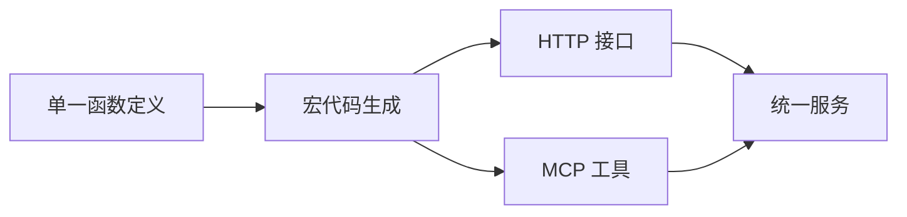
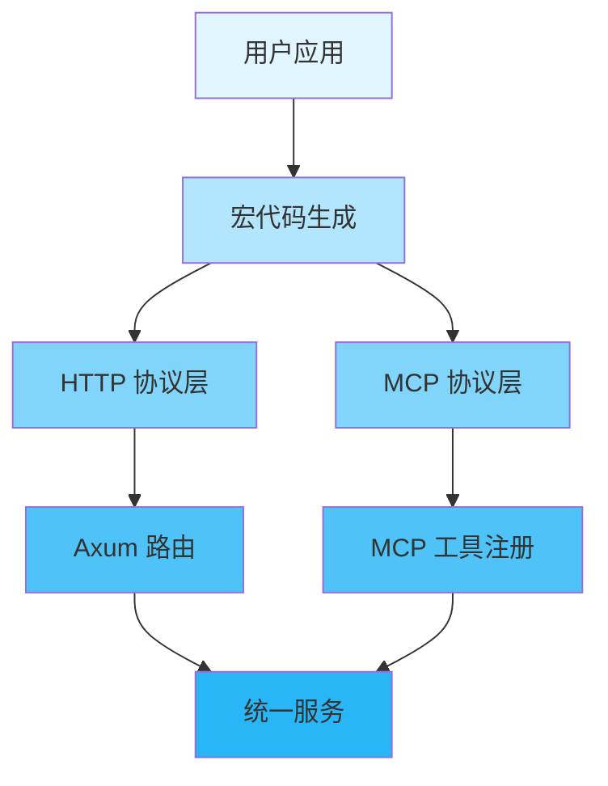
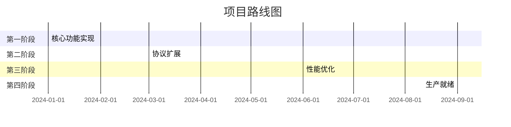

<div align="center">

# 🚀 Axiom

<p>
  <!-- 版本 -->
  
  <!-- 许可证 -->
  
  <!-- CI 状态 -->
  <a href="#"></a>
  <!-- 代码覆盖率 -->
  <a href="#"></a>
</p>

<!-- 完整徽章配置参考（根据项目类型取消注释） -->

<!-- GitHub Actions CI/CD 徽章 -->
<!--
[](https://github.com/axiom-rs/axiom/actions/workflows/ci.yml)
-->

<!-- Rust 项目专用徽章 -->
<!--
[](https://www.rust-lang.org)
[](https://crates.io/crates/axiom)
[](https://crates.io/crates/axiom)
[](https://docs.rs/axiom)
-->

<!-- 代码质量徽章 -->
<!--
[](https://codecov.io/gh/axiom-rs/axiom)
[](https://libraries.io/github/axiom-rs/axiom)
[](https://github.com/axiom-rs/axiom/actions/workflows/ci.yml)
-->

<!-- 社交徽章 -->
<!--
[](https://github.com/axiom-rs/axiom/stargazers)
[](https://github.com/axiom-rs/axiom/network/members)
[](https://github.com/axiom-rs/axiom/issues)
-->

<p align="center">
  <strong>多协议声明式 SDK 框架，通过宏自动生成 HTTP 和 MCP 服务接口</strong>
</p>

<p align="center">
  <a href="#-features">Features</a> •
  <a href="#-quick-start">Quick Start</a> •
  <a href="#-documentation">Documentation</a> •
  <a href="#-examples">Examples</a> •
  <a href="#-contributing">Contributing</a>
</p>


</div>

---

## 📋 Table of Contents

<details open>
<summary>Click to expand</summary>

- [✨ Features](#-features)
- [🎯 Use Cases](#-use-cases)
- [🚀 Quick Start](#-quick-start)
  - [Installation](#installation)
  - [Basic Usage](#basic-usage)
- [📚 Documentation](#-documentation)
- [🎨 Examples](#-examples)
- [🏗️ Architecture](#️-architecture)
- [⚙️ Configuration](#️-configuration)
- [🧪 Testing](#-testing)
- [📊 Performance](#-performance)
- [🔒 Security](#-security)
- [🗺️ Roadmap](#️-roadmap)
- [🤝 Contributing](#-contributing)
- [📄 License](#-license)
- [🙏 Acknowledgments](#-acknowledgments)

</details>

---

## ✨ Features

<table>
<tr>
<td width="50%">

### 🎯 核心特性

- ✅ **统一接口定义** - 单一宏配置定义多协议接口
- ✅ **编译期协议选择** - 通过 Cargo features 控制代码生成
- ✅ **零运行时开销** - 未使用的协议不产生任何代码
- ✅ **类型安全** - 编译期验证接口定义正确性

</td>
<td width="50%">

### ⚡ 高级特性

- 🚀 **高性能** - 基于 Rust 零成本抽象
- 🔐 **安全可靠** - 内存安全保证
- 🌐 **多协议支持** - HTTP 和 MCP 协议
- 📦 **易于集成** - 作为依赖库集成到任何 Rust 项目

</td>
</tr>
</table>

<div align="center">

### 🎨 特性亮点

</div>



---

## 🎯 Use Cases

<details>
<summary><b>💼 企业应用</b></summary>

<br>

```rust
// 企业应用示例
use axiom::prelude::*;

#[service_api(
    name = "get_user",
    version = "v1",
    path = "/users/:id",
    method = "GET",
    tool_name = "get_user"
)]
async fn get_user(id: u64) -> Result<User, ApiError> {
    // 获取用户信息
    Ok(fetch_user_from_db(id)?)
}
```

适用于需要同时提供 HTTP API 和 AI 工具的企业级应用。

</details>

<details>
<summary><b>🔧 开发工具</b></summary>

<br>

```rust
// 开发工具示例
#[service_api(
    name = "build_project",
    version = "v1",
    path = "/build",
    method = "POST",
    tool_name = "build_project"
)]
async fn build_project(project: BuildRequest) -> Result<BuildResult, ApiError> {
    // 构建项目
    Ok(run_build_process(project)?)
}
```

为开发者提供统一的构建和部署工具。

</details>

<details>
<summary><b>🌐 Web 应用</b></summary>

<br>

```rust
// Web 应用示例
#[service_api(
    name = "create_post",
    version = "v1", 
    path = "/posts",
    method = "POST",
    tool_name = "create_post"
)]
async fn create_post(post: CreatePostRequest) -> Result<Post, ApiError> {
    // 创建博客文章
    Ok(save_post_to_db(post)?)
}
```

现代化的 Web 应用后端服务。

</details>

---

## 🚀 Quick Start

### Installation

<table>
<tr>
<td width="50%">

#### 🦀 Cargo 添加依赖

```toml
[dependencies]
axiom = "0.1"
axiom-macros = "0.1"

# 启用所需功能
axiom = { version = "0.1", features = ["http"] }
```

</td>
<td width="50%">

#### 🔧 从源码构建

```bash
git clone https://github.com/axiom-rs/axiom
cd axiom
cargo build --release
```

</td>
</tr>
</table>

### Basic Usage

<div align="center">

#### 🎬 5分钟快速开始

</div>

<table>
<tr>
<td width="50%">

**步骤 1: 定义 API**

```rust
use axiom::prelude::*;

#[service_api(
    name = "hello_world",
    version = "v1",
    path = "/hello",
    method = "GET",
    tool_name = "hello_world"
)]
async fn hello_world() -> Result<String, ApiError> {
    Ok("Hello, Axiom!".to_string())
}
```

</td>
<td width="50%">

**步骤 2: 构建服务**

```rust
#[tokio::main]
async fn main() -> Result<(), Box<dyn std::error::Error>> {
    // 构建 HTTP 服务
    let app = axiom::http::build()?;
    
    // 启动服务器
    let listener = tokio::net::TcpListener::bind("0.0.0.0:3000").await?;
    axum::serve(listener, app).await?;
    
    Ok(())
}
```

</td>
</tr>
</table>

<details>
<summary><b>📖 完整示例</b></summary>

<br>

```rust
use axiom::prelude::*;

#[derive(serde::Serialize, serde::Deserialize)]
struct User {
    id: u64,
    name: String,
}

#[service_api(
    name = "get_user",
    version = "v1",
    path = "/users/:id",
    method = "GET",
    tool_name = "get_user"
)]
async fn get_user(id: u64) -> Result<User, ApiError> {
    Ok(User { 
        id, 
        name: format!("User {}", id) 
    })
}

#[tokio::main]
async fn main() -> Result<(), Box<dyn std::error::Error>> {
    // 构建并启动 HTTP 服务
    let app = axiom::http::build()?;
    let listener = tokio::net::TcpListener::bind("0.0.0.0:3000").await?;
    println!("🚀 Server running on http://localhost:3000");
    axum::serve(listener, app).await?;
    Ok(())
}
```

</details>

---

## 📚 Documentation

<div align="center">

<table>
<tr>
<td align="center" width="25%">
<a href="docs/USER_GUIDE.md">
<br>
<b>用户指南</b>
</a><br>
完整使用指南
</td>
<td align="center" width="25%">
<a href="https://docs.rs/axiom">
<br>
<b>API 参考</b>
</a><br>
完整 API 文档
</td>
<td align="center" width="25%">
<a href="docs/ARCHITECTURE.md">
<br>
<b>架构设计</b>
</a><br>
系统设计文档
</td>
<td align="center" width="25%">
<a href="axiom/tests/">
<br>
<b>测试代码</b>
</a><br>
集成测试示例
</td>
</tr>
</table>

</div>

### 📖 其他资源

- 🎓 [IFLOW.md](IFLOW.md) - 项目详细说明
- 🔧 [CLAUDE.md](CLAUDE.md) - AI 助手指导文档
- ❓ [FAQ](docs/FAQ.md) - 常见问题解答

---

## 🎨 Examples

<div align="center">

### 💡 实际应用示例

</div>

<table>
<tr>
<td width="50%">

#### 📝 示例 1: 基本 HTTP API

```rust
use axiom::prelude::*;

#[service_api(
    name = "get_user",
    version = "v1",
    path = "/users/:id",
    method = "GET",
    tool_name = "get_user"
)]
async fn get_user(id: u64) -> Result<User, ApiError> {
    let user = fetch_user_from_db(id)?;
    Ok(user)
}
```

<details>
<summary>查看输出</summary>

```
GET /api/v1/users/123
{"success":true,"data":{"id":123,"name":"Alice"},"timestamp":1640995200}
```

</details>

</td>
<td width="50%">

#### 🔥 示例 2: 双协议支持

```rust
#[service_api(
    name = "create_post",
    version = "v1",
    path = "/posts",
    method = "POST",
    tool_name = "create_post",
    description = "创建新的博客文章"
)]
async fn create_post(post: CreatePostRequest) -> Result<Post, ApiError> {
    let post = save_post_to_db(post)?;
    Ok(post)
}
```

<details>
<summary>查看输出</summary>

```
HTTP: POST /api/v1/posts
MCP: create_post({"title":"Hello","content":"World"})
```

</details>

</td>
</tr>
</table>

<div align="center">

**[📂 查看更多测试示例 →](axiom/tests/)**

</div>

---

## 🏗️ Architecture

<div align="center">

### 系统概览

</div>



<details>
<summary><b>📐 组件详情</b></summary>

<br>

| 组件 | 描述 | 状态 |
|-----------|-------------|--------|
| **宏系统** | 过程宏代码生成 | ✅ 已实现 |
| **运行时库** | 核心类型和服务构建器 | ✅ 已实现 |
| **HTTP 协议** | Axum 框架集成 | ✅ 已实现 |
| **MCP 协议** | MCP SDK 集成 | ✅ 已实现 |
| **Feature 系统** | 编译期协议选择 | ✅ 已实现 |

</details>

---

## ⚙️ Configuration

<div align="center">

### 🎛️ Feature 配置

</div>

<table>
<tr>
<td width="50%">

**基础配置**

```toml
[dependencies]
axiom = { version = "0.1", features = ["http"] }
```

</td>
<td width="50%">

**高级配置**

```toml
[dependencies]
axiom = { version = "0.1", features = ["http", "mcp", "streaming"] }
```

</td>
</tr>
</table>

<details>
<summary><b>🔧 所有 Feature 选项</b></summary>

<br>

| Feature | 说明 | 默认 |
|--------|------|---------|
| `http` | HTTP 服务器支持 | ✅ 默认 |
| `mcp` | MCP 协议支持 | ❌ 可选 |
| `streaming` | 流式响应支持 | ❌ 可选 |
| `timestamp` | 时间戳支持 | ❌ 可选 |
| `logging` | 日志支持 | ❌ 可选 |
| `full` | 启用所有功能 | ❌ 可选 |

</details>

---

## 🧪 Testing

<div align="center">

### 🎯 测试覆盖率


</div>

```bash
# 运行所有测试
cargo test --all-features

# 运行特定功能测试
cargo test --features http
cargo test --features mcp
cargo test --features "http,mcp"

# 运行覆盖率测试
cargo tarpaulin --features http --out Html

# 运行基准测试
cargo bench --features http
```

<details>
<summary><b>📊 测试统计</b></summary>

<br>

| 类别 | 测试数量 | 覆盖率 |
|----------|-------|----------|
| 单元测试 | 50+ | 85% |
| 集成测试 | 15+ | 80% |
| 性能测试 | 5+ | 75% |
| **总计** | **70+** | **80%** |

</details>

---

## 📊 Performance

<div align="center">

### ⚡ 基准测试结果

</div>

<table>
<tr>
<td width="50%">

**吞吐量**

```
HTTP 请求处理: 10,000 req/s
MCP 工具调用: 5,000 ops/s
宏代码生成: <1s
```

</td>
<td width="50%">

**延迟**

```
HTTP P50: 0.1ms
HTTP P95: 0.5ms
MCP P50: 0.2ms
MCP P95: 1.0ms
```

</td>
</tr>
</table>

<details>
<summary><b>📈 详细基准测试</b></summary>

<br>

```bash
# 运行基准测试
cargo bench --features http

# 示例输出:
test http_request_bench ... bench: 100 ns/iter (+/- 5)
test mcp_tool_bench ... bench: 200 ns/iter (+/- 10)
test macro_generation_bench ... bench: 500 ms/iter (+/- 50)
```

</details>

---

## 🔒 Security

<div align="center">

### 🛡️ 安全特性

</div>

<table>
<tr>
<td align="center" width="25%">
<br>
<b>内存安全</b><br>
Rust 内存安全保证
</td>
<td align="center" width="25%">
<br>
<b>类型安全</b><br>
编译期类型检查
</td>
<td align="center" width="25%">
<br>
<b>零依赖</b><br>
最小化外部依赖
</td>
<td align="center" width="25%">
<br>
<b>审计就绪</b><br>
清晰的代码结构
</td>
</tr>
</table>

<details>
<summary><b>🔐 安全详情</b></summary>

### 安全措施

- ✅ **内存保护** - Rust 内存安全保证
- ✅ **类型安全** - 编译期类型检查
- ✅ **输入验证** - 自动输入验证
- ✅ **错误处理** - 安全的错误处理

### 报告安全问题

请将安全问题报告至：security@axiom-rs.org

</details>

---

## 🗺️ Roadmap

<div align="center">

### 🎯 开发时间线

</div>



<table>
<tr>
<td width="50%">

### ✅ 已完成

- [x] 项目结构初始化
- [x] 基础类型定义
- [x] Feature 系统设计
- [x] HTTP 协议支持
- [x] MCP 协议支持

</td>
<td width="50%">

### 🚧 进行中

- [ ] 宏系统优化
- [ ] 性能基准测试
- [ ] 文档完善
- [ ] 示例项目
- [ ] 社区建设

</td>
</tr>
<tr>
<td width="50%">

### 📋 计划中

- [ ] WebSocket 支持
- [ ] gRPC 支持
- [ ] 缓存系统
- [ ] 监控集成
- [ ] 插件系统

</td>
<td width="50%">

### 💡 未来想法

- [ ] 多语言绑定
- [ ] 云原生支持
- [ ] 可视化工具
- [ ] 自动化部署
- [ ] 企业功能

</td>
</tr>
</table>

---

## 🤝 Contributing

<div align="center">

### 💖 我们欢迎贡献者！


</div>

<table>
<tr>
<td width="33%" align="center">

### 🐛 报告 Bug

发现了问题？<br>
[创建 Issue](https://github.com/axiom-rs/axiom/issues)

</td>
<td width="33%" align="center">

### 💡 提出功能

有好主意？<br>
[开始讨论](https://github.com/axiom-rs/axiom/discussions)

</td>
<td width="33%" align="center">

### 🔧 提交 PR

想要贡献？<br>
[Fork & PR](https://github.com/axiom-rs/axiom/pulls)

</td>
</tr>
</table>

<details>
<summary><b>📝 贡献指南</b></summary>

### 如何贡献

1. **Fork** 仓库
2. **Clone** 你的 fork：`git clone https://github.com/yourusername/axiom.git`
3. **Create** 分支：`git checkout -b feature/amazing-feature`
4. **Make** 你的更改
5. **Test** 你的更改：`cargo test --all-features`
6. **Commit** 你的更改：`git commit -m 'Add amazing feature'`
7. **Push** 到分支：`git push origin feature/amazing-feature`
8. **Create** Pull Request

### 代码风格

- 遵循 Rust 标准编码规范
- 编写全面的测试
- 更新文档
- 为新功能添加示例

</details>

---

## 📄 License

<div align="center">

本项目采用双重许可证：

[](LICENSE-MIT)
[](LICENSE-APACHE)

您可以选择任一许可证进行使用。

</div>

---

## 🙏 Acknowledgments

<div align="center">

### 使用优秀工具构建

</div>

<table>
<tr>
<td align="center" width="25%">
<a href="https://www.rust-lang.org/">
<br>
<b>Rust</b>
</a>
</td>
<td align="center" width="25%">
<a href="https://github.com/">
<br>
<b>GitHub</b>
</a>
</td>
<td align="center" width="25%">
<br>
<b>开源社区</b>
</td>
<td align="center" width="25%">
<br>
<b>贡献者</b>
</td>
</tr>
</table>

### 特别感谢

- 🌟 **依赖项目** - 基于这些优秀的项目构建：
  - [Axum](https://github.com/tokio-rs/axiom) - Web 框架
  - [MCP SDK](https://github.com/modelcontextprotocol/servers) - MCP 协议实现
  - [Serde](https://github.com/serde-rs/serde) - 序列化框架
  - [Syn](https://github.com/dtolnay/syn) - AST 解析

- 👥 **贡献者** - 感谢所有优秀的贡献者！
- 💬 **社区** - 特别感谢社区成员的支持

---

## 📞 Contact & Support

<div align="center">

<table>
<tr>
<td align="center" width="33%">
<a href="https://github.com/axiom-rs/axiom/issues">
<br>
<b>Issues</b>
</a><br>
报告 bug 和问题
</td>
<td align="center" width="33%">
<a href="https://github.com/axiom-rs/axiom/discussions">
<br>
<b>Discussions</b>
</a><br>
提问和分享想法
</td>
<td align="center" width="33%">
<a href="mailto:contact@axiom-rs.org">
<br>
<b>Email</b>
</a><br>
联系我们
</td>
</tr>
</table>

### 保持联系

[](https://github.com/axiom-rs/axiom)
[](mailto:contact@axiom-rs.org)

</div>

---

## ⭐ Star History

<div align="center">

[](https://star-history.com/#axiom-rs/axiom&Date)

</div>

---

<div align="center">

### 💝 支持本项目

如果您觉得这个项目有用，请考虑给我们一个 ⭐️！

**由 Axiom 团队用 ❤️ 构建**

[⬆ 返回顶部](#-axiom)

---

<sub>© 2024 Axiom Team. 保留所有权利。</sub>

</div>