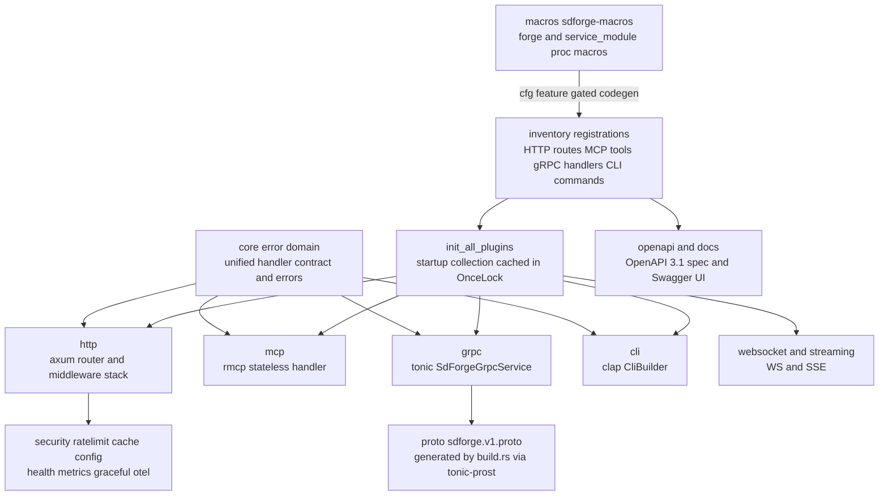
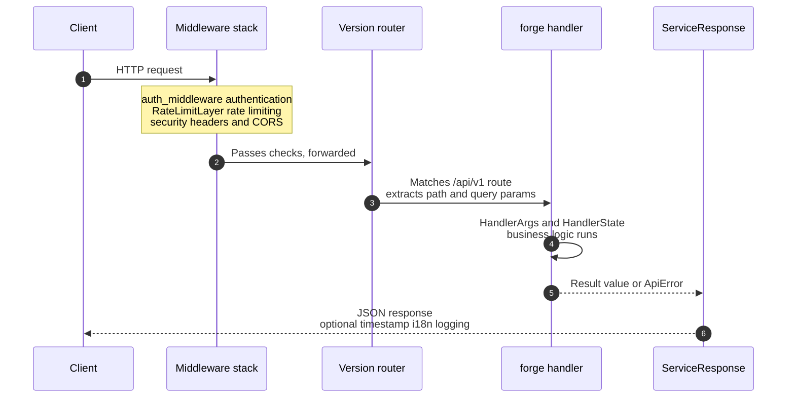
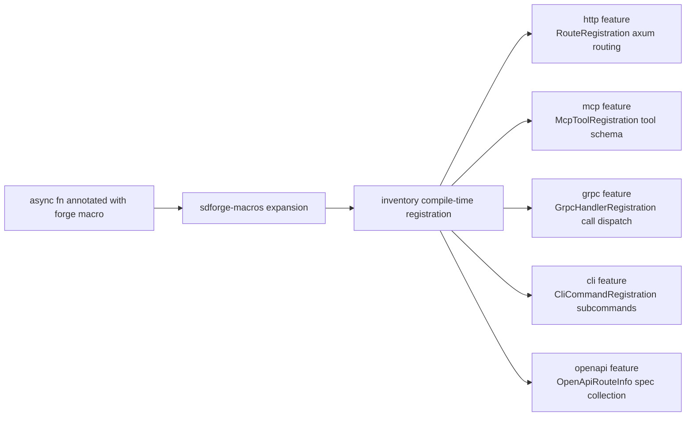

<div align="center">


[](https://github.com/Kirky-X/sdforge/actions/workflows/ci.yml) [](https://crates.io/crates/sdforge) [](https://docs.rs/sdforge) [](https://crates.io/crates/sdforge) [](LICENSE) [](https://www.rust-lang.org/) [](https://codecov.io/gh/Kirky-X/sdforge)

[中文](README.md) | **English**

**One macro annotation, multi-protocol SDKs assembled at compile time**

[✨ Features](#-features) • [🚀 Quick Start](#-quick-start) • [📚 Documentation](#-documentation) • [💻 Examples](#-examples) • [🤝 Contributing](#-contributing)

</div>

---

SDForge is a declarative SDK framework for Rust. Annotate a function once with the `#[forge]` procedural macro, and the framework generates registration code for five protocols at compile time: HTTP, MCP, gRPC, WebSocket, and CLI. Protocol selection is decided entirely by Cargo features; protocols you do not enable produce zero compiled code.

<div align="center">

<table>
  <tr>
    <td align="center" width="25%">🎯<br><b>Unified Annotation</b><br>One <code>#[forge]</code> macro defines an endpoint<br>five protocols consume the same metadata</td>
    <td align="center" width="25%">⚡<br><b>Compile-Time Selection</b><br>feature-gated code generation<br>unused protocols compile to nothing</td>
    <td align="center" width="25%">🌐<br><b>Five Protocol Entrypoints</b><br>HTTP / MCP / gRPC<br>WebSocket / CLI</td>
    <td align="center" width="25%">🛡️<br><b>Secure Defaults</b><br>auth, rate limiting, audit<br>fail-safe defaults</td>
  </tr>
</table>

</div>

---

## 📋 Table of Contents

<details open>
<summary>📑 Table of Contents</summary>

- [✨ Features](#-features)
- [🚀 Quick Start](#-quick-start)
- [🎨 Feature Flags](#-feature-flags)
- [📚 Documentation](#-documentation)
- [💻 Examples](#-examples)
- [🏗️ Architecture](#️-architecture)
- [🔄 Core Execution Path](#-core-execution-path)
- [🌐 One Annotation, Five Protocols](#-one-annotation-five-protocols)
- [🧪 Testing](#-testing)
- [📊 Performance](#-performance)
- [🔒 Security](#-security)
- [🗺️ Roadmap](#️-roadmap)
- [🤝 Contributing](#-contributing)
- [📋 Changelog](#-changelog)
- [📄 License](#-license)
- [🙏 Acknowledgments](#-acknowledgments)
- [📞 Contact & Support](#-contact--support)
- [⭐ Star History](#-star-history)

</details>

---

## ✨ Features

| Feature | Description |
|---------|-------------|
| 🎯 **Unified interface definition** | A single `#[forge]` macro configures HTTP, MCP, gRPC, WebSocket, and CLI at once |
| ⚡ **Zero protocol tax** | Protocol selection happens at compile time; no runtime probing or dynamic loading |
| 🌐 **Multi-protocol support** | Axum 0.8, rmcp 3.2 (MCP 2026-07-28 spec), tonic, WebSocket, SSE, clap |
| 🔒 **Type safety** | Interface definitions validated at compile time; trybuild covers compile-failure cases |
| 🛡️ **Security features** | API Key / JWT Bearer auth, limiteron rate limiting, audit logging, security headers |
| 💾 **In-memory caching** | oxcache provides LRU, pattern invalidation, batch ops, and stats; no database required |
| 🔧 **Configuration management** | Self-contained TOML config with modular defaults and Builder pattern |
| 📊 **Versioning** | Built-in `/api/{version}` version routing and `#[service_module]` module prefixes |
| 📜 **OpenAPI 3.1** | Routes collected at compile time via utoipa; runtime spec generation + Swagger UI |
| 🌍 **Internationalization** | ICU4X locale-aware formatting and Accept-Language parsing |
| 🔭 **Observability** | Prometheus metrics, OTLP export, health probes, graceful shutdown, request context |
| 🧩 **Feature composition** | 30+ Cargo features assembled on demand; the always-on core depends on no protocol stack |

<details>
<summary>🔧 Advanced capabilities, enabled on demand</summary>

| Capability | Feature | Description |
|------------|---------|-------------|
| Parameter validation | `validate` | `#[forge(validate)]` + `#[param(ge/le/...)]`; 400 with field-level errors |
| Declarative pagination | `paginate` | `#[forge(paginate)]` auto page/size and `{items,total,next}` wrapper |
| ETag conditional requests | `etag` | Automatic strong ETag (SHA-256) on GET; If-None-Match returns 304 |
| Lifecycle hooks | `lifecycle` | `#[forge(on_start/on_stop)]` process hooks, ordered with graceful shutdown |
| Hook pipeline | `hooks` | Pre/post handler hooks (middleware-style) with a unified error contract |
| Graceful shutdown | `graceful` | SIGTERM/SIGINT: stop accepting, drain in-flight, phased teardown |
| Health probes | `health` | `/healthz` and `/readyz` auto-mounted by `build_with_config` (auth bypassed) |
| Prometheus metrics | `metrics` | Request counts, latency histograms, status code distribution on `/metrics` |
| OTel export | `otel` | OTLP/HTTP JSON export of request spans and metric snapshots, zero extra deps |
| Request context | `context` | request_id/trace_id generation and cross-protocol (HTTP/MCP/gRPC/WS) injection |
| Response timestamps | `timestamp` | Auto-add timestamps to responses |
| Structured logging | `logging` | Structured request logging |
| inklog bridge | `inklog` | Route bare `log` calls into the inklog LoggerManager pipeline |
| trait-kit integration | `kit` | AsyncKit module graph integration and `LimiteronForgeAdapter` |
| SIMD JSON | `simd-json` | SIMD-accelerated JSON serialization/deserialization |

</details>

---

## 🚀 Quick Start

### 📦 Installation

```bash
cargo add sdforge
```

Or add it to your `Cargo.toml` manually (current version `0.5.0-rc.3`):

```toml
[dependencies]
sdforge = { version = "0.5.0-rc.3", features = ["http"] }
```

Minimum requirements:

- **Rust 1.97.1+** (edition 2024, toolchain pinned by `rust-toolchain.toml`)
- **protoc**: only needed when the `grpc` feature is enabled (`build.rs` compiles the protobuf)

> `sdforge` enables no features by default (`default = []`); enable protocol features explicitly as needed.

### 💡 Minimal runnable example

The following example comes from [`examples/basic_cli.rs`](examples/basic_cli.rs) (`cli` feature):

```rust
use sdforge::cli::CliBuilder;
use sdforge::core::ApiError;
use sdforge::forge;

#[forge(name = "echo", version = "1.0", description = "Echo a greeting", cli = true)]
async fn echo(name: String) -> Result<String, ApiError> {
    Ok(format!("Hello, {}!", name))
}

#[tokio::main]
async fn main() {
    sdforge::init_all_plugins();
    // execute() returns `!`: build / parse / dispatch / output / exit all happen inside
    CliBuilder::new().execute().await;
}
```

```bash
cargo run --example basic_cli --features cli -- echo --name world
# Output: Hello, world! (smart Value::String extraction, no quotes)
```

### 🧭 Core concepts

- A `#[forge]` annotation describes one set of endpoint metadata: name, version, path, method, description
- The macro generates registration code per enabled feature, submitted at compile time via `inventory::submit!()`
- At startup, `init_all_plugins()` collects all registrations once (cached in a `OnceLock`)
- Pick the entrypoint per protocol: `http::build()` / rmcp stdio / `SdForgeGrpcService` / `CliBuilder::execute()`

### 🔧 `#[forge]` macro parameters

| Parameter      | Description                                                        | Required | Default |
|----------------|--------------------------------------------------------------------|----------|---------|
| `name`         | Endpoint name                                                      | Yes      | -       |
| `version`      | API version                                                        | Yes      | -       |
| `path`         | HTTP path (e.g., `/users/:id`)                                     | No       | -       |
| `method`       | HTTP method (GET/POST/PUT/DELETE, etc.)                            | No       | GET     |
| `status`       | Explicit success status code (e.g., 201 for POST create)           | No       | 200     |
| `description`  | Endpoint description                                               | No       | -       |
| `tool_name`    | MCP tool name                                                      | No       | -       |
| `grpc_method`  | gRPC method name (effective when the `grpc` feature is enabled)    | No       | -       |
| `cli`          | Register as CLI command (effective when the `cli` feature is enabled) | No    | false   |

### 🌐 Protocol combinations

| Goal | features | Scenario |
|------|----------|----------|
| HTTP only | `["http"]` | Traditional REST APIs |
| MCP only | `["mcp"]` | AI tool integration |
| HTTP + MCP dual protocol | `["http", "mcp"]` | One codebase, two entrypoints |
| Full runtime features | `["full"]` | All protocols and capabilities (excludes `simd-json`/`hex`) |

`grpc`, `websocket`, `streaming`, `openapi`, `cli`, and `cache` can all be enabled independently of `http`, in any combination.

---

## 🎨 Feature Flags

`default = []`: every feature is optional and enabled explicitly.

<table>
  <tr><th>Flag</th><th>Description</th><th>Default</th></tr>
  <tr><td><code>http</code></td><td>HTTP server (Axum 0.8 routing, Tower middleware, version routing)</td><td>❌</td></tr>
  <tr><td><code>mcp</code></td><td>MCP protocol (rmcp 3.2, 2026-07-28 spec: stateless HTTP headers, MRTR, cache semantics)</td><td>❌</td></tr>
  <tr><td><code>grpc</code></td><td>gRPC (tonic + prost, independent of http, proto generated by build.rs)</td><td>❌</td></tr>
  <tr><td><code>websocket</code></td><td>WebSocket (requires http + streaming)</td><td>❌</td></tr>
  <tr><td><code>streaming</code></td><td>SSE streaming (independent of http)</td><td>❌</td></tr>
  <tr><td><code>cli</code></td><td>CLI integration (clap, independent of http)</td><td>❌</td></tr>
  <tr><td><code>openapi</code></td><td>OpenAPI 3.1 spec generation (utoipa, independent of http)</td><td>❌</td></tr>
  <tr><td><code>docs</code></td><td>Unified docs output (Swagger UI + CLI/MCP Markdown; requires openapi + cli)</td><td>❌</td></tr>
  <tr><td><code>security</code></td><td>Auth (API Key / JWT Bearer), audit, security headers, rate limiting and caching (includes http + ratelimit-http + cache)</td><td>❌</td></tr>
  <tr><td><code>ratelimit</code></td><td>Rate limiting core (limiteron, no http dependency)</td><td>❌</td></tr>
  <tr><td><code>ratelimit-http</code></td><td>HTTP rate limiting middleware (Tower Layer; requires http + ratelimit)</td><td>❌</td></tr>
  <tr><td><code>cache</code></td><td>oxcache in-memory cache (independent of http)</td><td>❌</td></tr>
  <tr><td><code>health</code></td><td><code>/healthz</code> and <code>/readyz</code> probes (auto-mounted, auth bypassed)</td><td>❌</td></tr>
  <tr><td><code>metrics</code></td><td>Prometheus text-format <code>/metrics</code> endpoint (lightweight in-house renderer)</td><td>❌</td></tr>
  <tr><td><code>graceful</code></td><td>Graceful shutdown (SIGTERM/SIGINT: stop accepting, drain in-flight)</td><td>❌</td></tr>
  <tr><td><code>context</code></td><td>Request context (request_id/trace_id cross-protocol injection)</td><td>❌</td></tr>
  <tr><td><code>validate</code></td><td><code>#[forge(validate)]</code> parameter validation contract</td><td>❌</td></tr>
  <tr><td><code>paginate</code></td><td><code>#[forge(paginate)]</code> declarative pagination</td><td>❌</td></tr>
  <tr><td><code>etag</code></td><td>ETag conditional requests (SHA-256 strong ETag + 304)</td><td>❌</td></tr>
  <tr><td><code>lifecycle</code></td><td><code>#[forge(on_start/on_stop)]</code> lifecycle hooks</td><td>❌</td></tr>
  <tr><td><code>hooks</code></td><td>Pre/post handler hook pipeline</td><td>❌</td></tr>
  <tr><td><code>otel</code></td><td>OTLP/HTTP JSON export (zero extra dependencies)</td><td>❌</td></tr>
  <tr><td><code>logging</code></td><td>Structured request logging</td><td>❌</td></tr>
  <tr><td><code>timestamp</code></td><td>Response timestamps</td><td>❌</td></tr>
  <tr><td><code>inklog</code></td><td>inklog structured logging bridge</td><td>❌</td></tr>
  <tr><td><code>i18n</code></td><td>ICU4X internationalization (locale-aware formatting + Accept-Language parsing)</td><td>❌</td></tr>
  <tr><td><code>simd-json</code></td><td>SIMD-accelerated JSON serialization</td><td>❌</td></tr>
  <tr><td><code>limiteron-integration</code></td><td>Pulls in the limiteron dependency (foundation for kit)</td><td>❌</td></tr>
  <tr><td><code>kit</code></td><td>trait-kit AsyncKit integration (SdforgeModule graph)</td><td>❌</td></tr>
  <tr><td><code>tokio</code></td><td>Internal feature: enables the tokio dependency (pulled in automatically by other features)</td><td>❌</td></tr>
  <tr><td><code>hex</code></td><td>Hex encoding utility feature</td><td>❌</td></tr>
  <tr><td><code>full</code></td><td>All runtime features (excludes <code>simd-json</code> and <code>hex</code>)</td><td>❌</td></tr>
</table>

<details>
<summary>🔗 Feature dependency relations</summary>

- Independent of `http`: `mcp` / `grpc` / `openapi` / `cli` / `streaming` / `cache` / `timestamp` / `context` / `logging` / `inklog` / `i18n` / `simd-json` / `limiteron-integration`
- Derived from `http`: `security` (includes `ratelimit-http` → `ratelimit` and `cache`), `ratelimit-http`, `websocket` (includes `streaming`), `health` / `metrics` / `graceful` / `validate` / `paginate` / `lifecycle` / `hooks` / `otel`
- `docs` = `openapi` + `cli` (mounting the Swagger UI additionally requires `http`)
- `kit` = `trait-kit` (health + lifecycle) + `limiteron-integration` + `limiteron/kit` + `oxcache/kit`
- `full` covers 18 runtime features and excludes `simd-json` / `hex`

</details>

---

## 📚 Documentation

| Document | Description |
|----------|-------------|
| [📖 User Guide](docs/USER_GUIDE.md) | Complete tutorial from installation and core concepts to advanced usage |
| [📘 API Reference](docs/API_REFERENCE.md) | Public APIs of the core and every feature gate |
| [🏗️ Architecture](docs/ARCHITECTURE.md) | Design principles, module breakdown, data flow, security and performance design |
| [⚡ Performance Baselines](docs/PERFORMANCE.md) | Runtime hot-path criterion baselines and regression guidelines |
| [📶 Compile-Time Gating Benchmarks](docs/benchmarks/vs-server-less.md) | Compile time and artifact size: feature gating vs full build |
| [🔒 Security](docs/SECURITY.md) | Vulnerability reporting process, security design, and best practices |
| [🧾 Test Scenarios](docs/TEST_SCENARIOS.md) | Test pyramid baseline and E2E scenario definitions |
| [📋 Changelog](docs/CHANGELOG.md) | Change log for every release |
| [🤝 Contributing](docs/CONTRIBUTING.md) | Development environment, TDD workflow, and PR process |
| [📦 Online API Docs](https://docs.rs/sdforge) | Latest docs.rs documentation (all features) |

---

## 💻 Examples

### Root package examples (`cargo run --example`)

| Example | Required features | Description |
|---------|-------------------|-------------|
| `basic_cli` | `cli` | `#[forge(cli = true)]` + one-shot `CliBuilder::execute()` CLI |
| `swagger_demo` | `docs` + `http` | Swagger UI route + OpenAPI JSON + axum serve |
| `perf_regex_cache` | `cache` | Regex cache performance verification |
| `perf_lru_eviction` | `cache` | LRU eviction performance verification |
| `perf_prefix_index` | `cache` | Prefix index performance verification |
| `perf_batch_ops` | `cache` | Batch operation performance verification |

```bash
cargo run --example basic_cli --features cli -- echo --name world
cargo run --example swagger_demo --features "docs http"
cargo run --example perf_regex_cache --features cache
```

### Comprehensive example library (workspace member `sdforge-examples`, `examples/src/`)

| Module | Contents |
|--------|----------|
| `basics/` | Simple API, response building, types and error handling |
| `http/` | Routing (path params, query params), middleware (CORS) |
| `mcp/` | Tool definition & registration, MCP 2026-07-28 migration, MRTR sessions |
| `security/` | API Key auth, auth failure scenarios, full security stack |
| `cache/` | Advanced caching patterns and performance verification |
| `config/` | Configuration management (`app_config.rs`) |
| `streaming/` | SSE streaming responses |
| `websocket/` | Basic usage and chat room |
| `grpc/` | gRPC server |
| `logging/` | Structured logging |
| `openapi/` | OpenAPI spec generation (`OpenApiBuilder`, `generate_openapi_spec`) |
| `combined/` | Complete example combining multiple features (`full_example.rs`) |

### Ecosystem integration examples (`sdforge-examples` member examples)

| Example | Feature | Description |
|---------|---------|-------------|
| `oxcache_admin` | `oxcache_admin_example` | Expose oxcache management endpoints via `BackendRegistry` |
| `dbnexus_gateway` | `dbnexus_gateway_example` | Read-only data API gateway over a whitelisted table (in-memory sqlite) |

```bash
cargo run -p sdforge-examples --example oxcache_admin --features oxcache_admin_example
```

Sample configuration files live in `examples/config/` (`default.toml`, `minimal.toml`, `production.toml`, `api-key-auth.toml`).

---

## 🏗️ Architecture

SDForge consists of two crates: `macros/sdforge-macros` parses the `#[forge]` / `#[service_module]` annotations and generates feature-gated registration code, while `sdforge` is the runtime library. The runtime skeleton is built on inventory: registrations are submitted at compile time via `inventory::submit!()` and collected once at startup by `init_all_plugins()` into a `OnceLock`, preventing link-time elimination in release builds. The protocol modules (http / mcp / grpc / websocket / streaming / cli) are mutually independent and compiled per feature, all sharing the unified handler contract in `core` (`HandlerArgs` + `HandlerState`). The gRPC protobuf lives in `proto/sdforge.v1.proto` (`SdForgeService` with `Call` / `GetInfo`) and is generated by `build.rs` via tonic-prost into `OUT_DIR`. See the [Architecture document](docs/ARCHITECTURE.md) for the full design description.



### Design principles

- **Compile-time protocol selection**: disabled protocols never enter the compile graph; no runtime probing or dynamic loading
- **Inventory registration pattern**: compile-time `inventory::submit!()`; `init_all_plugins()` prevents linker elimination and returns registration counts
- **Unified handler contract**: every protocol follows `fn(HandlerArgs, HandlerState) -> HandlerFuture`
- **Three construction modes**: components support `new()` (out of the box), `builder()` (builder pattern), and `with_dependencies()` (dependency injection)
- **No database**: all data interaction goes through oxcache in-memory caching; rate limiting reuses limiteron; logging can bridge to inklog

---

## 🔄 Core Execution Path

The HTTP request hot path as an example (full data flow in the [Architecture document](docs/ARCHITECTURE.md), data flow section):



The middleware stack order, version routing, and response pipeline are assembled by `http::build()` / `build_with_config()`; the MCP, gRPC, and CLI entrypoints reuse the same handlers and response contract.

---

## 🌐 One Annotation, Five Protocols

The `#[forge]` macro generates protocol registrations for the features currently enabled; disabled protocols generate no code at all:



MCP routes via the `Mcp-Method` / `Mcp-Name` headers (or stdio) through `StatelessServerHandler`; gRPC dispatches via `SdForgeGrpcService::call()` keyed by `grpc_method`; CLI runs parse, dispatch, output, and exit code through `CliBuilder::execute()`. Protocols are decoupled at runtime.

---

## 🧪 Testing

### Test strategy matrix

| Layer | Location | Description |
|-------|----------|-------------|
| Unit tests | Embedded `#[cfg(test)]` in `src/`, `tests/unit/` | Module-level tests, including proptest property tests (`src/tests/property_tests.rs`) |
| Integration tests | `tests/integration/` | Covers http / mcp / grpc / websocket / security / cache / streaming / openapi / cli / docs / health_probes / graceful_shutdown / validate / paginate / etag / lifecycle / otel_export / status_code / rbac protocol and feature combinations |
| Macro tests | `tests/macros/`, `macros/tests/` | trybuild compile-failure cases and macro expansion verification |
| E2E | `tests/e2e/` | `e2e_advanced` covers 12 domains with 178 tests |
| Examples comprehensive tests | `examples/tests/` | All-feature re-export accessibility and cross-protocol dispatch (77 tests) plus gateway E2E |
| Benchmarks | `benches/`, `src/benches/` | criterion: `runtime_bench` / `config_and_cache_bench` / `sdforge_bench` |
| Doc-tests | `src/` doc comments | Embedded rustdoc examples |

### Running commands

```bash
# Aligned with the CI matrix (http / mcp / http,mcp / http,security / http,cache /
# http,websocket / http,grpc / http,streaming / full — 9 combinations)
cargo test --features "http,mcp" --workspace
cargo test --features full --workspace

# Lib tests (the CI coverage target)
cargo test --features full --lib

# Coverage (CI gate >=80% line coverage; same gate in lefthook pre-push)
cargo llvm-cov --features full --lib --lcov --fail-under-lines 80

# Formatting and zero-warning lint
cargo fmt --all -- --check
cargo clippy --workspace --all-targets --all-features -- -D warnings
```

Coverage measurement excludes the build.rs-generated protobuf code (`src/grpc/pb/`) via `llvm-cov.toml`.

### Test scale

About **2,900** test functions (`src/` 2,015 + `tests/` 704 + `macros/` 59 + `examples/` 126; grep count, as of v0.5.0-rc.3).

---

## 📊 Performance

### Runtime hot path (criterion baselines)

| Benchmark | Median latency | Throughput |
|-----------|----------------|------------|
| `plain_get` (routing dispatch, no path params) | ~553 ns | ~1.81 M req/s |
| `path_param_get` (1 path param) | ~604 ns | ~1.65 M req/s |
| `handler_args_build_5_params` (5-param assembly) | ~117 ns | - |
| `serialize_nested_object` (7-field nested object) | ~137 ns | - |
| `deserialize_nested_object` (same object) | ~383 ns | - |

> Environment: WSL2 (linux 6.6.87) x64, Rust 1.97.1, release profile (`lto=fat`, `codegen-units=1`), criterion medians. Reproduce with `cargo bench --bench runtime_bench --features http`. See [Performance Baselines](docs/PERFORMANCE.md) for the full methodology.

### Compile-time gating gains (feature gating vs full build)

| Metric | http only | full | Savings |
|--------|-----------|------|---------|
| Compile time (debug) | 28.88s | 54.52s | **47.0%** |
| Compile time (release) | 13.72s | 25.48s | **46.2%** |
| Framework rlib size (debug) | 33.9 MB | 100.2 MB | **66.2%** |
| Framework rlib size (release) | 3.57 MB | 9.07 MB | **60.6%** |
| Unique dependency crates | 396 | 478 | 17.2% |

> Data source: [compile-time gating benchmarks](docs/benchmarks/vs-server-less.md) (measured 2026-07-03 on AMD Ryzen 9 9950X / rustc 1.93.1 / WSL2); methodology and reproduction commands are included there.

---

## 🔒 Security

### 🚨 Reporting vulnerabilities

**Do not report security vulnerabilities through public GitHub issues.** Please use the private GitHub [Security Advisories](https://github.com/Kirky-X/sdforge/security/advisories/new) disclosure channel. The project commits to acknowledging reports within 48 hours and providing an initial assessment within 7 days. See [docs/SECURITY.md](docs/SECURITY.md).

### 🛡️ Security design highlights

- **Authentication**: API Key (versioning, LRU cache, explicit seeding, fail-loud on empty store) and JWT Bearer (HMAC-SHA256 verification, `MIN_SECRET_LENGTH=32` enforced)
- **Fail-safe defaults**: `ServerConfig` binds `127.0.0.1` by default; CORS validation checks both scheme and host
- **Unspoofable client IP**: `X-Forwarded-For` / `X-Real-IP` are not trusted without `ConnectInfo`; rate limiting and bans rely only on the TCP peer address
- **Audit**: `AuditLogger` records security events with optional HMAC-SHA256 tamper-proof signatures; key rotation is audited
- **Error sanitization**: `ApiError::Internal` is sanitized before output with an `error_id`; `ErrorContext` stays server-side only
- **Input defense**: required / unknown-field validation of MCP tool `input_schema`; 1 MiB payload caps for MCP and gRPC

### 🔍 Supply chain security

CI security gates are always on: `cargo deny check` ([deny.toml](deny.toml) policy: advisories, licenses, duplicate dependencies) + `cargo audit`, together with CodeQL, Dependabot, and pre-commit secret scanning (detect-secrets).

---

## 🗺️ Roadmap

<table>
  <tr><th>Status</th><th>Item</th><th>Notes</th></tr>
  <tr><td>🚧</td><td><b>v0.5.0 release</b></td><td>Currently at <code>0.5.0-rc.3</code>; completing coordinated releases of the dependency chain (trait-kit / oxcache / inklog / limiteron) and final verification</td></tr>
  <tr><td>✅</td><td>Custom success status codes</td><td><code>#[forge(status = &lt;code&gt;)]</code> static declaration + <code>ServiceResponse::success_with_status</code> dynamic control, released in 0.5.0-rc.2</td></tr>
  <tr><td>✅</td><td>MSRV alignment</td><td>Workspace unified to 1.97.1 (2026-09-06), covering the effective requirement under <code>--all-features</code></td></tr>
  <tr><td>📋</td><td>Unified error-code behavior contract</td><td>Evaluate aligning the status code for the same validation error between HTTP (400) and gRPC (422) (recorded behavior contract)</td></tr>
  <tr><td>📋</td><td>Dependency hygiene</td><td>Mid-term evaluation of migrating <code>bincode</code> (RUSTSEC-2025-0141 unmaintained) to <code>postcard</code> / <code>bitcode</code> / <code>rkyv</code></td></tr>
</table>

---

## 🤝 Contributing

Contributions are welcome! Please read the [Contributing Guide](docs/CONTRIBUTING.md) first.

```bash
git clone https://github.com/Kirky-X/sdforge.git
cd sdforge

# Toolchain: Rust 1.97.1 (pinned by rust-toolchain.toml); grpc needs protoc
# Install lefthook / pre-commit hooks (fmt / clippy / cargo-deny / secret scanning)
./scripts/install-pre-commit.sh

# Verify the environment
cargo build --all-features
cargo test --all-features --lib
```

Commit messages follow Conventional Commits (`feat` / `fix` / `refactor` / `docs` / `test` / `chore`, etc.); the commit-msg hook enforces this.

---

## 📋 Changelog

See [CHANGELOG.md](docs/CHANGELOG.md). Highlights of recent releases:

- **[0.5.0-rc.3]** (2026-09-10): `ResponseCacheLayer` response caching middleware, `AppConfig` security/cache fields, `AuditSink` abstraction and `InklogAuditSink`
- **[0.5.0-rc.2]** (2026-09-07): `#[forge(status = <code>)]` custom success status codes, `i18n_key` parameter and translation registry, rmcp 2.2 → 3.2
- **[0.4.7]** (2026-07-23): Removed tilde constraints from dependency versions; published the `bincode` RUSTSEC-2025-0141 ignore decision

---

## 📄 License

This project is licensed under **MIT + Commons Clause**: free to use, modify, and distribute under the MIT License, but selling requires separate written authorization from the licensor. See [LICENSE](LICENSE).

Copyright (c) 2026 Kirky.X

---

## 🙏 Acknowledgments

SDForge stands on the shoulders of an excellent open-source ecosystem. Thanks to:

- [Axum](https://github.com/tokio-rs/axum) / [Tower](https://github.com/tower-rs/tower) — HTTP service and middleware
- [rmcp](https://crates.io/crates/rmcp) — the official MCP Rust SDK
- [Tonic](https://github.com/hyperium/tonic) / [Prost](https://github.com/tokio-rs/prost) — gRPC and protobuf
- [utoipa](https://crates.io/crates/utoipa) — OpenAPI spec generation
- [clap](https://github.com/clap-rs/clap) — command-line parsing
- [inventory](https://crates.io/crates/inventory) — compile-time registration
- [ICU4X](https://github.com/unicode-org/icu4x) — internationalization
- Base workspace sibling projects [oxcache](https://github.com/Kirky-X/oxcache), [limiteron](https://github.com/Kirky-X/limiteron), [trait-kit](https://github.com/Kirky-X/trait-kit), [inklog](https://github.com/Kirky-X/inklog), [dbnexus](https://github.com/Kirky-X/dbnexus)

---

## 📞 Contact & Support

- **🐛 Issues**: [github.com/Kirky-X/sdforge/issues](https://github.com/Kirky-X/sdforge/issues)
- **💬 Discussions**: [github.com/Kirky-X/sdforge/discussions](https://github.com/Kirky-X/sdforge/discussions)
- **🏠 Repository**: <https://github.com/Kirky-X/sdforge>
- **📖 Documentation**: <https://docs.rs/sdforge>
- **👤 Maintainer**: Kirky.X

---

## ⭐ Star History

[](https://star-history.com/#Kirky-X/sdforge&Date)

### 💝 Support This Project

If you find this project useful, please consider giving it a ⭐️!

---

<div align="center">

**Built with ❤️ using Rust**

</div>
