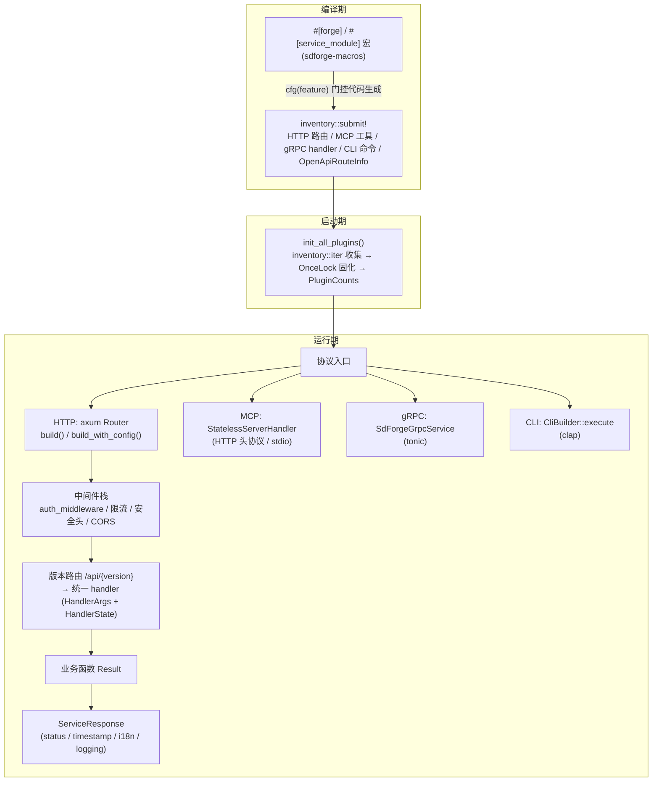

# 🏗️ Sdforge 架构文档

本文档描述 SDForge 的设计原则、系统架构、模块划分、数据流以及安全与性能设计。SDForge 是一个基于 Rust 的声明式多协议 SDK 框架：`#[forge]` 过程宏在编译期从统一的函数注解生成多协议（HTTP + MCP + gRPC + WebSocket + CLI）注册代码，未启用的协议不产生任何编译代码。

## 📋 目录

<details open>

- [概述](#-概述)
- [设计原则](#-设计原则)
- [系统架构](#️-系统架构)
- [模块划分](#-模块划分)
- [数据流](#-数据流)
- [安全设计](#-安全设计)
- [性能设计](#-性能设计)

</details>

## 🧭 概述

SDForge 由两个 crate 组成：

- **`sdforge-macros`**：过程宏 crate，实现 `#[forge]` / `#[service_module]`，负责解析注解并按 feature 门控生成各协议的注册代码
- **`sdforge`**：运行时库，提供各协议实现、核心类型、配置、安全与文档生成能力

框架的运行时骨架建立在 [inventory](https://crates.io/crates/inventory) 之上：宏生成的注册项（HTTP 路由、MCP 工具、gRPC handler、CLI 命令等）在编译期通过 `inventory::submit!()` 提交，应用启动时由 `init_all_plugins()` 一次性收集固化。

## 🧭 设计原则

1. **编译时协议选择** — 所有协议实现都由 `#[cfg(feature = "...")]` 门控。启用 `http` 不编译 MCP/gRPC/CLI 的任何代码；反之 `mcp`、`grpc`、`openapi`、`cli`、`streaming`、`cache` 也独立于 `http`（`#[forge(path=...)]` 生成的 HTTP 注册代码同样被 `#[cfg(feature = "http")]` 包裹）。量化收益：`http` only 相比 `full` 节省约 46–47% 编译时间、约六成库体积（见 [性能基准](benchmarks/vs-server-less.md)）。
2. **统一接口定义** — 单个 `#[forge]` 注解描述端点，多协议各自消费同一份元数据（名称、版本、描述、参数 schema），消除跨协议的重复定义。
3. **Inventory 注册模式** — 编译期 `inventory::submit!()` 注册、运行期收集；`init_all_plugins()` 通过 `OnceLock` 缓存收集结果，防止 release 构建（LTO + 死代码消除）剔除注册项，并返回各协议注册计数用于自检。
4. **统一注册系统** — HTTP、MCP、WebSocket、gRPC 四大协议模块共享 `define_registration!` 宏与 `Registration` trait 抽象，消除重复样板代码。
5. **三种构造模式** — 所有组件必须支持 `new()`（开箱即用）、`builder()`（Builder 模式）、`with_dependencies()`（依赖注入）。
6. **不使用数据库** — 所有数据交互通过 oxcache（内存缓存）完成，框架自身零外部服务依赖；限流复用 limiteron，日志可桥接 inklog，依赖注入复用 trait-kit（`kit` feature）。
7. **统一 handler 契约** — 所有协议的 handler 遵循 `fn(HandlerArgs, HandlerState) -> HandlerFuture`：`HandlerArgs` 由 clap / tonic / axum extractor 构造，`HandlerState` 通过 `downcast_state::<T>()` 注入。

## 🏛️ 系统架构



仓库布局：

```
sdforge/
├── src/                # 运行时库
├── macros/             # 过程宏 crate (#[forge])
├── examples/           # 综合示例库 (workspace member: sdforge-examples)
├── benches/            # 基准测试
├── proto/              # protobuf 定义 (gRPC)
├── docs/               # 文档（本目录）
├── tests/              # 集成/单元/宏测试
└── scripts/            # 构建和实用脚本
```

## 🧱 模块划分

| 模块（`src/`） | Feature | 职责 |
|----------------|---------|------|
| `core/` | 无 | 核心类型：`ServiceError` / `ServiceResponse`、`ApiMetadata`、统一 handler 契约（`handler.rs`）、inventory 注册抽象（`registration.rs`）、JSON 工具、`RegexCache`、校验（`validation.rs`） |
| `error/` | 无 | 框架错误：`ApiError`、`SdForgeError` / `SdForgeResult`、`ErrorContext`、错误 i18n |
| `domain/` | 无 | 领域抽象（如 `ForgeRateLimiter`），供集成层消费 |
| `i18n/` | `i18n`（格式化部分） | 翻译注册表（始终可用）+ ICU4X `HttpI18nFormatter` |
| `http/` | `http` | Axum 协议实现：`build()` / `build_with_config()`、版本路由、安全头、响应构造、路由注册 |
| `mcp/` | `mcp` | rmcp 集成：`StatelessServerHandler`、HTTP 头协议（`headers.rs`）、MRTR 会话（`mrtr.rs`）、缓存语义（`cache_semantics.rs`）、schema 校验 |
| `grpc/` | `grpc` | tonic 服务：`SdForgeGrpcService`、`GrpcServerConfig`、protobuf（`proto/`，build.rs 生成）、handler 注册与拦截器 |
| `websocket/` | `websocket` | 连接管理（`connection.rs`）、handler 分发（`handler.rs`）、广播（`broadcast.rs`）、消息解析（`message.rs`） |
| `streaming/` | `streaming` | SSE：`StreamEvent` / `StreamResponse`、`stream_to_sse`、`StreamBuilder` |
| `cli/` | `cli` | clap 集成：`CliBuilder`、`dispatch`、`GlobalArg`、docs 子命令 |
| `security/` | `security` / `ratelimit` / `ratelimit-http` | 认证（Bearer / API Key，`bearer/`、`types/`）、限流（limiteron 适配）、审计（`audit/`）、中间件 |
| `cache/` | `cache` | oxcache 透传与适配：`SyncCache` / `SharedCache` / `DashMapCache` |
| `openapi/` | `openapi` | `OpenApiRouteInfo` 收集与 utoipa 规范生成、`OpenApiBuilder`、路径参数 schema 映射 |
| `docs/` | `docs` | 统一文档输出：Swagger UI 路由、CLI/MCP Markdown（`generate_docs` / `write_docs`） |
| `config/` | `http` | `AppConfig` / `ServerConfig` / `AuthConfig` / `CorsConfig` / `CacheConfig` 等模块化配置 + 集中默认值 + Builder |
| `logging.rs` | `logging` | `StructuredLogger`、全局 Logger |
| `inklog.rs` | `inklog` | 裸 `log` → inklog `LoggerManager` 桥接 |
| `integrations/` | `limiteron-integration` / `kit` | trait-kit 0.3 AsyncKit 集成（`SdforgeModule`）、`LimiteronForgeAdapter` |

`macros/`（独立 crate）：`#[forge]` / `#[service_module]` 解析、参数校验、路径参数提取与 schema 生成、按 feature 门控的多协议代码生成、trybuild 编译失败测试。

## 🔀 数据流

### 编译期

1. 开发者标注 `#[forge(name, version, path, method, ...)]`
2. 宏解析参数并校验（trybuild 覆盖编译失败用例）
3. 按启用的 feature 生成注册代码：
   - `http` → `RouteRegistration`（路径/方法/版本）+ 路径参数提取器（多参数生成 `Path<(T1, ...)>` 元组按序解构；标量 Query 生成专用提取结构体）
   - `mcp` → `McpToolRegistration` + `input_schema`（required / unknown-field 校验）
   - `grpc` → `GrpcHandlerRegistration`（按 `grpc_method` 键）
   - `cli` → `CliCommandRegistration` + `CliHandlerRegistration`（1:1 成对）
   - `openapi` → `OpenApiRouteInfo`（含 `OpenApiPathParam`，路径 `:id` → `{id}`）
4. 全部注册项经 `inventory::submit!()` 进入编译产物

### 启动期

5. `main` 调用 `init_all_plugins()`：对每类注册项执行 `inventory::iter::<T>().collect()` 存入 `OnceLock<Mutex<Vec<&'static T>>>`（收集结果进程级缓存、幂等；Mutex 中毒时降级返回 0 而非连锁 panic），返回 `PluginCounts`
6. HTTP 侧 `http::build()` 依据 `RouteRegistration` 构建 Axum `Router`（含版本前缀 `/api/{version}` 与 `#[service_module]` 前缀拼接）

### 请求期（以 HTTP 为例）

7. 请求进入中间件栈：认证（`auth_middleware`，API Key / JWT Bearer）→ 限流（`RateLimitLayer`，基于 `ConnectInfo` 提取的 TCP 对端 IP）→ 安全头 / CORS / 超时
8. 版本路由匹配 `/api/{version}`，将请求分发到目标 handler；宏生成的提取器把路径/查询参数反序列化为函数参数
9. 统一 handler 契约执行：`HandlerArgs`（extractor 构造）+ `HandlerState`（`downcast_state` 注入）→ 业务函数 → `Result<T, ApiError>`
10. 响应管道：`ServiceResponse` 封装（显式 `status` / `success_with_status`）→ 可选 timestamp / logging / i18n 处理 → JSON 输出

其他协议入口复用 7–10 的后段：MCP 经 `Mcp-Method` / `Mcp-Name` 头（或 stdio）由 `StatelessServerHandler` 路由到同一批工具 handler；gRPC 经 `SdForgeGrpcService::call()` 按 `grpc_method` 路由（载荷上限 1 MiB）；CLI 经 `CliBuilder::execute()` 完成 parse → dispatch → `extract_value`（`Value::String` 输出原始串）→ 退出码。

## 🔒 安全设计

- **认证**：`security` feature 提供 API Key（版本管理、LRU 缓存、显式播种 `ApiKeySeed`、空库 fail-loud、过期反向索引强制）与 JWT Bearer（HMAC-SHA256 验签，`MIN_SECRET_LENGTH=32` 强制密钥长度）
- **fail-safe 默认值**：`ServerConfig` 默认绑定 `127.0.0.1`（而非 `0.0.0.0`）；CORS 校验同时检查 scheme 与 host，`"http://"` 这类仅 scheme 的 origin 被拒绝
- **不可伪造的客户端 IP**：无 `ConnectInfo` 时不信任 `X-Forwarded-For` / `X-Real-IP`，直接返回 `None`，由调用方安全兜底——IP 限流/封禁只能基于 TCP 对端地址
- **审计**：`AuditLogger` 记录安全事件，支持 HMAC-SHA256 签名防篡改；密钥轮换动作有审计日志
- **错误脱敏**：`ApiError::Internal.message` 清洗后输出（不含路径/堆栈），`error_id` 供日志侧关联；`ErrorContext` 仅在服务端保留
- **输入防御**：MCP 工具 `input_schema` 的 required / unknown-field 校验；MCP 与 gRPC 载荷 1 MiB 上限；并发安全模式（Mutex/RwLock 中毒感知、缓存一致性锁序、usize 下溢防护）经系统化审计修复
- **供应链**：`cargo-audit` + `cargo-deny`（`deny.toml` 策略）+ Dependabot + CodeQL；发布前强制 tiangang SAST（0 CRITICAL）与 diting 审查（无 HIGH）

详见 [安全文档](SECURITY.md)。

## ⚡ 性能设计

- **编译时裁剪是第一性能设计**：特性门控让未用协议的依赖（tonic/prost、rmcp、tokio-tungstenite、argon2/sha2 等）完全不进入编译图。实测（2026-07-03，详见 [性能基准](benchmarks/vs-server-less.md)）：
  - 编译时间：`http` only 相比 `full` 节省 47.0%（debug）/ 46.2%（release）
  - 框架库 rlib：debug 33.9 MB vs 100.2 MB（-66.2%）；release 3.57 MB vs 9.07 MB（-60.6%）
  - 依赖图：396 vs 478 个唯一 crate
- **运行期零协议税**：协议选择发生在编译期，不存在运行时协议探测或动态加载
- **注册收集幂等缓存**：`init_all_plugins()` 用 `OnceLock` 缓存 inventory 迭代结果，重复调用零开销
- **正则缓存**：`core::RegexCache` 以 LRU 缓存编译后的正则（修复过 MRU 误驱逐缺陷），避免热路径重复编译
- **内存缓存**：oxcache 承载响应/工具结果缓存，支持键规范化、模式失效、批量操作与统计
- **发布 profile**：`lto = true`、`codegen-units = 1`、`opt-level = "z"`，最大化死代码消除与体积优化（注意：链接期消除可稀释二进制层级的裁剪收益，但编译期成本节省不受影响）
