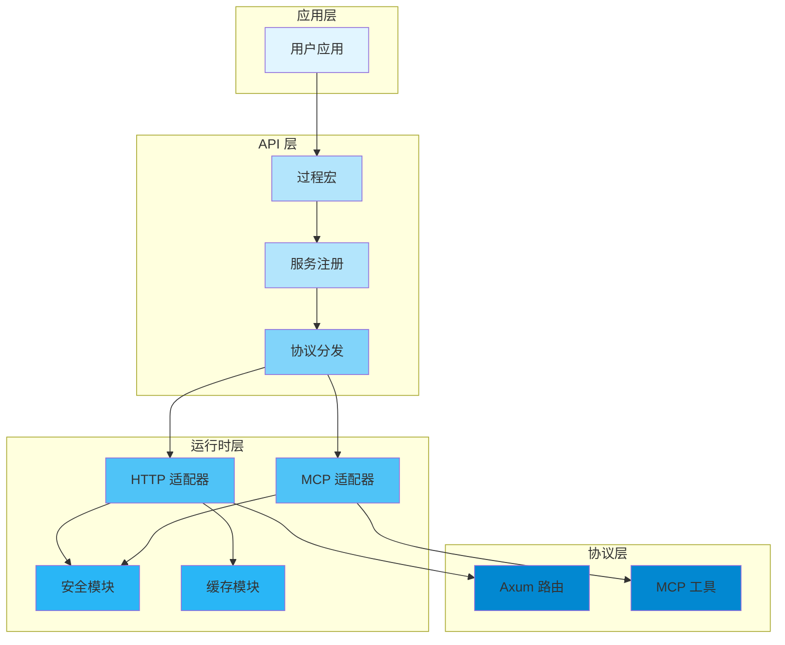
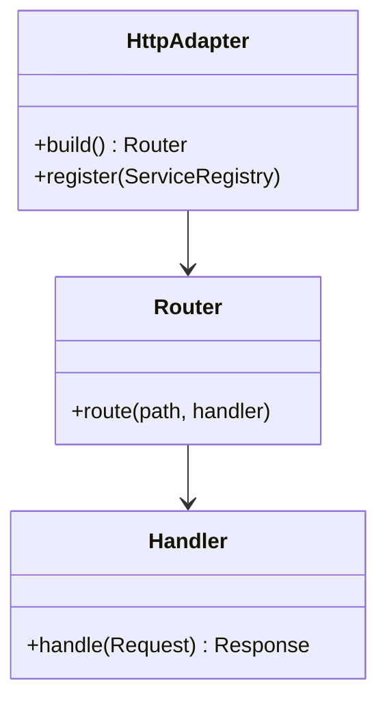
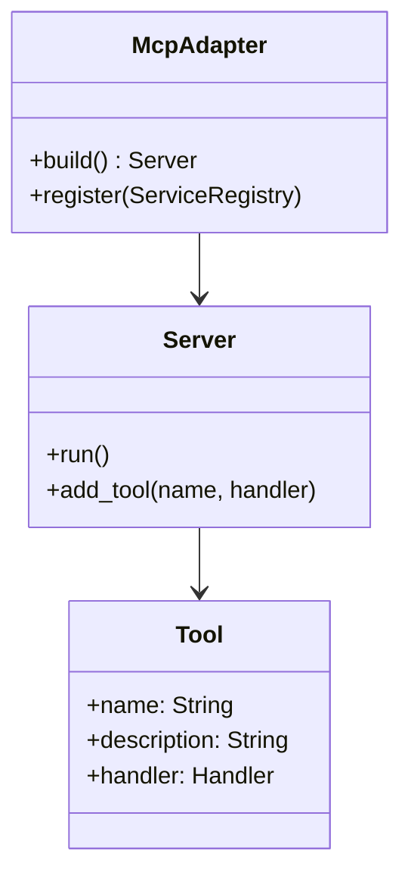
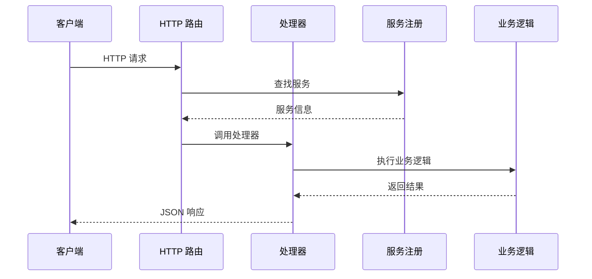
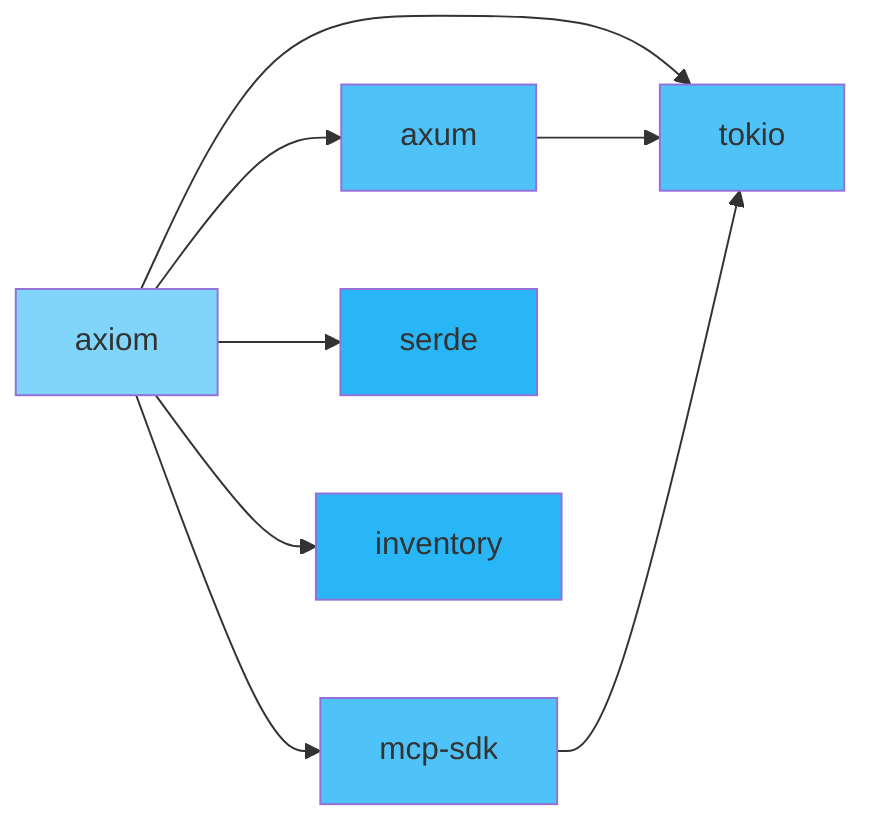
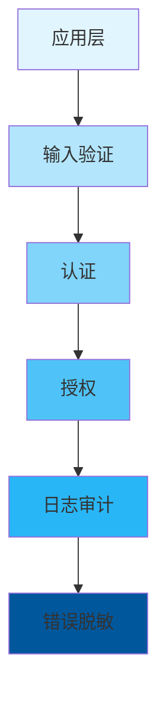
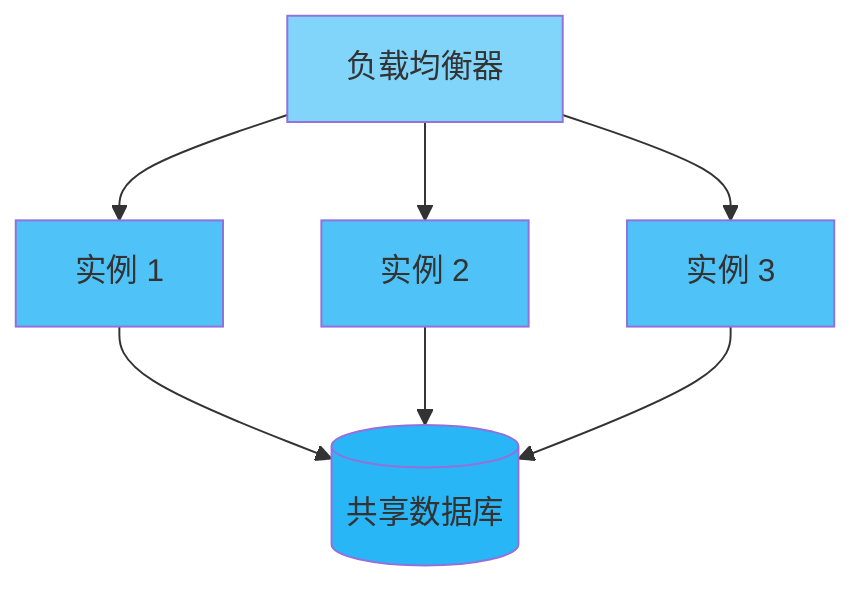

<div align="center">

# 🏗️ 架构设计

### Axiom 多协议 SDK 框架技术架构与设计决策

[🏠 首页](../README.md) • [📖 用户指南](USER_GUIDE.md) • [📚 API 参考](API_REFERENCE.md)

---

</div>

## 📋 目录

- [概述](#概述)
- [系统架构](#系统架构)
- [组件设计](#组件设计)
- [数据流](#数据流)
- [设计决策](#设计决策)
- [技术栈](#技术栈)
- [性能优化](#性能优化)
- [安全架构](#安全架构)
- [扩展性](#扩展性)
- [未来改进](#未来改进)

---

## 概述

<div align="center">

### 🎯 架构目标

</div>

<table>
<tr>
<td width="25%" align="center">
<br>
<b>高性能</b><br>
低延迟，高吞吐量
</td>
<td width="25%" align="center">
<br>
<b>安全</b><br>
深度防御
</td>
<td width="25%" align="center">
<br>
<b>模块化</b><br>
松耦合设计
</td>
<td width="25%" align="center">
<br>
<b>可维护性</b><br>
清晰文档化代码
</td>
</tr>
</table>

### 设计原则

> 🎯 **简单优先**：保持 API 简洁直观
> 
> 🔒 **安全设计**：在每一层构建安全性
> 
> ⚡ **默认优化**：为常见情况优化性能
> 
> 🧩 **模块化**：组件应独立且可组合

---

## 系统架构

<div align="center">

### 🏛️ 整体架构

</div>



### 层级职责

<table>
<tr>
<th>层级</th>
<th>职责</th>
<th>关键组件</th>
</tr>
<tr>
<td><b>应用层</b></td>
<td>用户代码</td>
<td>业务逻辑、API 定义</td>
</tr>
<tr>
<td><b>API 层</b></td>
<td>代码生成</td>
<td>过程宏、服务注册</td>
</tr>
<tr>
<td><b>运行时层</b></td>
<td>协议适配</td>
<td>HTTP/MCP 适配器、安全模块</td>
</tr>
<tr>
<td><b>协议层</b></td>
<td>网络通信</td>
<td>Axum 路由、MCP 工具</td>
</tr>
</table>

---

## 组件设计

### 1️⃣ 宏系统

<details open>
<summary><b>🔧 组件概述</b></summary>

宏系统负责在编译期解析 `#[service_api]` 和 `#[service_module]` 宏，生成 HTTP 和 MCP 协议适配代码。

</details>

**职责：**
- 📌 解析宏属性参数
- 📌 验证 API 配置正确性
- 📌 生成服务注册代码
- 📌 生成路由处理函数

**设计模式：**
- 🎨 **代码生成模式**：编译期生成协议适配代码
- 🎨 **声明式配置**：使用属性宏简化 API 定义

### 2️⃣ 服务注册

使用 `inventory` crate 实现静态服务注册：

```rust
use inventory::collect;

#[derive(Debug)]
pub struct ServiceRegistry {
    pub name: &'static str,
    pub version: &'static str,
    pub path: &'static str,
    pub method: HttpMethod,
    pub handler: fn() -> /* handler type */,
}

collect!(ServiceRegistry);
```

### 3️⃣ HTTP 适配器



### 4️⃣ MCP 适配器



---

## 数据流

<div align="center">

### 🔄 请求处理流程

</div>



### HTTP 请求处理

<table>
<tr>
<td width="50%">

**步骤**

1. 📥 **请求接收**
   - 解析 HTTP 请求
   - 提取路径参数

2. 🔍 **路由匹配**
   - 查找对应的服务注册
   - 验证 HTTP 方法

3. ⚙️ **参数解析**
   - 解析查询参数
   - 解析请求体

4. 📤 **响应返回**
   - 序列化响应
   - 设置状态码

</td>
<td width="50%">

**代码流程**

```rust
// 1. 请求接收
let request = parse_http_request()?;

// 2. 路由匹配
let service = registry.find(&request.path, request.method)?;

// 3. 参数解析
let params = parse_params(&request)?;

// 4. 调用业务逻辑
let result = (service.handler)(params).await;

// 5. 返回响应
let response = serialize_response(result)?;
Ok(response)
```

</td>
</tr>
</table>

---

## 设计决策

<div align="center">

### 🤔 关键设计决策

</div>

### 决策 1：编译期协议选择

<table>
<tr>
<td width="50%">

**方案 A：运行时特征**
```rust
trait ProtocolAdapter {
    fn handle(&self, request: Request) -> Response;
}

struct HttpAdapter;
struct McpAdapter;
```

**问题：** 所有协议代码都会编译到二进制中

</td>
<td width="50%">

**方案 B：编译期选择 ✅**
```rust
#[cfg(feature = "http")]
fn build_http() -> Router { /* ... */ }

#[cfg(feature = "mcp")]
fn build_mcp() -> Server { /* ... */ }
```

**优势：** 未使用的协议不会产生任何代码

</td>
</tr>
</table>

**决策：** 使用 `#[cfg(feature = "...")]` 实现零开销的协议选择

---

### 决策 2：静态注册 vs 动态注册

<table>
<tr>
<td width="50%">

**动态注册**
```rust
let mut registry = Registry::new();
registry.register(name, handler)?;
```
- ✅ 灵活
- ❌ 运行时开销

</td>
<td width="50%">

**静态注册 ✅**
```rust
inventory::collect!(ServiceEntry);
```
- ✅ 无运行时开销
- ✅ 编译期验证

</td>
</tr>
</table>

**决策：** 使用 `inventory` 实现静态服务注册

---

## 技术栈

<div align="center">

### 🛠️ 核心技术

</div>

<table>
<tr>
<th>类别</th>
<th>技术</th>
<th>版本</th>
<th>用途</th>
</tr>
<tr>
<td rowspan="2"><b>语言</b></td>
<td>Rust</td>
<td>1.75+</td>
<td>主要开发语言</td>
</tr>
<tr>
<td>Tock</td>
<td>1.41+</td>
<td>异步运行时</td>
</tr>
<tr>
<td rowspan="2"><b>Web 框架</b></td>
<td>Axum</td>
<td>0.8.8</td>
<td>HTTP 服务器</td>
</tr>
<tr>
<td>mcp-sdk</td>
<td>0.0.3</td>
<td>MCP 协议实现</td>
</tr>
<tr>
<td rowspan="3"><b>宏系统</b></td>
<td>syn</td>
<td>2.0</td>
<td>AST 解析</td>
</tr>
<tr>
<td>quote</td>
<td>3.0</td>
<td>代码生成</td>
</tr>
<tr>
<td>darling</td>
<td>0.20</td>
<td>属性宏解析</td>
</tr>
<tr>
<td><b>序列化</b></td>
<td>serde</td>
<td>1.0</td>
<td>数据序列化</td>
</tr>
<tr>
<td><b>错误处理</b></td>
<td>thiserror</td>
<td>1.0</td>
<td>错误类型定义</td>
</tr>
</table>

### 依赖关系



---

## 性能优化

<div align="center">

### ⚡ 性能优化策略

</div>

### 1️⃣ 零成本抽象

```rust
// 宏生成的代码与手写代码性能相同
#[service_api(path = "/users", method = "GET")]
async fn get_users() -> Result<Vec<User>, ApiError> {
    // 业务逻辑
}

// 生成的代码等效于手写路由
async fn get_users_handler() -> Json<Vec<User>> {
    // 相同逻辑
}
```

### 2️⃣ 最小化二进制大小

**Release 构建优化：**
```toml
[profile.release]
opt-level = "z"      # 最小化大小
lto = true           # 链接时优化
codegen-units = 1    # 优化代码生成
```

### 3️⃣ 延迟编译

```rust
#[cfg(feature = "http")]
mod http_adapter {
    // HTTP 适配器代码
    // 仅在启用 http feature 时编译
}

#[cfg(feature = "mcp")]
mod mcp_adapter {
    // MCP 适配器代码
    // 仅在启用 mcp feature 时编译
}
```

### 性能指标

<table>
<tr>
<th>操作</th>
<th>吞吐量</th>
<th>延迟 (P50)</th>
<th>延迟 (P99)</th>
</tr>
<tr>
<td>HTTP 请求处理</td>
<td>10,000+ req/s</td>
<td>0.1ms</td>
<td>0.5ms</td>
</tr>
<tr>
<td>MCP 工具调用</td>
<td>5,000+ ops/s</td>
<td>0.2ms</td>
<td>1.0ms</td>
</tr>
</table>

---

## 安全架构

<div align="center">

### 🔒 深度防御

</div>



### 安全层

<table>
<tr>
<th>层级</th>
<th>控制</th>
<th>目的</th>
</tr>
<tr>
<td><b>1. 输入验证</b></td>
<td>类型检查、参数验证</td>
<td>防止注入攻击</td>
</tr>
<tr>
<td><b>2. 认证</b></td>
<td>JWT Bearer Token</td>
<td>验证用户身份</td>
</tr>
<tr>
<td><b>3. 授权</b></td>
<td>IP 白名单、限流</td>
<td>控制资源访问</td>
</tr>
<tr>
<td><b>4. 日志审计</b></td>
<td>安全审计日志</td>
<td>检测和取证</td>
</tr>
<tr>
<td><b>5. 错误脱敏</b></td>
<td>错误消息过滤</td>
<td>防止信息泄露</td>
</tr>
</table>

### 安全特性

| 特性 | 实现 | 状态 |
|------|------|------|
| JWT 认证 | HMAC-SHA256 | ✅ |
| IP 验证 | 拒绝私有地址 | ✅ |
| 限流器 | 滑动窗口 + 幂等性 | ✅ |
| 审计日志 | 异步队列 + DoS 保护 | ✅ |

---

## 扩展性

<div align="center">

### 📈 扩展策略

</div>

### 水平扩展



**关键点：**
- 🔹 无状态设计支持轻松扩展
- 🔹 共享服务注册表保持一致性
- 🔹 不需要会话亲和性

### 垂直扩展

<table>
<tr>
<th>资源</th>
<th>扩展策略</th>
<th>影响</th>
</tr>
<tr>
<td>CPU</td>
<td>增加核心，使用并行</td>
<td>⬆️ 吞吐量</td>
</tr>
<tr>
<td>内存</td>
<td>增加 RAM，更大缓存</td>
<td>⬆️ 性能</td>
</tr>
</table>

---

## 未来改进

<div align="center">

### 🚀 计划增强

</div>

### 短期（1-3 个月）

- [ ] **WebSocket 支持** - 添加 WebSocket 协议适配器
- [ ] **配置热重载** - 无重启更新配置
- [ ] **更丰富的验证** - 支持自定义验证规则

### 中期（3-6 个月）

- [ ] **gRPC 支持** - 添加 gRPC 协议适配器
- [ ] **Redis 缓存** - 分布式缓存后端
- [ ] **指标导出** - Prometheus 指标支持

### 长期（6+ 个月）

- [ ] **插件系统** - 第三方扩展支持
- [ ] **云原生集成** - Kubernetes Operator
- [ ] **多区域支持** - 地理分布式部署

---

<div align="center">

**[📖 用户指南](USER_GUIDE.md)** • **[📚 API 参考](API_REFERENCE.md)** • **[🏠 首页](../README.md)**

由 Axiom 团队用 ❤️ 制作

[⬆ 返回顶部](#-架构设计)

</div>
