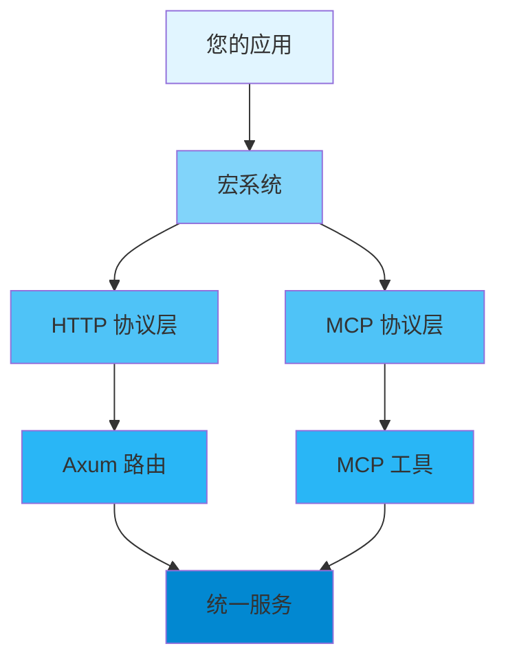

<div align="center">

# 📖 用户指南

### Axiom 多协议 SDK 框架完整使用指南

[🏠 首页](../README.md) • [📚 文档](README.md) • [🎯 测试](../axiom/tests/) • [❓ FAQ](FAQ.md)

---

</div>

## 📋 Table of Contents

- [Introduction](#introduction)
- [Getting Started](#getting-started)
  - [Prerequisites](#prerequisites)
  - [Installation](#installation)
  - [First Steps](#first-steps)
- [Core Concepts](#core-concepts)
- [Basic Usage](#basic-usage)
  - [Initialization](#initialization)
  - [Configuration](#configuration)
  - [Basic Operations](#basic-operations)
- [Advanced Usage](#advanced-usage)
  - [Custom Configuration](#custom-configuration)
  - [Performance Tuning](#performance-tuning)
  - [Error Handling](#error-handling)
- [Best Practices](#best-practices)
- [Common Patterns](#common-patterns)
- [Troubleshooting](#troubleshooting)
- [Next Steps](#next-steps)

---

## Introduction

<div align="center">

### 🎯 您将学到什么

</div>

<table>
<tr>
<td width="25%" align="center">
<br>
<b>快速上手</b><br>
5 分钟内开始使用
</td>
<td width="25%" align="center">
<br>
<b>配置管理</b><br>
自定义您的需求
</td>
<td width="25%" align="center">
<br>
<b>最佳实践</b><br>
学习正确的方式
</td>
<td width="25%" align="center">
<br>
<b>高级主题</b><br>
掌握细节
</td>
</tr>
</table>

**Axiom** 是一个基于 Rust 的声明式 SDK 框架，通过过程宏自动将 Rust 函数转换为多协议服务接口（HTTP + MCP）。本指南将带您从基础设置到高级使用模式的完整流程。

> 💡 **提示**: 本指南假设您具备基础的 Rust 知识。如果您是 Rust 新手，建议先学习 [Rust 官方教程](https://doc.rust-lang.org/book/)。

---

## Getting Started

### Prerequisites

在开始之前，请确保您已安装以下工具：

<table>
<tr>
<td width="50%">

**必需工具**
- ✅ Rust 1.75+ (stable)
- ✅ Cargo (随 Rust 一起安装)
- ✅ Git

</td>
<td width="50%">

**可选工具**
- 🔧 支持 Rust 的 IDE
- 🔧 Docker (用于容器化部署)
- 🔧 tokio 运行时

</td>
</tr>
</table>

<details>
<summary><b>🔍 验证安装</b></summary>

```bash
# 检查 Rust 版本
rustc --version
# 期望: rustc 1.75.0 或更高

# 检查 Cargo 版本
cargo --version
# 期望: cargo 1.75.0 或更高

# 检查 Git 版本
git --version
# 期望: git version 2.x.x
```

</details>

### Installation

<div align="center">

#### 选择您的安装方法

</div>

<table>
<tr>
<td width="50%">

**📦 使用 Cargo (推荐)**

```toml
[dependencies]
axiom = "0.1"
axiom-macros = "0.1"

# 启用所需功能
axiom = { version = "0.1", features = ["http"] }
```

</td>
<td width="50%">

**🐙 从源码构建**

```bash
git clone https://github.com/axiom-rs/axiom
cd axiom
cargo build --release
```

</td>
</tr>
</table>

<details>
<summary><b>🌐 其他安装方法</b></summary>

**使用 Docker**
```bash
docker pull axiom-rs/axiom:latest
docker run -it axiom-rs/axiom
```

**使用本地路径**
```toml
[dependencies]
axiom = { path = "../axiom" }
axiom-macros = { path = "../axiom-macros" }
```

</details>

### First Steps

让我们用一个简单的 "Hello World" 验证您的安装：

```rust
use axiom::prelude::*;

#[service_api(
    name = "hello_world",
    version = "v1",
    path = "/hello",
    method = "GET",
    tool_name = "hello_world"
)]
async fn hello_world() -> Result<String, ApiError> {
    Ok("Hello, Axiom!".to_string())
}

#[tokio::main]
async fn main() -> Result<(), Box<dyn std::error::Error>> {
    // 构建 HTTP 服务
    let app = axiom::http::build()?;
    
    // 启动服务器
    let listener = tokio::net::TcpListener::bind("0.0.0.0:3000").await?;
    println!("✅ Axiom 服务已就绪！");
    
    axum::serve(listener, app).await?;
    Ok(())
}
```

<details>
<summary><b>🎬 运行示例</b></summary>

```bash
# 创建新项目
cargo new hello-axiom
cd hello-axiom

# 添加依赖
cargo add axiom axiom-macros

# 将代码复制到 src/main.rs

# 运行！
cargo run --features http
```

**期望输出:**
```
✅ Axiom 服务已就绪！
```

</details>

---

## Core Concepts

理解这些核心概念将帮助您有效使用 Axiom 框架。

<div align="center">

### 🧩 关键组件

</div>



### 1️⃣ 概念一：统一 API 定义

**它是什么：** 使用单一宏定义同时生成 HTTP 和 MCP 协议接口。

**为什么重要：** 避免重复代码，保持接口一致性，简化维护。

**示例：**
```rust
#[service_api(
    name = "get_user",
    version = "v1",
    path = "/users/:id",      // HTTP 参数
    method = "GET",           // HTTP 参数
    tool_name = "get_user",   // MCP 参数
    description = "获取用户信息" // MCP 参数
)]
async fn get_user(id: u64) -> Result<User, ApiError> {
    // 单一实现，双协议支持
}
```

<details>
<summary><b>📚 了解更多</b></summary>

详细说明该概念，包括：
- 工作原理
- 使用时机
- 常见陷阱
- 相关概念

</details>

### 2️⃣ 概念二：编译期协议选择

**它是什么：** 通过 Cargo features 在编译期选择要支持的协议。

**关键特性：**
- ✅ 零运行时开销
- ✅ 最小化二进制大小
- ✅ 类型安全保证

**示例：**
```rust
// 仅 HTTP 支持
axiom = { version = "0.1", features = ["http"] }

// 双协议支持
axiom = { version = "0.1", features = ["http", "mcp"] }

// 全功能支持
axiom = { version = "0.1", features = ["full"] }
```

### 3️⃣ 概念三：模块化路径

**表格对比**

| 传统方式 | Axiom 方式 |
|---------|------------|
| 手动管理路由 | 自动路径生成 |
| 重复代码 | 单一定义 |
| 易出错 | 类型安全 |

**Axiom 方式：**
```rust
#[service_module(prefix = "/auth")]
mod auth {
    #[service_api(path = "/login", method = "POST")]
    async fn login(req: LoginRequest) -> Result<Token, ApiError> {
        // 路径: /auth/api/v1/login
    }
}
```

---

## Basic Usage

### 定义 API 接口

使用 `#[service_api]` 宏定义您的第一个 API：

```rust
use axiom::prelude::*;
use serde::{Deserialize, Serialize};

#[derive(Serialize, Deserialize)]
struct User {
    id: u64,
    name: String,
    email: String,
}

#[service_api(
    name = "get_user",
    version = "v1",
    path = "/users/:id",
    method = "GET",
    tool_name = "get_user",
    description = "根据 ID 获取用户信息"
)]
async fn get_user(id: u64) -> Result<User, ApiError> {
    // 实现您的业务逻辑
    let user = fetch_user_from_database(id).await?;
    Ok(user)
}
```

<div align="center">

| 方法 | 使用场景 | 性能 | 复杂度 |
|--------|----------|-------------|------------|
| `GET` | 数据查询 | ⚡ 快速 | 🟢 简单 |
| `POST` | 数据创建 | ⚡⚡ 优化 | 🟡 中等 |
| `PUT/DELETE` | 数据更新 | ⚡⚡ 优化 | 🟡 中等 |

</div>

### 构建和运行服务

<div align="center">

#### 🎬 完整的服务示例

</div>

```rust
use axiom::prelude::*;

#[tokio::main]
async fn main() -> Result<(), Box<dyn std::error::Error>> {
    // 构建 HTTP 服务
    let app = axiom::http::build()?;
    
    println!("🚀 Axiom 服务启动在 http://localhost:3000");
    
    // 启动服务器
    let listener = tokio::net::TcpListener::bind("0.0.0.0:3000").await?;
    axum::serve(listener, app).await?;
    
    Ok(())
}
```

### 错误处理

Axiom 提供了统一的错误处理机制：

```rust
use axiom::prelude::*;

#[service_api(
    name = "create_user",
    version = "v1",
    path = "/users",
    method = "POST",
    tool_name = "create_user"
)]
async fn create_user(user: CreateUserRequest) -> Result<User, ApiError> {
    // 验证输入
    if user.email.is_empty() {
        return Err(ApiError::InvalidInput {
            message: "邮箱不能为空".to_string(),
            field: Some("email".to_string()),
            value: Some(serde_json::json!(user.email)),
        });
    }
    
    // 创建用户
    let new_user = save_user_to_database(user).await?;
    Ok(new_user)
}
```

---

## Advanced Usage

### 模块化组织

使用 `#[service_module]` 宏组织相关的 API：

```rust
#[service_module(prefix = "/auth")]
mod auth {
    use axiom::prelude::*;
    
    #[service_api(
        name = "login",
        version = "v1",
        path = "/login",
        method = "POST",
        tool_name = "login"
    )]
    async fn login(req: LoginRequest) -> Result<AuthToken, ApiError> {
        // 实现: /auth/api/v1/login
        authenticate_user(req.username, req.password).await
    }
    
    #[service_api(
        name = "register",
        version = "v1",
        path = "/register",
        method = "POST",
        tool_name = "register"
    )]
    async fn register(req: RegisterRequest) -> Result<User, ApiError> {
        // 实现: /auth/api/v1/register
        create_new_user(req).await
    }
}

#[service_module(prefix = "/users")]
mod users {
    use axiom::prelude::*;
    
    #[service_api(
        name = "get_profile",
        version = "v1",
        path = "/:id/profile",
        method = "GET",
        tool_name = "get_profile"
    )]
    async fn get_profile(id: u64) -> Result<UserProfile, ApiError> {
        // 实现: /users/api/v1/:id/profile
        fetch_user_profile(id).await
    }
}
```

### 双协议支持

同时启用 HTTP 和 MCP 协议：

```toml
[dependencies]
axiom = { version = "0.1", features = ["http", "mcp"] }
```

```rust
use axiom::prelude::*;

#[service_api(
    name = "search_users",
    version = "v1",
    path = "/users/search",
    method = "GET",
    tool_name = "search_users",
    description = "搜索用户信息"
)]
async fn search_users(query: SearchQuery) -> Result<Vec<User>, ApiError> {
    // 同一个函数，同时支持 HTTP 和 MCP
    let results = search_in_database(query).await?;
    Ok(results)
}

#[tokio::main]
async fn main() -> Result<(), Box<dyn std::error::Error>> {
    // HTTP 服务
    let http_app = axiom::http::build()?;
    
    // MCP 服务
    let mcp_server = axiom::mcp::build().await;
    
    // 可以同时运行两个服务
    tokio::spawn(async move {
        let listener = tokio::net::TcpListener::bind("0.0.0.0:3000").await?;
        axum::serve(listener, http_app).await?;
    });
    
    // MCP 服务通常通过 stdio 运行
    mcp_server.run().await?;
    
    Ok(())
}
```

### 流式响应

启用 streaming 功能支持 SSE：

```toml
[dependencies]
axiom = { version = "0.1", features = ["http", "streaming"] }
```

```rust
use axiom::prelude::*;

#[service_api(
    name = "stream_events",
    version = "v1",
    path = "/events/stream",
    method = "GET",
    tool_name = "stream_events"
)]
async fn stream_events() -> Result<StreamResponse, ApiError> {
    let (tx, rx) = create_stream_channel();
    
    // 发送流式数据
    tokio::spawn(async move {
        for i in 1..=100 {
            let event = StreamEvent::data(format!("Event {}", i));
            let _ = tx.send(event).await;
            tokio::time::sleep(tokio::time::Duration::from_millis(100)).await;
        }
    });
    
    Ok(StreamResponse::new(rx))
}
```

---

## Best Practices

<div align="center">

### 🌟 Follow These Guidelines

</div>

### ✅ DO's

<table>
<tr>
<td width="50%">

**早期初始化**
```rust
fn main() {
    // 在开始时初始化
    let app = axiom::http::build().unwrap();
    
    // 然后使用库
    run_service(app);
}
```

</td>
<td width="50%">

**使用 Builder 模式**
```rust
let config = Config::builder()
    .option_a(value)
    .option_b(value)
    .build()?;
```

</td>
</tr>
<tr>
<td width="50%">

**正确处理错误**
```rust
match operation() {
    Ok(result) => process(result),
    Err(e) => handle_error(e),
}
```

</td>
<td width="50%">

**清理资源**
```rust
{
    let resource = acquire()?;
    use_resource(&resource)?;
    // 作用域退出时自动清理
}
```

</td>
</tr>
</table>

### ❌ DON'Ts

<table>
<tr>
<td width="50%">

**不要忽略错误**
```rust
// ❌ 错误
let _ = operation();

// ✅ 正确
operation()?;
```

</td>
<td width="50%">

**不要在异步上下文中阻塞**
```rust
// ❌ 错误 (在异步函数中)
thread::sleep(duration);

// ✅ 正确
tokio::time::sleep(duration).await;
```

</td>
</tr>
</table>

### 💡 技巧和提示

> **🔥 性能提示**: 为生产环境启用 release 模式优化：
> ```bash
> cargo build --release
> ```

> **🔒 安全提示**: 永远不要硬编码敏感数据：
> ```rust
> // ❌ 错误
> let api_key = "sk-1234567890";
> 
> // ✅ 正确
> let api_key = env::var("API_KEY")?;
> ```

> **📊 监控提示**: 在生产环境中启用指标：
> ```rust
> Config::builder().enable_metrics(true).build()?
> ```

---

## Common Patterns

### Pattern 1: 统一错误处理

```rust
use axiom::prelude::*;

fn handle_api_error(err: ApiError) -> ServiceError {
    match err {
        ApiError::NotFound { resource, .. } => {
            ServiceError::new("NOT_FOUND", format!("{} 未找到", resource), 404)
        }
        ApiError::InvalidInput { message, .. } => {
            ServiceError::new("INVALID_INPUT", message, 400)
        }
        _ => ServiceError::new("INTERNAL_ERROR", "内部错误", 500)
    }
}
```

### Pattern 2: 数据库连接池

```rust
use axiom::prelude::*;

static DB_POOL: OnceCell<Arc<DatabasePool>> = OnceCell::new();

#[service_api(
    name = "get_data",
    version = "v1",
    path = "/data/:id",
    method = "GET"
)]
async fn get_data(id: String) -> Result<Data, ApiError> {
    let pool = DB_POOL.get_or_init(|| {
        Arc::new(DatabasePool::new())
    });
    
    let data = pool.get_data(&id).await?;
    Ok(data)
}
```

### Pattern 3: 缓存装饰器

```rust
use axiom::prelude::*;
use std::collections::HashMap;

static CACHE: OnceCell<Arc<Mutex<HashMap<String, CachedData>>>> = OnceCell::new();

#[service_api(
    name = "get_cached_data",
    version = "v1",
    path = "/cache/:key",
    method = "GET"
)]
async fn get_cached_data(key: String) -> Result<Data, ApiError> {
    let cache = CACHE.get_or_init(|| Arc::new(Mutex::new(HashMap::new())));
    
    // 尝试从缓存获取
    if let Ok(cached) = cache.lock() {
        if let Some(data) = cached.get(&key) {
            return Ok(data.clone());
        }
    }
    
    // 缓存未命中，从数据源获取
    let data = fetch_from_source(&key).await?;
    
    // 存入缓存
    if let Ok(mut cached) = cache.lock() {
        cached.insert(key, data.clone());
    }
    
    Ok(data)
}
```

---

## Troubleshooting

<details>
<summary><b>❓ 问题：编译失败，提示 "feature 必须启用"</b></summary>

**解决方案:**
```bash
# 确保至少启用一个协议 feature
cargo build --features http
# 或
cargo build --features mcp
```

</details>

<details>
<summary><b>❓ 问题：运行时错误，提示 "服务构建失败"</b></summary>

**诊断:**
1. 检查宏参数是否正确
2. 验证所有必需的参数都已提供
3. 确认启用了正确的 feature

**解决方案:**
```rust
// HTTP 协议需要 path 和 method
#[service_api(
    name = "api",
    version = "v1",
    path = "/api",     // 必需
    method = "GET",   // 必需
    tool_name = "api"  // MCP 协议需要
)]
```

</details>

<details>
<summary><b>❓ 问题：性能比预期慢</b></summary>

**检查清单:**
- [ ] 是否在 release 模式下运行？
  ```bash
  cargo run --release --features http
  ```

- [ ] 是否启用了适当的 feature？
  ```toml
  [dependencies]
  axiom = { version = "0.1", features = ["http"] }
  ```

- [ ] 是否使用了批量操作？
  ```rust
  // ❌ 低效
  for item in items {
      process_one(item)?;
  }
  
  // ✅ 高效
  process_batch(&items)?;
  ```

</details>

<div align="center">

**💬 还需要帮助？** [创建 Issue](https://github.com/axiom-rs/axiom/issues) 或 [开始讨论](https://github.com/axiom-rs/axiom/discussions)

</div>

---

## Next Steps

<div align="center">

### 🎯 继续您的学习之旅

</div>

<table>
<tr>
<td width="33%" align="center">
<a href="https://docs.rs/axiom">
<br>
<b>📚 API 文档</b>
</a><br>
完整的 API 参考
</td>
<td width="33%" align="center">
<a href="../axiom/tests/">
<br>
<b>🔧 测试代码</b>
</a><br>
实际使用示例
</td>
<td width="33%" align="center">
<a href="../IFLOW.md">
<br>
<b>💻 项目说明</b>
</a><br>
详细技术文档
</td>
</tr>
</table>

---

<div align="center">

**[📖 API 参考](https://docs.rs/axiom)** • **[❓ FAQ](FAQ.md)** • **[🐛 报告问题](https://github.com/axiom-rs/axiom/issues)**

由 Axiom 团队用 ❤️ 制作

[⬆ 返回顶部](#-用户指南)

</div>