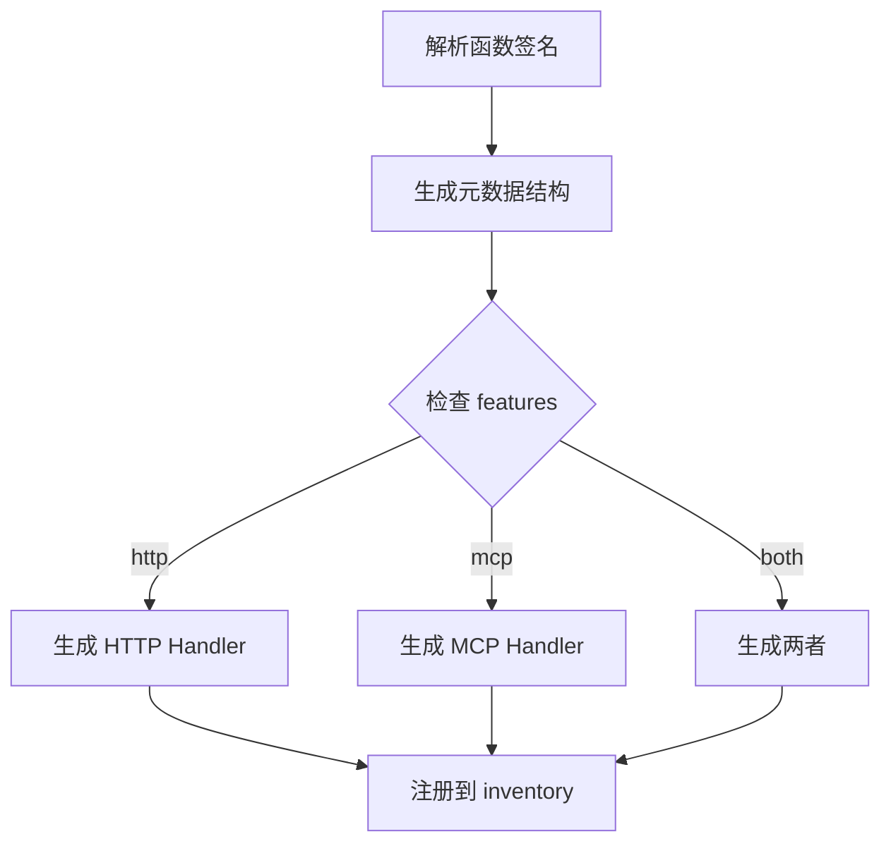

# 技术设计文档 (TDD)

## Axiom - Multi-Protocol SDK Framework

**版本**: v1.2 (修复版)  
**日期**: 2025-01-01  
**状态**: ⚠️ 部分实现 (~60%)

---

## 1. 系统架构

### 1.1 总体架构

```mermaid
graph TB
    subgraph "编译时层 Compile-Time"
        A1[#service_api 宏] --> A2[解析统一配置]
        A2 --> A3[生成元数据]
        A3 --> A4{检查 features}
        A4 -->|http| A5[生成 HTTP 代码]
        A4 -->|mcp| A6[生成 MCP 代码]
        A4 -->|both| A7[生成两种代码]
    end
    
    subgraph "抽象层 Abstraction"
        B1[统一元数据结构]
        B2[协议无关转换层]
        B3[错误统一表示]
    end
    
    subgraph "运行时层 Runtime"
        C1[HTTP Server - Axum 0.8.8]
        C2[MCP Server - mcp-sdk]
        C3[自动服务构建]
    end
    
    A5 --> B1
    A6 --> B1
    B1 --> C1
    B1 --> C2
    B2 --> C1
    B2 --> C2
    C3 --> C1
    C3 --> C2
```



### 1.2 架构原则 ⏳ 待实现

- [ ] **编译期协议选择**: 通过 `#[cfg(feature = "...")]` 控制代码生成
- [ ] **零运行时开销**: 未启用的协议不存在于最终二进制中
- [ ] **单一配置源**: 所有协议共享同一宏配置
- [ ] **自动服务发现**: 通过 `inventory` crate 自动收集接口

---

## 2. 技术栈选型

### 2.1 核心依赖

| 库               | 版本   | 用途       | Feature Gate | 选型理由     |
| ---------------- | ------ | ---------- | ------------ | ------------ |
| **syn**          | 2.0    | AST 解析   | -            | Rust 宏标准  |
| **quote**        | 1.0    | 代码生成   | -            | 配套 syn     |
| **darling**      | 0.20   | 属性解析   | -            | 简化宏参数   |
| **inventory**    | 0.3    | 静态注册   | -            | 自动收集接口 |
| **axum**         | 0.8.8 | HTTP 框架  | `http`       | 高性能       |
| **tower**        | 0.5.2 | 中间件     | `http`       | Axum 生态    |
| **tower-http**   | 0.6.2 | HTTP 中间件| `http`       | 官方支持   |
| **axum-extra**   | 0.10.0| 扩展功能  | `http`       | 类型化头部 |
| **mcp-sdk**       | 0.0.3 | MCP 协议   | `mcp`        | 官方 SDK     |
| **serde**        | 1.0    | 序列化     | -            | 标准库       |
| **tokio**        | 1.41.1| 异步运行时 | -            | 异步标准     |
| **tracing**      | 0.1.41 | 日志       | `logging`    | 结构化日志   |
| **tokio-stream** | 0.1.17 | 流处理     | `streaming`  | Tokio 官方   |
| **validator**     | 0.18.0 | 输入验证   | `http`       | 安全验证     |
| **proc-macro-error** | 1.0.4 | 宏错误处理 | -            | 友好错误提示 |

**选型状态**: ⏳ 待实现

---

## 3. 核心模块设计

### 3.1 宏解析模块 (macros) ⏳ 待实现

#### 3.1.1 统一配置结构

```rust
/// 统一的 API 配置
#[derive(Debug, FromDeriveInput)]
#[darling(attributes(service_api))]
pub struct ApiConfig {
    // 通用字段
    pub name: String,
    pub version: String,
    #[darling(default)]
    pub description: Option<String>,
    
    // HTTP 专用字段
    #[darling(default)]
    pub path: Option<String>,
    #[darling(default)]
    pub method: Option<HttpMethod>,
    
    // MCP 专用字段
    #[darling(default)]
    pub tool_name: Option<String>,
    
    // 通用配置
    #[darling(default)]
    pub stream: bool,
    
    #[darling(default)]
    pub features: Vec<String>,
}

/// HTTP 方法枚举
#[derive(Debug, FromMeta)]
pub enum HttpMethod {
    GET,
    POST,
    PUT,
    DELETE,
    PATCH,
}

/// 模块配置
#[derive(Debug, FromDeriveInput)]
#[darling(attributes(service_module))]
pub struct ModuleConfig {
    pub prefix: String,  // "/auth" 或 "/admin"
}
```

#### 3.1.2 编译期参数验证

```rust
impl ApiConfig {
    /// 验证配置在当前 feature 下是否完整
    pub fn validate(&self) -> Result<(), Error> {
        // HTTP feature 启用时必须有 path 和 method
        #[cfg(feature = "http")]
        {
            if self.path.is_none() {
                return Err(Error::new(
                    Span::call_site(),
                    "Missing required field 'path' when feature 'http' is enabled"
                ));
            }
            if self.method.is_none() {
                return Err(Error::new(
                    Span::call_site(),
                    "Missing required field 'method' when feature 'http' is enabled"
                ));
            }
        }
        
        // MCP feature 启用时必须有 tool_name
        #[cfg(feature = "mcp")]
        {
            if self.tool_name.is_none() {
                return Err(Error::new(
                    Span::call_site(),
                    "Missing required field 'tool_name' when feature 'mcp' is enabled"
                ));
            }
        }
        
        // 至少启用一个协议
        #[cfg(not(any(feature = "http", feature = "mcp")))]
        {
            return Err(Error::new(
                Span::call_site(),
                "At least one protocol feature (http or mcp) must be enabled"
            ));
        }
        
        Ok(())
    }
}
```

**实现清单**:

- [ ] 定义 `ApiConfig` 结构
- [ ] 实现 `ModuleConfig` 结构
- [ ] 实现 `validate()` 方法
- [ ] 添加友好的错误提示（包含具体错误位置和修复建议）

---

### 3.2 代码生成模块 (codegen) ⏳ 待实现

#### 3.2.1 生成流程



#### 3.2.2 生成的代码结构

```rust
// 用户编写
#[service_api(
    name = "get_user",
    version = "v1",
    description = "Get user by ID",
    path = "/users/:id",
    method = "GET",
    tool_name = "get_user"
)]
async fn get_user(id: u64) -> Result<User, ApiError> {
    // 实现
}

// ===== 宏展开后生成 =====

// 1. 统一元数据（总是生成）
mod __meta_get_user {
    pub const NAME: &str = "get_user";
    pub const VERSION: &str = "v1";
    pub const DESCRIPTION: &str = "Get user by ID";
    
    #[cfg(feature = "http")]
    pub const PATH: &str = "/users/:id";
    #[cfg(feature = "http")]
    pub const METHOD: &str = "GET";
    
    #[cfg(feature = "mcp")]
    pub const TOOL_NAME: &str = "get_user";
}

// 2. 输入输出类型（总是生成）
#[derive(Debug, serde::Deserialize)]
pub struct GetUserInput {
    pub id: u64,
}

#[derive(Debug, serde::Serialize)]
pub struct GetUserOutput {
    #[serde(flatten)]
    pub data: User,
    
    #[cfg(feature = "timestamp")]
    pub timestamp: i64,
}

// 3. HTTP 适配器（仅 feature = "http" 时生成）
#[cfg(feature = "http")]
pub mod __http_get_user {
    use super::*;
    use axiom::prelude::*;
    
    pub async fn handler(
        axum::extract::Path(id): axum::extract::Path<u64>,
    ) -> impl axum::response::IntoResponse {
        let result = get_user(id).await;
        
        match result {
            Ok(user) => {
                let output = GetUserOutput {
                    data: user,
                    #[cfg(feature = "timestamp")]
                    timestamp: chrono::Utc::now().timestamp(),
                };
                axum::Json(ServiceResponse::success(output))
            }
            Err(e) => axum::Json(ServiceResponse::error(e.into())),
        }
    }
    
    // 注册路由
    pub fn register(router: axum::Router) -> axum::Router {
        router.route("/api/v1/users/:id", axum::routing::get(handler))
    }
    
    // 注册到 inventory
    inventory::submit! {
        HttpRoute {
            path: "/api/v1/users/:id",
            method: axum::http::Method::GET,
            handler: handler,
            metadata: ApiMetadata {
                name: "get_user",
                version: "v1",
                description: "Get user by ID",
            },
        }
    }
}

// 4. MCP 适配器（仅 feature = "mcp" 时生成）
#[cfg(feature = "mcp")]
pub mod __mcp_get_user {
    use super::*;
    use axiom::prelude::*;
    
    pub async fn handler(params: serde_json::Value) -> Result<serde_json::Value, McpError> {
        let input: GetUserInput = serde_json::from_value(params)?;
        let result = get_user(input.id).await?;
        
        let output = GetUserOutput {
            data: result,
            #[cfg(feature = "timestamp")]
            timestamp: chrono::Utc::now().timestamp(),
        };
        
        Ok(serde_json::to_value(output)?)
    }
    
    pub fn tool_definition() -> McpTool {
        McpTool {
            name: "get_user".to_string(),
            description: "Get user by ID".to_string(),
            input_schema: serde_json::json!({
                "type": "object",
                "properties": {
                    "id": {"type": "integer"}
                },
                "required": ["id"]
            }),
        }
    }
    
    // 注册到 inventory
    inventory::submit! {
        McpToolRegistration {
            tool: tool_definition(),
            handler: handler,
        }
    }
}
```

**实现清单**:

- [ ] 实现函数签名解析
- [ ] 实现输入/输出类型生成
- [ ] 实现 HTTP Handler 生成（带 `#[cfg(feature = "http")]`）
- [ ]  实现 MCP Handler 生成（带 `#[cfg(feature = "mcp")]`）
- [ ] 实现 `inventory::submit!` 注册

### 3.3 自动服务构建 (runtime) ⚠️ 部分实现

#### 3.3.1 HTTP 自动构建

```rust
/// HTTP 路由注册结构
pub struct HttpRoute {
    pub path: &'static str,
    pub method: axum::http::Method,
    pub handler: fn() -> axum::response::Response,  // 简化，实际更复杂
    pub metadata: ApiMetadata,
}

inventory::collect!(HttpRoute);

/// 自动构建 HTTP 服务
#[cfg(feature = "http")]
pub mod http {
    use super::*;
    
    pub fn build() -> axum::Router {
        let mut router = axum::Router::new();
        
        // 收集所有注册的路由
        for route in inventory::iter::<HttpRoute> {
            router = router.route(route.path, /* ... */);
        }
        
        // 添加中间件
        #[cfg(feature = "logging")]
        {
            router = router.layer(tower::ServiceBuilder::new()
                .layer(tower_http::trace::TraceLayer::new_for_http()));
        }
        
        router
    }
}
```

#### 3.3.2 MCP 自动构建

```rust
/// MCP 工具注册结构
pub struct McpToolRegistration {
    pub tool: McpTool,
    pub handler: fn(serde_json::Value) -> BoxFuture<'static, Result<serde_json::Value, McpError>>,
}

inventory::collect!(McpToolRegistration);

/// 自动构建 MCP 服务
#[cfg(feature = "mcp")]
pub mod mcp {
    use super::*;
    
    pub async fn build() -> McpServer {
        let mut server = McpServer::new();
        
        // 收集所有注册的工具
        for reg in inventory::iter::<McpToolRegistration> {
            server.add_tool(reg.tool.clone());
            server.register_handler(&reg.tool.name, reg.handler);
        }
        
        server
    }
}
```

**实现清单**:

- [x] 定义 `HttpRoute` 结构
- [x] 定义 `McpToolRegistration` 结构
- [x] 实现 `http::build()`
- [x] 实现 `mcp::build()`（有编译错误需修复）
- [ ] 测试自动收集功能

------

### 3.4 抽象层设计 (core) ✅ 已实现

#### 3.4.1 统一元数据

```rust
/// API 元数据（协议无关）
#[derive(Debug, Clone)]
pub struct ApiMetadata {
    pub name: &'static str,
    pub version: &'static str,
    pub description: &'static str,
}

/// 统一请求（内部使用）
pub struct ServiceRequest {
    pub params: serde_json::Value,
}

/// 统一响应
#[derive(serde::Serialize)]
pub struct ServiceResponse<T = serde_json::Value> {
    pub success: bool,
    #[serde(skip_serializing_if = "Option::is_none")]
    pub data: Option<T>,
    #[serde(skip_serializing_if = "Option::is_none")]
    pub error: Option<ServiceError>,
    
    #[cfg(feature = "timestamp")]
    pub timestamp: i64,
}

impl<T> ServiceResponse<T> {
    pub fn success(data: T) -> Self {
        Self {
            success: true,
            data: Some(data),
            error: None,
            #[cfg(feature = "timestamp")]
            timestamp: chrono::Utc::now().timestamp(),
        }
    }
    
    pub fn error(error: ServiceError) -> Self {
        Self {
            success: false,
            data: None,
            error: Some(error),
            #[cfg(feature = "timestamp")]
            timestamp: chrono::Utc::now().timestamp(),
        }
    }
}
```

#### 3.4.2 错误处理

```rust
/// 统一错误类型
#[derive(Debug, thiserror::Error, serde::Serialize, serde::Deserialize)]
#[serde(tag = "type")]
pub enum ApiError {
    #[error("Resource not found: {resource}")]
    NotFound {
        resource: String,
        resource_id: Option<String>,
    },
    
    #[error("Invalid input: {message}")]
    InvalidInput {
        message: String,
        field: Option<String>,
        value: Option<serde_json::Value>,
    },
    
    #[error("Authentication failed: {reason}")]
    AuthenticationFailed {
        reason: String,
    },
    
    #[error("Access denied: {permission}")]
    AccessDenied {
        permission: String,
        user_id: Option<String>,
    },
    
    #[error("Rate limit exceeded")]
    RateLimitExceeded {
        limit: u32,
        window_seconds: u32,
    },
    
    #[error("Internal server error: {message}")]
    Internal {
        message: String,
        error_id: String,
    },
    
    #[error("Service unavailable: {service}")]
    ServiceUnavailable {
        service: String,
        retry_after: Option<u64>,
    },
    
    #[error("Validation failed: {field}")]
    ValidationError {
        field: String,
        constraint: String,
    },
}

/// 服务错误表示
#[derive(Debug, serde::Serialize, serde::Deserialize)]
pub struct ServiceError {
    pub code: String,
    pub message: String,
    pub details: Option<serde_json::Value>,
    pub http_status: u16,
}

impl From<ApiError> for ServiceError {
    fn from(err: ApiError) -> Self {
        // 实现错误转换逻辑...
    }
}

// MCP 错误转换
#[cfg(feature = "mcp")]
impl From<ServiceError> for McpError {
    fn from(err: ServiceError) -> Self {
        McpError {
            code: err.code,
            message: err.message,
            data: err.details,
        }
    }
}
```

**实现清单**:

- [x] 定义 `ApiMetadata`
- [x] 定义 `ServiceResponse`
- [x] 定义 `ApiError` 和 `ServiceError`
- [x] 实现错误转换逻辑

------

### 3.5 模块前缀处理 ⏳ 待实现

#### 3.5.1 简化的模块宏实现

```rust
#[proc_macro_attribute]
pub fn service_module(attr: TokenStream, item: TokenStream) -> TokenStream {
    let config = parse_macro_input!(attr as ModuleConfig);
    let mut module = parse_macro_input!(item as ItemMod);
    
    let prefix = &config.prefix;
    
    // 验证前缀格式
    if !prefix.starts_with('/') {
        return Error::new_spanned(&prefix, "Module prefix must start with '/'")
            .to_compile_error()
            .into();
    }
    
    // 在模块内注入前缀常量
    if let Some((_, items)) = &mut module.content {
        let prefix_item: Item = parse_quote! {
            #[doc(hidden)]
            pub(super) const __AXIOM_MODULE_PREFIX: &str = #prefix;
        };
        items.insert(0, prefix_item);
    }
    
    quote! { #module }.into()
}
```

#### 3.5.2 简化的路径组合

```rust
// 在 service_api 宏中读取前缀
fn get_module_prefix() -> Option<String> {
    // 简化实现：只读取直接父模块的前缀
    // 不支持复杂的嵌套模块组合
    // 实现略
}

fn generate_full_path(
    module_prefix: Option<&str>,
    version: &str,
    path: &str,
) -> String {
    match module_prefix {
        Some(prefix) => format!("{}/api/{}{}", prefix.trim_end_matches('/'), version, path),
        None => format!("/api/{}{}", version, path),
    }
}
```

**使用示例**:
```rust
// 简单的单层模块前缀
#[service_module(prefix = "/auth")]
mod auth {
    // 自动应用前缀: /auth/api/v1/...
}

// 不再支持复杂的嵌套组合
// 如需嵌套，请明确指定完整前缀
#[service_module(prefix = "/admin/users")]
mod admin_users {
    // 直接使用完整前缀
}
```

**实现清单**:

- [ ] 实现简化的 `service_module` 宏
- [ ] 实现基本的前缀常量注入
- [ ] 实现简单的路径组合逻辑
- [ ] 移除复杂的嵌套模块支持
- [ ] 添加前缀格式验证

------

### 3.6 流式响应支持 ⏳ 待实现

```rust
// 仅在 streaming feature 启用时生成流式代码
#[cfg(feature = "streaming")]
pub fn generate_streaming_handler(/* ... */) -> TokenStream2 {
    quote! {
        pub async fn handler(/* ... */) -> axum::response::Sse<impl tokio_stream::Stream<Item = Result<axum::response::sse::Event, Infallible>>> {
            match #original_fn(#args).await {
                Ok(stream) => {
                    let event_stream = stream
                        .map(|item| {
                            Ok(axum::response::sse::Event::default().data(
                                serde_json::to_string(&item)
                                    .unwrap_or_else(|_| "{}".to_string())
                            ))
                        })
                        // 添加超时控制
                        .timeout(tokio::time::Duration::from_secs(30))
                        // 添加背压控制
                        .throttle(tokio::time::Duration::from_millis(100))
                        // 限制流的大小
                        .take(10000);
                    
                    axum::response::Sse::new(event_stream)
                        .keep_alive(
                            axum::response::sse::KeepAlive::new()
                                .interval(tokio::time::Duration::from_secs(15))
                                .text("keep-alive")
                        )
                }
                Err(e) => {
                    let error_stream = tokio_stream::once(async move {
                        Ok(axum::response::sse::Event::default()
                            .event("error")
                            .data(serde_json::to_string(&e.into_service_error()).unwrap()))
                    });
                    axum::response::Sse::new(error_stream)
                }
            }
        }
    }
}
```

**实现清单**:

-  检测函数返回 `impl Stream`
-  生成 SSE handler
-  添加 `#[cfg(feature = "streaming")]`
-  实现错误处理

------

### 3.7 安全模块设计 (security) ⏳ 待实现

#### 3.7.1 认证中间件

```rust
/// 认证配置
#[derive(Debug, Clone)]
pub struct AuthConfig {
    pub api_key_header: String,
    pub jwt_secret: Option<String>,
    pub required_by_default: bool,
}

/// 认证中间件
#[cfg(feature = "security")]
pub mod auth {
    use super::*;
    
    pub fn layer(config: AuthConfig) -> tower::LayerFn<impl Fn(_) -> _> {
        tower::LayerFn::new(move |service: _| {
            // 实现 API Key 和 JWT 认证
        })
    }
}
```

#### 3.7.2 权限控制

```rust
/// 权限定义
#[derive(Debug, Clone)]
pub struct Permission {
    pub roles: Vec<String>,
    pub permissions: Vec<String>,
}

/// 权限检查中间件
#[cfg(feature = "security")]
pub mod rbac {
    pub fn check_permission(permission: Permission) -> impl Middleware {
        // 实现基于角色的访问控制
    }
}
```

#### 3.7.3 输入验证与防护

```rust
/// 安全配置
#[derive(Debug, Clone)]
pub struct SecurityConfig {
    pub rate_limit: RateLimit,
    pub max_body_size: usize,
    pub enable_sanitization: bool,
}

#[derive(Debug, Clone)]
pub struct RateLimit {
    pub requests_per_minute: u32,
    pub burst_size: u32,
}

/// 安全中间件
#[cfg(feature = "security")]
pub mod security {
    pub fn layer(config: SecurityConfig) -> impl Layer {
        // 实现速率限制、大小限制、输入清理
    }
}
```

**实现清单**:

- [ ] 实现认证中间件
- [ ] 实现权限控制系统
- [ ] 实现安全防护中间件
- [ ] 添加安全配置结构
- [ ] 编写安全测试用例

------

### 3.8 审计日志模块 (audit) ⏳ 待实现

```rust
/// 审计事件
#[derive(Debug, serde::Serialize)]
pub struct AuditEvent {
    pub timestamp: chrono::DateTime<chrono::Utc>,
    pub event_type: AuditEventType,
    pub user_id: Option<String>,
    pub resource: String,
    pub action: String,
    pub result: AuditResult,
    pub ip_address: Option<String>,
    pub user_agent: Option<String>,
}

#[derive(Debug, serde::Serialize)]
pub enum AuditEventType {
    Authentication,
    Authorization,
    DataAccess,
    ConfigurationChange,
    SecurityViolation,
}

#[derive(Debug, serde::Serialize)]
pub enum AuditResult {
    Success,
    Failure,
    Denied,
}

/// 审计日志记录器
#[cfg(feature = "audit")]
pub mod audit {
    pub fn log_event(event: AuditEvent) {
        // 记录到不可篡改的日志存储
    }
    
    pub fn export_logs(
        start: chrono::DateTime<chrono::Utc>,
        end: chrono::DateTime<chrono::Utc>,
    ) -> Vec<AuditEvent> {
        // 导出审计日志
    }
}
```

------

### 3.9 配置管理模块 (config) ⏳ 待实现

#### 3.9.1 配置结构定义

```rust
/// 完整的配置结构
#[derive(Debug, Clone, serde::Deserialize)]
pub struct AxiomConfig {
    pub http: HttpConfig,
    pub security: SecurityConfig,
    pub logging: LoggingConfig,
    pub audit: AuditConfig,
}

/// HTTP 配置
#[derive(Debug, Clone, serde::Deserialize)]
pub struct HttpConfig {
    #[serde(default = "default_host")]
    pub host: String,
    
    #[serde(default = "default_port")]
    pub port: u16,
    
    #[serde(default = "default_body_limit")]
    pub body_limit_mb: usize,
    
    #[serde(default)]
    pub cors_origins: Vec<String>,
    
    #[serde(default)]
    pub timeout_seconds: u64,
}

/// 安全配置
#[derive(Debug, Clone, serde::Deserialize)]
pub struct SecurityConfig {
    #[serde(default)]
    pub api_key_header: String,
    
    #[serde(default)]
    pub jwt_secret: Option<String>,
    
    #[serde(default = "default_rate_limit")]
    pub rate_limit: String,
    
    #[serde(default)]
    pub require_auth_by_default: bool,
}

/// 日志配置
#[derive(Debug, Clone, serde::Deserialize)]
pub struct LoggingConfig {
    #[serde(default = "default_log_level")]
    pub level: String,
    
    #[serde(default)]
    pub enable_tracing: bool,
    
    #[serde(default)]
    pub audit_enabled: bool,
}

/// 审计配置
#[derive(Debug, Clone, serde::Deserialize)]
pub struct AuditConfig {
    #[serde(default)]
    pub log_file: Option<String>,
    
    #[serde(default = "default_retention_days")]
    pub retention_days: u32,
    
    #[serde(default)]
    pub enable_export: bool,
}

// 默认值函数
fn default_host() -> String { "0.0.0.0".to_string() }
fn default_port() -> u16 { 3000 }
fn default_body_limit() -> usize { 2 }
fn default_rate_limit() -> String { "100/minute".to_string() }
fn default_log_level() -> String { "info".to_string() }
fn default_retention_days() -> u32 { 30 }
```

#### 3.9.2 配置加载实现

```rust
impl AxiomConfig {
    /// 从环境变量加载
    pub fn from_env() -> Result<Self, config::ConfigError> {
        config::Config::builder()
            .add_source(config::Environment::with_prefix("AXIOM"))
            .build()?
            .try_deserialize()
    }
    
    /// 从配置文件加载
    pub fn from_file(path: &str) -> Result<Self, config::ConfigError> {
        config::Config::builder()
            .add_source(config::File::with_name(path))
            .build()?
            .try_deserialize()
    }
    
    /// 合并环境变量和配置文件
    pub fn load() -> Result<Self, config::ConfigError> {
        let mut builder = config::Config::builder();
        
        // 先加载配置文件（如果存在）
        if std::path::Path::new("axiom.toml").exists() {
            builder = builder.add_source(config::File::with_name("axiom"));
        }
        
        // 环境变量覆盖配置文件
        builder = builder.add_source(config::Environment::with_prefix("AXIOM"));
        
        builder.build()?.try_deserialize()
    }
    
    /// 验证配置
    pub fn validate(&self) -> Result<(), Vec<String>> {
        let mut errors = Vec::new();
        
        // 验证端口范围
        if self.http.port == 0 || self.http.port > 65535 {
            errors.push("HTTP port must be between 1 and 65535".to_string());
        }
        
        // 验证速率限制格式
        if !self.security.rate_limit.contains('/') {
            errors.push("Rate limit must be in format 'requests/period'".to_string());
        }
        
        // 验证日志级别
        if !matches!(self.logging.level.as_str(), "trace" | "debug" | "info" | "warn" | "error") {
            errors.push("Invalid log level".to_string());
        }
        
        if errors.is_empty() {
            Ok(())
        } else {
            Err(errors)
        }
    }
}
```

#### 3.9.3 构建器集成

```rust
/// HTTP 构建器配置支持
#[cfg(feature = "http")]
pub mod http {
    use super::*;
    
    pub fn build() -> axum::Router {
        build_with_config(AxiomConfig::load().unwrap_or_default())
    }
    
    pub fn build_with_config(config: AxiomConfig) -> axum::Router {
        let mut router = axum::Router::new();
        
        // 收集路由...
        
        // 应用配置
        router = router.layer(
            tower::ServiceBuilder::new()
                .layer(DefaultBodyLimit::max(config.http.body_limit_mb * 1024 * 1024))
        );
        
        #[cfg(feature = "security")]
        {
            router = apply_security_layers(router, &config.security);
        }
        
        #[cfg(feature = "logging")]
        {
            router = apply_logging_layers(router, &config.logging);
        }
        
        router
    }
}
```

**实现清单**:

- [ ] 定义完整的配置结构
- [ ] 实现多种配置加载方式
- [ ] 添加配置验证逻辑
- [ ] 集成到服务构建器
- [ ] 编写配置文档和示例

------

## 4. 编译期检查

### 4.1 Feature 组合验证 ⏳ 待实现

```rust
// 在宏内部统一检查（推荐方案）
impl ApiConfig {
    pub fn validate(&self) -> Result<(), Error> {
        // 检查至少启用一个协议
        let has_protocol = cfg!(feature = "http") || cfg!(feature = "mcp");
        if !has_protocol {
            return Err(Error::new(
                Span::call_site(),
                "At least one protocol feature (http or mcp) must be enabled.\n\
                 Add features = [\"http\"] or features = [\"mcp\"] to Cargo.toml"
            ));
        }
        
        // HTTP 参数检查
        #[cfg(feature = "http")]
        {
            if self.path.is_none() {
                return Err(Error::new(
                    Span::call_site(),
                    "Missing required field 'path' when feature 'http' is enabled"
                ));
            }
            if self.method.is_none() {
                return Err(Error::new(
                    Span::call_site(),
                    "Missing required field 'method' when feature 'http' is enabled"
                ));
            }
        }
        
        // MCP 参数检查
        #[cfg(feature = "mcp")]
        {
            if self.tool_name.is_none() {
                return Err(Error::new(
                    Span::call_site(),
                    "Missing required field 'tool_name' when feature 'mcp' is enabled"
                ));
            }
        }
        
        // Streaming 依赖检查
        #[cfg(all(feature = "streaming", not(feature = "http")))]
        {
            return Err(Error::new(
                Span::call_site(),
                "Feature 'streaming' requires 'http' feature to be enabled"
            ));
        }
        
        Ok(())
    }
}
```

### 4.2 参数完整性检查

```rust
// 在宏展开时检查
impl ApiConfig {
    pub fn check_completeness(&self) -> Result<(), Error> {
        #[cfg(feature = "http")]
        if self.stream && self.method != Some(HttpMethod::GET) {
            return Err(Error::new(
                Span::call_site(),
                "Streaming is only supported for GET requests"
            ));
        }
        
        Ok(())
    }
}
```

------

## 5. 性能优化策略

### 5.1 编译期优化 ⏳ 待实现

-  减少生成代码量（按需生成）
-  使用 `#[inline]` 标记小函数
-  静态分发而非动态分发

### 5.2 运行时优化 ⏳ 待实现

-  零拷贝序列化（`bytes::Bytes`）
-  连接复用（HTTP Keep-Alive）
-  响应缓存（可选）

### 5.3 二进制体积优化 ⏳ 待实现

-  未启用的 feature 完全不编译
-  LTO (Link Time Optimization)
-  `opt-level = "z"` for release

------

## 6. 测试策略

### 6.1 Feature 组合测试 ⏳ 待实现

```toml
# 测试不同 feature 组合
[[test]]
name = "http_only"
required-features = ["http"]

[[test]]
name = "mcp_only"
required-features = ["mcp"]

[[test]]
name = "both_protocols"
required-features = ["http", "mcp"]

[[test]]
name = "full_features"
required-features = ["full"]
```

### 6.2 宏展开测试 ⏳ 待实现

```rust
#[test]
fn test_macro_expansion() {
    let input = quote! {
        #[service_api(
            name = "test",
            version = "v1",
            path = "/test",
            method = "GET",
            tool_name = "test"
        )]
        async fn test_fn(id: u64) -> Result<String, ApiError> {}
    };
    
    let output = service_api_impl(/* ... */);
    
    // 验证生成的代码
    #[cfg(feature = "http")]
    assert!(output.to_string().contains("__http_test_fn"));
    
    #[cfg(feature = "mcp")]
    assert!(output.to_string().contains("__mcp_test_fn"));
}
```

------

## 7. 部署与集成

### 7.1 作为库使用 ⏳ 待实现

```toml
# 用户的 Cargo.toml
[dependencies]
axiom = { version = "0.1", features = ["http", "timestamp"] }
```

```rust
// 用户的 main.rs
use axiom::prelude::*;

#[service_api(
    name = "hello",
    version = "v1",
    path = "/hello",
    method = "GET",
    tool_name = "hello"
)]
async fn hello(name: String) -> Result<String, ApiError> {
    Ok(format!("Hello, {}!", name))
}

#[tokio::main]
async fn main() {
    #[cfg(feature = "http")]
    {
        let app = axiom::http::build();
        let listener = tokio::net::TcpListener::bind("0.0.0.0:3000").await.unwrap();
        axum::serve(listener, app).await.unwrap();
    }
}
```

## 8. 配置管理设计 ⏳ 待实现

### 8.1 配置结构定义

```rust
// axiom/src/config.rs
use serde::Deserialize;

#[derive(Debug, Deserialize)]
pub struct HttpConfig {
    #[serde(default = "default_host")]
    pub host: String,
    
    #[serde(default = "default_port")]
    pub port: u16,
    
    #[serde(default)]
    pub cors_origins: Vec<String>,
    
    #[serde(default = "default_body_limit")]
    pub body_limit_mb: usize,
}

fn default_host() -> String {
    "0.0.0.0".to_string()
}

fn default_port() -> u16 {
    3000
}

fn default_body_limit() -> usize {
    2
}

impl HttpConfig {
    /// 从环境变量加载
    pub fn from_env() -> Result<Self, config::ConfigError> {
        config::Config::builder()
            .add_source(config::Environment::with_prefix("AXIOM"))
            .build()?
            .try_deserialize()
    }
    
    /// 从配置文件加载
    pub fn from_file(path: &str) -> Result<Self, config::ConfigError> {
        config::Config::builder()
            .add_source(config::File::with_name(path))
            .build()?
            .try_deserialize()
    }
    
    /// 默认配置
    pub fn default() -> Self {
        Self {
            host: default_host(),
            port: default_port(),
            cors_origins: vec![],
            body_limit_mb: default_body_limit(),
        }
    }
}
```

### 8.2 构建器集成

```rust
// axiom/src/http/builder.rs
use crate::config::HttpConfig;

pub fn build() -> Router {
    build_with_config(HttpConfig::default())
}

pub fn build_with_config(config: HttpConfig) -> Router {
    let mut router = Router::new();
    
    // 收集路由...
    
    router
        .layer(DefaultBodyLimit::max(config.body_limit_mb * 1024 * 1024))
        .layer(CorsLayer::new().allow_origins(/* config.cors_origins */))
}
```

### 8.3 使用示例

```rust
// 使用环境变量
#[tokio::main]
async fn main() {
    // AXIOM_HOST=127.0.0.1
    // AXIOM_PORT=8080
    // AXIOM_BODY_LIMIT_MB=10
    let config = HttpConfig::from_env().unwrap_or_default();
    
    let app = axiom::http::build_with_config(config);
    
    let addr = format!("{}:{}", config.host, config.port);
    let listener = tokio::net::TcpListener::bind(&addr).await.unwrap();
    
    println!("Server running on http://{}", addr);
    axum::serve(listener, app).await.unwrap();
}

// 使用配置文件
#[tokio::main]
async fn main() {
    // config/axiom.toml
    let config = HttpConfig::from_file("config/axiom").unwrap();
    let app = axiom::http::build_with_config(config);
    // ...
}
```

### 7.2 发布到 crates.io ⏳ 待实现

```toml
[package]
name = "axiom"
version = "0.1.0"
edition = "2021"
description = "Multi-protocol SDK framework with unified macro configuration"
license = "MIT OR Apache-2.0"
repository = "https://github.com/username/axiom"
keywords = ["api", "http", "mcp", "macro", "framework"]
categories = ["web-programming", "development-tools"]
```

------

## 8. 技术债务与限制

### 8.1 已知限制 ⏳ 待解决

-  模块前缀传递依赖特殊机制
-  流式响应仅支持 SSE（不支持 WebSocket）
-  宏错误提示仍需优化

### 8.2 未来规划

-  支持 gRPC 协议
-  支持 WebSocket
-  CLI 工具生成模板项目
-  宏可视化调试工具