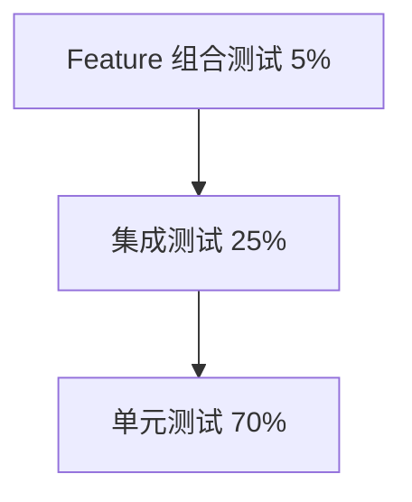

- 

# 测试文档 (Test Plan)

## Axiom - Multi-Protocol SDK Framework

**版本**: v1.2 (修复版)  
**日期**: 2025-01-01  
**目标覆盖率**: > 80%

---

## 1. 测试策略

### 1.1 测试金字塔 ⏳ 待测试



### 1.2 测试重点

- **Feature 组合**: 验证不同 feature 组合的编译和运行
- **宏展开**: 验证代码生成正确性
- **协议隔离**: 验证未启用协议不产生代码
- **自动构建**: 验证 `inventory` 自动收集

---

## 2. 单元测试

### 2.1 宏解析模块测试 ⏳ 待测试

#### TC-MACRO-001: 统一配置解析

**测试目标**: 验证宏能正确解析统一配置

```rust
#[test]
fn test_parse_unified_config() {
    let input = quote! {
        #[service_api(
            name = "test",
            version = "v1",
            description = "Test API",
            path = "/test",
            method = "GET",
            tool_name = "test_tool"
        )]
        async fn test_fn(id: u64) -> Result<String, ApiError> {}
    };
    
    let config = parse_api_attribute(input).unwrap();
    assert_eq!(config.name, "test");
    assert_eq!(config.version, "v1");
    assert_eq!(config.description, Some("Test API".to_string()));
    
    #[cfg(feature = "http")]
    {
        assert_eq!(config.path, Some("/test".to_string()));
        assert_eq!(config.method, Some(HttpMethod::GET));
    }
    
    #[cfg(feature = "mcp")]
    {
        assert_eq!(config.tool_name, Some("test_tool".to_string()));
    }
}
```

**状态**: ⏳ 待测试

---

#### TC-MACRO-002: 参数验证 - HTTP Feature

**测试目标**: 验证 HTTP feature 启用时参数完整性

```rust
#[test]
#[cfg(feature = "http")]
fn test_http_required_params() {
    // 缺少 path
    let input = quote! {
        #[service_api(
            name = "test",
            version = "v1",
            method = "GET"
        )]
        async fn test_fn() -> Result<String, ApiError> {}
    };
    
    let result = parse_and_validate(input);
    assert!(result.is_err());
    assert!(result.unwrap_err().to_string().contains("Missing required field 'path'"));
}
```

**状态**: ⏳ 待测试

---

#### TC-MACRO-003: 参数验证 - MCP Feature

**测试目标**: 验证 MCP feature 启用时参数完整性

```rust
#[test]
#[cfg(feature = "mcp")]
fn test_mcp_required_params() {
    // 缺少 tool_name
    let input = quote! {
        #[service_api(
            name = "test",
            version = "v1",
            description = "Test"
        )]
        async fn test_fn() -> Result<String, ApiError> {}
    };
    
    let result = parse_and_validate(input);
    assert!(result.is_err());
    assert!(result.unwrap_err().to_string().contains("Missing required field 'tool_name'"));
}
```

**状态**: ⏳ 待测试

---

#### TC-MACRO-004: 模块前缀解析

**测试目标**: 验证模块宏正确解析

```rust
#[test]
fn test_module_prefix_parsing() {
    let input = quote! {
        #[service_module(prefix = "/auth")]
        mod auth_module {}
    };
    
    let config = parse_module_attribute(input).unwrap();
    assert_eq!(config.prefix, "/auth");
}
```

**状态**: ⏳ 待测试

---

### 2.2 代码生成模块测试 ⏳ 待测试

#### TC-CODEGEN-001: HTTP 代码生成 - Feature 启用

**测试目标**: 验证 HTTP feature 启用时生成代码

```rust
#[test]
#[cfg(feature = "http")]
fn test_http_code_generation() {
    let config = ApiConfig {
        name: "test".to_string(),
        version: "v1".to_string(),
        path: Some("/test".to_string()),
        method: Some(HttpMethod::GET),
        // ...
    };
    
    let generated = generate_code(&config, &fn_sig);
    let code_str = generated.to_string();
    
    // 验证包含 HTTP 适配器
    assert!(code_str.contains("#[cfg(feature = \"http\")]"));
    assert!(code_str.contains("pub mod __http_test"));
    assert!(code_str.contains("inventory::submit!"));
}
```

**状态**: ⏳ 待测试

---

#### TC-CODEGEN-002: HTTP 代码不生成 - Feature 禁用

**测试目标**: 验证 HTTP feature 禁用时不生成代码

```rust
#[test]
#[cfg(not(feature = "http"))]
fn test_http_code_not_generated() {
    let config = ApiConfig {
        name: "test".to_string(),
        version: "v1".to_string(),
        tool_name: Some("test_tool".to_string()),
        // 注意: 没有 path 和 method
    };
    
    let generated = generate_code(&config, &fn_sig);
    let code_str = generated.to_string();
    
    // 验证不包含 HTTP 适配器
    assert!(!code_str.contains("__http_test"));
}
```

**状态**: ⏳ 待测试

---

#### TC-CODEGEN-003: MCP 代码生成 - Feature 启用

**测试目标**: 验证 MCP feature 启用时生成代码

```rust
#[test]
#[cfg(feature = "mcp")]
fn test_mcp_code_generation() {
    let config = ApiConfig {
        name: "test".to_string(),
        tool_name: Some("test_tool".to_string()),
        description: Some("Test tool".to_string()),
        // ...
    };
    
    let generated = generate_code(&config, &fn_sig);
    let code_str = generated.to_string();
    
    // 验证包含 MCP 适配器
    assert!(code_str.contains("#[cfg(feature = \"mcp\")]"));
    assert!(code_str.contains("pub mod __mcp_test"));
    assert!(code_str.contains("McpToolRegistration"));
}
```

**状态**: ⏳ 待测试

---

#### TC-CODEGEN-004: 双协议代码生成

**测试目标**: 验证同时启用两种 feature 时生成两套代码

```rust
#[test]
#[cfg(all(feature = "http", feature = "mcp"))]
fn test_dual_protocol_generation() {
    let config = ApiConfig {
        name: "test".to_string(),
        version: "v1".to_string(),
        path: Some("/test".to_string()),
        method: Some(HttpMethod::GET),
        tool_name: Some("test_tool".to_string()),
        description: Some("Test".to_string()),
    };
    
    let generated = generate_code(&config, &fn_sig);
    let code_str = generated.to_string();
    
    // 验证同时包含两种适配器
    assert!(code_str.contains("__http_test"));
    assert!(code_str.contains("__mcp_test"));
}
```

**状态**: ⏳ 待测试

---

#### TC-CODEGEN-005: Timestamp 特性代码生成

**测试目标**: 验证 timestamp feature 的条件编译

```rust
#[test]
fn test_timestamp_feature_generation() {
    let generated = generate_output_struct(/* ... */);
    let code_str = generated.to_string();
    
    #[cfg(feature = "timestamp")]
    {
        assert!(code_str.contains("#[cfg(feature = \"timestamp\")]"));
        assert!(code_str.contains("pub timestamp: i64"));
    }
    
    #[cfg(not(feature = "timestamp"))]
    {
        assert!(!code_str.contains("timestamp"));
    }
}
```

**状态**: ⏳ 待测试

---

### 2.3 自动构建模块测试 ⏳ 待测试

#### TC-BUILD-001: HTTP 自动收集

**测试目标**: 验证 inventory 自动收集 HTTP 路由

```rust
#[test]
#[cfg(feature = "http")]
fn test_http_auto_collection() {
    // 定义测试接口
    #[service_api(
        name = "test1",
        version = "v1",
        path = "/test1",
        method = "GET"
    )]
    async fn test_fn1() -> Result<String, ApiError> { Ok("test1".to_string()) }
    
    #[service_api(
        name = "test2",
        version = "v1",
        path = "/test2",
        method = "POST"
    )]
    async fn test_fn2() -> Result<String, ApiError> { Ok("test2".to_string()) }
    
    // 构建服务
    let router = axiom::http::build();
    
    // 验证路由数量
    let routes: Vec<_> = inventory::iter::<HttpRoute>().collect();
    assert!(routes.len() >= 2);
    
    // 验证路由路径
    let paths: Vec<_> = routes.iter().map(|r| r.path).collect();
    assert!(paths.contains(&"/api/v1/test1"));
    assert!(paths.contains(&"/api/v1/test2"));
}
```

**状态**: ⏳ 待测试

---

#### TC-BUILD-002: MCP 自动收集

**测试目标**: 验证 inventory 自动收集 MCP 工具

```rust
#[test]
#[cfg(feature = "mcp")]
async fn test_mcp_auto_collection() {
    // 定义测试工具
    #[service_api(
        name = "tool1",
        tool_name = "test_tool_1",
        description = "Test tool 1"
    )]
    async fn tool1() -> Result<String, ApiError> { Ok("tool1".to_string()) }
    
    #[service_api(
        name = "tool2",
        tool_name = "test_tool_2",
        description = "Test tool 2"
    )]
    async fn tool2() -> Result<String, ApiError> { Ok("tool2".to_string()) }
    
    // 构建服务
    let server = axiom::mcp::build().await;
    
    // 验证工具数量
    let tools: Vec<_> = inventory::iter::<McpToolRegistration>().collect();
    assert!(tools.len() >= 2);
    
    // 验证工具名
    let names: Vec<_> = tools.iter().map(|t| &t.tool.name).collect();
    assert!(names.contains(&&"test_tool_1".to_string()));
    assert!(names.contains(&&"test_tool_2".to_string()));
}
```

**状态**: ⏳ 待测试

---

### 2.4 模块前缀测试 ⏳ 待测试

#### TC-MODULE-001: 单层模块前缀

**测试目标**: 验证模块前缀正确应用

```rust
#[test]
#[cfg(feature = "http")]
fn test_module_prefix() {
    #[service_module(prefix = "/auth")]
    mod auth {
        #[service_api(
            name = "login",
            version = "v1",
            path = "/login",
            method = "POST"
        )]
        async fn login() -> Result<String, ApiError> { Ok("ok".to_string()) }
    }
    
    // 验证路径组合
    let routes: Vec<_> = inventory::iter::<HttpRoute>()
        .filter(|r| r.metadata.name == "login")
        .collect();
    
    assert_eq!(routes.len(), 1);
    assert_eq!(routes[0].path, "/auth/api/v1/login");
}
```

**状态**: ⏳ 待测试

---

#### TC-MODULE-002: 嵌套模块前缀

**测试目标**: 验证嵌套模块前缀组合

```rust
#[test]
#[cfg(feature = "http")]
fn test_nested_module_prefix() {
    #[service_module(prefix = "/admin")]
    mod admin {
        #[service_module(prefix = "/users")]
        mod users {
            #[service_api(
                name = "list",
                version = "v1",
                path = "/list",
                method = "GET"
            )]
            async fn list_users() -> Result<Vec<String>, ApiError> { Ok(vec![]) }
        }
    }
    
    // 验证路径组合
    let routes: Vec<_> = inventory::iter::<HttpRoute>()
        .filter(|r| r.metadata.name == "list")
        .collect();
    
    assert_eq!(routes[0].path, "/admin/users/api/v1/list");
}
```

**状态**: ⏳ 待测试

---

## 3. 集成测试

### 3.1 HTTP 端到端测试 ⏳ 待测试

#### TC-INT-001: HTTP 完整流程 - 仅 HTTP Feature

**测试配置**: `features = ["http"]`

```rust
#[tokio::test]
#[cfg(feature = "http")]
async fn test_http_only_e2e() {
    // 定义接口
    #[service_api(
        name = "get_user",
        version = "v1",
        path = "/users/:id",
        method = "GET",
        tool_name = "get_user"  // MCP 参数（但不会生成代码）
    )]
    async fn get_user(id: u64) -> Result<User, ApiError> {
        Ok(User { id, name: "Test".to_string() })
    }
    
    // 构建服务
    let app = axiom::http::build();
    let server = TestServer::new(app).await;
    
    // 发送请求
    let response = server.get("/api/v1/users/123").await;
    
    // 验证响应
    assert_eq!(response.status(), 200);
    let body: ServiceResponse<User> = response.json();
    assert!(body.success);
    assert_eq!(body.data.unwrap().id, 123);
}
```

**验证点**:

- [ ] HTTP 服务正常工作
- [ ] MCP 相关代码未编译（通过二进制大小验证）

**状态**: ⏳ 待测试

---

#### TC-INT-002: MCP 完整流程 - 仅 MCP Feature

**测试配置**: `features = ["mcp"]`

```rust
#[tokio::test]
#[cfg(feature = "mcp")]
async fn test_mcp_only_e2e() {
    // 定义工具
    #[service_api(
        name = "search",
        version = "v1",  // HTTP 参数（但不会使用）
        path = "/search",  // HTTP 参数（但不会使用）
        method = "GET",  // HTTP 参数（但不会使用）
        tool_name = "search_docs",
        description = "Search documentation"
    )]
    async fn search_docs(query: String) -> Result<Vec<String>, ApiError> {
        Ok(vec!["doc1".to_string(), "doc2".to_string()])
    }
    
    // 构建服务
    let server = axiom::mcp::build().await;
    
    // 调用工具
    let result = server.call_tool("search_docs", json!({"query": "test"})).await;
    
    // 验证结果
    assert!(result.is_ok());
    let docs: Vec<String> = serde_json::from_value(result.unwrap()).unwrap();
    assert_eq!(docs.len(), 2);
}
```

**验证点**:

- [ ] MCP 服务正常工作
- [ ] HTTP 相关代码未编译

**状态**: ⏳ 待测试

---

#### TC-INT-003: 双协议集成测试

**测试配置**: `features = ["http", "mcp"]`

```rust
#[tokio::test]
#[cfg(all(feature = "http", feature = "mcp"))]
async fn test_dual_protocol_e2e() {
    // 定义接口
    #[service_api(
        name = "get_data",
        version = "v1",
        path = "/data",
        method = "GET",
        tool_name = "get_data",
        description = "Get data"
    )]
    async fn get_data(id: u64) -> Result<String, ApiError> {
        Ok(format!("data-{}", id))
    }
    
    // 启动 HTTP 服务
    let http_app = axiom::http::build();
    let http_server = TestServer::new(http_app).await;
    
    // 启动 MCP 服务
    let mcp_server = axiom::mcp::build().await;
    
    // HTTP 调用
    let http_response = http_server.get("/api/v1/data?id=123").await;
    let http_data: ServiceResponse<String> = http_response.json();
    
    // MCP 调用
    let mcp_result = mcp_server.call_tool("get_data", json!({"id": 123})).await.unwrap();
    let mcp_data: String = serde_json::from_value(mcp_result).unwrap();
    
    // 验证结果一致
    assert_eq!(http_data.data.unwrap(), mcp_data);
}
```

**状态**: ⏳ 待测试

---

### 3.2 特性组合测试 ⏳ 待测试

#### TC-INT-004: Timestamp 特性测试

**测试配置**: `features = ["http", "timestamp"]`

```rust
#[tokio::test]
#[cfg(all(feature = "http", feature = "timestamp"))]
async fn test_timestamp_feature() {
    #[service_api(
        name = "test",
        version = "v1",
        path = "/test",
        method = "GET"
    )]
    async fn test_fn() -> Result<String, ApiError> {
        Ok("test".to_string())
    }
    
    let app = axiom::http::build();
    let server = TestServer::new(app).await;
    let response = server.get("/api/v1/test").await;
    
    let body: serde_json::Value = response.json();
    
    // 验证包含 timestamp
    assert!(body["timestamp"].is_number());
}
```

**状态**: ⏳ 待测试

---

#### TC-INT-005: 无 Timestamp 特性测试

**测试配置**: `features = ["http"]`

```rust
#[tokio::test]
#[cfg(all(feature = "http", not(feature = "timestamp")))]
async fn test_no_timestamp_feature() {
    #[service_api(
        name = "test",
        version = "v1",
        path = "/test",
        method = "GET"
    )]
    async fn test_fn() -> Result<String, ApiError> {
        Ok("test".to_string())
    }
    
    let app = axiom::http::build();
    let server = TestServer::new(app).await;
    let response = server.get("/api/v1/test").await;
    
    let body: serde_json::Value = response.json();
    
    // 验证不包含 timestamp
    assert!(body.get("timestamp").is_none());
}
```

**状态**: ⏳ 待测试

---

### 3.3 流式响应测试 ⏳ 待测试

#### TC-INT-006: SSE 流式测试

**测试配置**: `features = ["http", "streaming"]`

```rust
#[tokio::test]
#[cfg(all(feature = "http", feature = "streaming"))]
async fn test_sse_streaming() {
    #[service_api(
        name = "stream",
        version = "v1",
        path = "/stream",
        method = "GET",
        stream = true
    )]
    async fn stream_data() -> Result<impl tokio_stream::Stream<Item = String>, ApiError> {
        Ok(tokio_stream::iter(vec!["a", "b", "c"]).map(|s| s.to_string()))
    }
    
    let app = axiom::http::build();
    let server = TestServer::new(app).await;
    
    // 使用 EventSource 客户端
    let mut event_source = server.get_event_source("/api/v1/stream").await;
    
    let mut events = Vec::new();
    while let Some(event) = event_source.next().await {
        events.push(event.data);
        if events.len() == 3 {
            break;
        }
    }
    
    assert_eq!(events, vec!["\"a\"", "\"b\"", "\"c\""]);
}
```

**状态**: ⏳ 待测试

---

## 4. 边界条件测试

### 4.1 参数边界测试 ⏳ 待测试

#### TC-EDGE-001: 无参数函数

**测试目标**: 验证无参数函数处理

```rust
#[test]
#[cfg(feature = "http")]
fn test_no_params_function() {
    #[service_api(
        name = "health",
        version = "v1",
        path = "/health",
        method = "GET"
    )]
    async fn health() -> Result<String, ApiError> {
        Ok("OK".to_string())
    }
    
    // 验证生成的 Input 结构为空
    // 验证可以正常调用
}
```

**状态**: ⏳ 待测试

---

#### TC-EDGE-002: 大量参数函数

**测试目标**: 验证 10+ 参数处理

```rust
#[test]
fn test_many_params() {
    #[service_api(
        name = "complex",
        version = "v1",
        path = "/complex",
        method = "POST"
    )]
    async fn complex(
        p1: String, p2: u64, p3: bool, p4: Option<String>,
        p5: Vec<u64>, p6: HashMap<String, String>,
        p7: f64, p8: i32, p9: u32, p10: String,
    ) -> Result<String, ApiError> {
        Ok("ok".to_string())
    }
    
    // 验证所有参数正确提取
}
```

**状态**: ⏳ 待测试

---

### 4.2 错误场景测试 ⏳ 待测试

#### TC-EDGE-003: 缺少必需 Feature

**测试目标**: 验证编译期错误

```rust
// 此测试应该编译失败
#[test]
#[cfg(not(any(feature = "http", feature = "mcp")))]
fn test_no_protocol_feature() {
    // 编译应该失败，因为至少需要一个协议
    compile_error!("This should not compile");
}
```

**状态**: ⏳ 待测试

---

#### TC-EDGE-004: Feature 冲突检测

**测试目标**: 验证 streaming 依赖 http

```rust
// 此测试应该编译失败
#[test]
#[cfg(all(feature = "streaming", not(feature = "http")))]
fn test_streaming_without_http() {
    compile_error!("Streaming requires HTTP feature");
}
```

**状态**: ⏳ 待测试

---

### 4.3 边界条件测试补充 ⏳ 待测试

#### TC-EDGE-005: 空参数边界测试
**测试目标**: 验证各种空值处理

```rust
#[test]
fn test_empty_string_param() {
    #[service_api(path = "/search", method = "GET")]
    async fn search(query: String) -> Result<Vec<String>, ApiError> {
        if query.is_empty() {
            return Err(ApiError::InvalidInput {
                message: "Query cannot be empty".to_string(),
                field: Some("query".to_string()),
            });
        }
        Ok(vec![])
    }
    
    // 测试空字符串
    let response = client.get("/api/v1/search?query=").await;
    assert_eq!(response.status(), 400);
}

#[test]
fn test_null_optional_param() {
    #[service_api(path = "/users", method = "GET")]
    async fn list_users(
        page: Option<u32>,
    ) -> Result<Vec<User>, ApiError> {
        let page = page.unwrap_or(1);
        Ok(vec![])
    }
    
    // 测试不提供可选参数
    let response = client.get("/api/v1/users").await;
    assert_eq!(response.status(), 200);
}
```

**状态**: ⏳ 待测试

---

#### TC-EDGE-006: 超大参数测试
**测试目标**: 验证大数据处理

```rust
#[test]
fn test_large_json_body() {
    // 生成 10MB JSON
    let large_data = vec![User::default(); 100_000];
    
    let response = client
        .post("/api/v1/users/batch")
        .json(&large_data)
        .await;
    
    // 应该被 Body 限制拒绝
    assert_eq!(response.status(), 413);  // Payload Too Large
}

#[test]
fn test_deeply_nested_json() {
    // 100 层嵌套
    let mut nested = json!({"value": 1});
    for _ in 0..100 {
        nested = json!({"nested": nested});
    }
    
    let response = client
        .post("/api/v1/data")
        .json(&nested)
        .await;
    
    // 应该正确处理或拒绝
    assert!(response.status() == 200 || response.status() == 400);
}
```

**状态**: ⏳ 待测试

---

#### TC-EDGE-007: 并发安全测试
**测试目标**: 验证并发访问安全性

```rust
#[tokio::test]
async fn test_concurrent_requests() {
    let server = TestServer::new(app).await;
    
    // 1000 并发请求
    let tasks: Vec<_> = (0..1000)
        .map(|i| {
            let server = server.clone();
            tokio::spawn(async move {
                server.get(&format!("/api/v1/users/{}", i)).await
            })
        })
        .collect();
    
    let results = futures::future::join_all(tasks).await;
    
    // 验证无请求丢失
    assert_eq!(results.len(), 1000);
    // 验证无错误
    assert!(results.iter().all(|r| r.is_ok()));
}

#[tokio::test]
async fn test_race_condition() {
    let counter = Arc::new(AtomicU64::new(0));
    
    // 并发写入
    let tasks: Vec<_> = (0..1000)
        .map(|_| {
            let counter = counter.clone();
            tokio::spawn(async move {
                client.post("/api/v1/increment").await;
                counter.fetch_add(1, Ordering::SeqCst);
            })
        })
        .collect();
    
    futures::future::join_all(tasks).await;
    
    // 验证计数一致
    let server_count = client.get("/api/v1/count").await.json::<u64>();
    assert_eq!(counter.load(Ordering::SeqCst), server_count);
}
```

**状态**: ⏳ 待测试

---

#### TC-EDGE-008: 内存泄漏测试
**测试目标**: 验证无内存泄漏

```rust
#[test]
fn test_memory_leak_detection() {
    use std::alloc::{GlobalAlloc, Layout, System};
    use std::sync::atomic::{AtomicUsize, Ordering};
    
    struct TrackingAllocator;
    static ALLOCATED: AtomicUsize = AtomicUsize::new(0);
    
    unsafe impl GlobalAlloc for TrackingAllocator {
        unsafe fn alloc(&self, layout: Layout) -> *mut u8 {
            ALLOCATED.fetch_add(layout.size(), Ordering::SeqCst);
            System.alloc(layout)
        }
        
        unsafe fn dealloc(&self, ptr: *mut u8, layout: Layout) {
            ALLOCATED.fetch_sub(layout.size(), Ordering::SeqCst);
            System.dealloc(ptr, layout)
        }
    }
    
    let before = ALLOCATED.load(Ordering::SeqCst);
    
    // 执行 1000 次请求
    for _ in 0..1000 {
        let _ = client.get("/api/v1/health").await;
    }
    
    // 强制 GC
    std::thread::sleep(Duration::from_secs(1));
    
    let after = ALLOCATED.load(Ordering::SeqCst);
    let leaked = after.saturating_sub(before);
    
    // 允许 1MB 误差
    assert!(leaked < 1024 * 1024, "Memory leak detected: {} bytes", leaked);
}

#[tokio::test]
async fn test_stream_memory_leak() {
    let before_memory = get_process_memory();
    
    // 打开 100 个流式连接
    let streams: Vec<_> = (0..100)
        .map(|_| client.get_event_source("/api/v1/stream"))
        .collect();
    
    // 接收一些数据后关闭
    for mut stream in streams {
        let _ = stream.next().await;
        drop(stream);  // 显式关闭
    }
    
    tokio::time::sleep(Duration::from_secs(2)).await;
    
    let after_memory = get_process_memory();
    let leaked = after_memory.saturating_sub(before_memory);
    
    // 允许 10MB 误差
    assert!(leaked < 10 * 1024 * 1024, "Stream memory leak: {} bytes", leaked);
}
```

**状态**: ⏳ 待测试

---

#### TC-EDGE-009: 字符编码边界测试
**测试目标**: 验证 UTF-8 和特殊字符处理

```rust
#[test]
fn test_utf8_handling() {
    let test_strings = vec![
        "Hello, 世界",           // 中文
        "🎉🎊🎈",                // Emoji
        "Ñoño",                  // 西班牙语
        "Москва",                // 俄语
        "\u{0000}",              // NULL 字符
        "a\nb\tc",               // 控制字符
    ];
    
    for s in test_strings {
        let response = client
            .post("/api/v1/echo")
            .json(&json!({"text": s}))
            .await;
        
        assert_eq!(response.status(), 200);
        let body: String = response.json();
        assert_eq!(body, s);
    }
}
```

**状态**: ⏳ 待测试
```

## 5. 性能测试

### 5.1 编译性能测试 ⏳ 待测试

#### TC-PERF-001: 编译时间基准

**测试用例**:

- 10 个接口: < 30 秒
- 50 个接口: < 2 分钟
- 100 个接口: < 5 分钟

```bash
# 测试脚本
for n in 10 50 100; do
    echo "Testing $n interfaces..."
    time cargo build --release --features http
done
```

**状态**: ⏳ 待测试

---

#### TC-PERF-002: 增量编译测试

**测试用例**:

- 修改单个函数后重新编译: < 10 秒

```bash
# 首次编译
cargo build --features http

# 修改一个函数
sed -i 's/Ok("test")/Ok("test2")/' src/lib.rs

# 增量编译
time cargo build --features http
```

**状态**: ⏳ 待测试

---

### 5.2 运行时性能测试 ⏳ 待测试

#### TC-PERF-003: HTTP QPS 基准

**测试配置**: `features = ["http"]`

```rust
#[bench]
fn bench_http_simple_get(b: &mut Bencher) {
    let rt = tokio::runtime::Runtime::new().unwrap();
    let app = axiom::http::build();
    let server = rt.block_on(TestServer::new(app));
    
    b.iter(|| {
        rt.block_on(async {
            server.get("/api/v1/health").await
        })
    });
}
```

**目标**:

- [ ] QPS > 3000
- [ ] P99 延迟 < 150ms

**状态**: ⏳ 待测试

---

#### TC-PERF-004: 二进制体积测试

**测试用例**:

```bash
# 仅 HTTP
cargo build --release --features http
ls -lh target/release/myapp

# 仅 MCP
cargo build --release --features mcp
ls -lh target/release/myapp

# 两者都有
cargo build --release --features http,mcp
ls -lh target/release/myapp
```

**验证点**:

- [ ] 仅 HTTP 体积 < 仅 HTTP+MCP 体积
- [ ] 未使用的协议不增加体积

**状态**: ⏳ 待测试

---

## 6. Feature 组合矩阵测试

### 6.1 测试矩阵 ⏳ 待测试

| Feature 组合       | 编译 | HTTP 工作 | MCP 工作 | Streaming | Timestamp | 状态     |
| ------------------ | ---- | --------- | -------- | --------- | --------- | -------- |
| `http`             | ✓    | ✓         | ✗        | ✗         | ✗         | ⏳ 待测试 |
| `mcp`              | ✓    | ✗         | ✓        | ✗         | ✗         | ⏳ 待测试 |
| `http,mcp`         | ✓    | ✓         | ✓        | ✗         | ✗         | ⏳ 待测试 |
| `http,streaming`   | ✓    | ✓         | ✗        | ✓         | ✗         | ⏳ 待测试 |
| `http,timestamp`   | ✓    | ✓         | ✗        | ✗         | ✓         | ⏳ 待测试 |
| `full`             | ✓    | ✓         | ✓        | ✓         | ✓         | ⏳ 待测试 |
| `streaming` (单独) | ✗    | -         | -        | -         | -         | ⏳ 待测试 |
| `` (无 feature)    | ✗    | -         | -        | -         | -         | ⏳ 待测试 |

### 6.2 自动化测试配置

```toml
# .cargo/config.toml
[target.test-http]
rustflags = ["--cfg", "feature=\"http\""]

[target.test-mcp]
rustflags = ["--cfg", "feature=\"mcp\""]

[target.test-full]
rustflags = ["--cfg", "feature=\"full\""]
```

---

## 7. 测试覆盖率报告

### 7.1 覆盖率目标 ⏳ 待测试

| 模块      | 目标覆盖率 | 当前覆盖率 | 状态     |
| --------- | ---------- | ---------- | -------- |
| 宏解析    | 90%        | 0%         | ⏳ 待测试 |
| 代码生成  | 85%        | 0%         | ⏳ 待测试 |
| 自动构建  | 90%        | 0%         | ⏳ 待测试 |
| HTTP 协议 | 90%        | 0%         | ⏳ 待测试 |
| MCP 协议  | 85%        | 0%         | ⏳ 待测试 |
| 特性系统  | 85%        | 0%         | ⏳ 待测试 |
| **总体**  | **> 80%**  | **0%**     | ⏳ 待测试 |

### 7.2 分 Feature 覆盖率

```bash
# HTTP feature 覆盖率
cargo tarpaulin --features http --out Html

# MCP feature 覆盖率
cargo tarpaulin --features mcp --out Html

# 全部 feature 覆盖率
cargo tarpaulin --features full --out Html
```

---

## 8. CI/CD 集成

### 8.1 GitHub Actions 配置 ⏳ 待配置

```yaml
name: Test Matrix
on: [push, pull_request]

jobs:
  test-features:
    runs-on: ubuntu-latest
    strategy:
      matrix:
        features:
          - "http"
          - "mcp"
          - "http,mcp"
          - "http,streaming"
          - "http,timestamp"
          - "full"
    steps:
      - uses: actions/checkout@v4
      - uses: actions-rs/toolchain@v1
      - name: Test with features ${{ matrix.features }}
        run: cargo test --features "${{ matrix.features }}"
      
  test-compile-failures:
    runs-on: ubuntu-latest
    steps:
      - uses: actions/checkout@v4
      - name: Test no features (should fail)
        run: |
          ! cargo build 2>&1 | grep "At least one protocol feature"
      - name: Test streaming without http (should fail)
        run: |
          ! cargo build --features streaming 2>&1 | grep "requires 'http'"
```

---

## 9. 测试执行计划

### 9.1 测试阶段 ⏳ 待执行

| 阶段    | 周次    | 测试重点                         | 状态     |
| ------- | ------- | -------------------------------- | -------- |
| Phase 1 | Week 4  | 宏解析 + 代码生成 + Feature 隔离 | ⏳ 待测试 |
| Phase 2 | Week 7  | 自动构建 + 模块前缀              | ⏳ 待测试 |
| Phase 3 | Week 10 | MCP + 流式 + Feature 组合        | ⏳ 待测试 |
| Phase 4 | Week 11 | 性能测试 + 二进制体积            | ⏳ 待测试 |
| Phase 5 | Week 12 | 全量回归测试 + CI/CD             | ⏳ 待测试 |

---

## 10. 关键测试检查清单

### 10.1 每次 PR 必须通过 ⏳ 待实现

- [ ] 所有 feature 组合编译通过
- [ ] 单元测试覆盖率 > 80%
- [ ] 集成测试全部通过
- [ ] 性能基准无退化（< 5%）
- [ ] 二进制体积无异常增长（< 10%）
- [ ] 文档更新完整